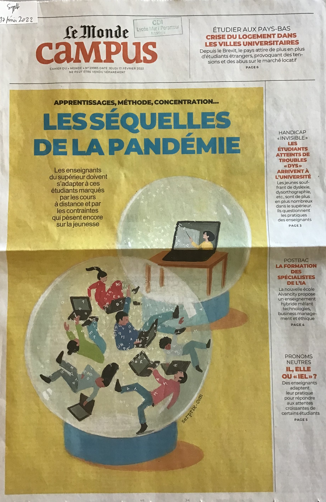

**Pour ne rien manquer des dernières actualités du lycée et du CDI.**

[{width=20% align=left}](https://www.ecmorlaix.fr/actualites/){target=_blank}

## Au CDI

???info "**Expositions en cours**"
    
   

??? info "**Expositions antérieures**"
    ??? "**Handicaps et exclusions**"
     
        {width=30% align=left}
        {width=30% align=left}
        Dans le cadre de leur formation, les élèves de ==**2nd BAC PRO ASSP**== ont réalisé des affiches de lutte contre toutes les formes d’==**exclusion**== liées au ==**handicap**== : scolaires, sociales, professionnelles, citoyennes…
    
         ==**Visible au CDI jusqu'aux vacances de printemps**==
		

    ??? "**Frida KAHLO**"
     
        {width=30% align=left}
	    Exposition sur ==**Frida Kahlo**== réalisée par les élèves du cours d'Espagnol.
	
	    Pour aller plus loin : [**Frida Kahlo - France Culture**]( https://www.franceculture.fr/personne-frida-kahlo.html)
	
	    ==**Visible au CDI jusqu'à mi-mars**==
    
    ??? "**Projets franco-allemands**"
    
        {width=50% align=left}
        {width=50% align=left}

        A découvrir,
    
        L'Exposition sur le thème des ==**relations franco-allemandes**==, "ennemis bien-aimés" (en lien avec l'Axe du programme : Identité et échanges) réalisée par les deux groupes de germanistes de Terminale générale et STMG.

        Rappel des grandes dates de cette relation un peu tendue qui a fini par se normaliser, grâce au couple De Gaulle - Adenauer.
    
        A l’occasion de ce travail, les élèves ont lu un extrait du roman célèbre de Erich Maria Remarque "A l'Ouest, rien de nouveau" (1929), ainsi que le récit d'un amour franco-allemand (article extrait de "der Spiegel").

        Cette exposition vise à faire connaître l'amitié franco-allemande et les projets et institutions qui en découlent.
    
        Pour aller plus loin : [**Sources bibliographiques**](./pdf/Expo_Projet_franco_allemand_sources.pdf){target=_blank}
    
        ==**Visible au CDI jusqu'à mi-mars**==

    ??? tip "**Rendez-vous du Roudour**"
        Les élèves de 1re HLP font la promotion des ==**soirées théâtrales**== qui se dérouleront à la salle du Roudour, les 30 et 31 mars. Ils ont aussi créé un compte Instagram.
    
        ??? "**Soirée illuminée : Poème**"
            Les lumières s’allument et éclairent le bois  
            Verni d’un beau parquet luisant comme un soleil,  	
            Et qui, majestueux, rayonne comme un roi  	
            Alors qu’il se découvre de ses longs draps vermeils.
            
                
            Une foule attend là, depuis sa vaste plaine  	
            Bondée, mais pourtant calme, arrosée de douceur,  	
            Florissante et joyeuse, observant cette scène  	
            Qui la nourrit d’un grand et paisible bonheur.
        
            
            Soudain, les voici donc, ces acteurs éloquents,  	
            Parfois d’un air tragique, Antigone, Athalie  	
            Ou parfois amusé, le Médecin volant  	
            Mais toujours honorés, par un public ravi.
        
            
            Leur voix de chérubins se porte à la façon  	
            D’un écho apaisant les sommets couronnés,  	
            Les falaises, les champs, les forêts de ces monts,  	
            Ainsi que tous les lacs de ces lieux enneigés.
        
        
            Le spectacle fini, le public applaudit.  	
            C’est ainsi l’allégresse, ô plaine si joyeuse,  
            Tu récompenses là le travail infini  	
            Des artistes au cœur d’une soirée heureuse.
        
            
            *Tristan Abily - 1G1*

        {width=20%}
        {width=20%}
        {width=20%}
        {width=20%}
        {width=20%}
        {width=20%}
        {width=30%}
        {width=40%}

    ??? "**Le petit Prince - Antoine de Saint-Exupéry**"
        {width=30% align=left}
        {width=30% align=left}
	    {width=20% align=left}
	
	    
        Dans le cadre d’une lecture intégrale d’une oeuvre en français, les élèves de ==**2AEPE**== ont réalisé des affiches retraçant le schéma narratif de l’oeuvre d'Antoine de Saint Exupéry, le **^^Petit Prince^^**. Les affiches ont été très appréciées lors des portes ouvertes et elles continuent à être regardées au CDI. "On sent le talent de futurs animateurs s’exprimer à travers ces affiches !" (Mme MAURICE-ANDREETTI, enseignante de Lettres).

    ??? "**Semaine de la presse - 21 au 25 mars 2022**"  
        A l'occasion de la semaine de la presse, un kiosque de journaux et magazines est à votre disposition au CDI pour un ==**bain de presse**==. 
        
        Les deux classes première ==**HGGSP**== participeront au ==**concours de Unes**== organisé par le CLEMI. Cette participation s’inscrit dans l'étude du thème 4 du  programme de la spécialité HGGSP, portant sur l’information et à la communication. Les séances se dérouleront au CDI jusqu’à la restitution du travail.

## Nos élèves ont du talent...

    

## Nouveautés

### Presse
???+ Info "Visualiser les "Unes" "
    ==**Déroulez**== pour découvrir les "Unes" du kiosque du mois en cours, du mois précédent, ou des langues vivantes... puis ==**cliquez**== pour accéder au ==**sommaire du numéro**==.   
    Retrouvez tous ces périodiques au CDI pour lire, sur place, les articles qui vous intéressent ou emprunter un magazine.
   
??? "**Kiosque du mois** :newspaper:"
  
    [{width=20%}](./images/abonnements/11_novembre/01.net_02_novembre_2022_985.pdf){target=_blank}
    [{width=20%}](./images/abonnements/11_novembre/Alternatives_economiques_novembre_2022_428.pdf){target=_blank}
    [{width=20%}](./images/abonnements/11_novembre/Ca_m_interesse_novembre_2022_501.pdf){target=_blank}
    [{width=20%}](./images/abonnements/11_novembre/Courrier_international_03_novembre_2022_1670.pdf){target=_blank}
    [{width=20%}](./images/abonnements/11_novembre/Courrier_international_10_novembre_2022_1671.pdf){target=_blank}
    [{width=20%}](./images/abonnements/11_novembre/Documentation_photographique_novembre_2022_8149.pdf){target=_blank}
    [{width=20%}](./images/abonnements/11_novembre/Management_octobre-novembre_2022_305.pdf){target=_blank}
    [{width=20%}](./images/abonnements/11_novembre/Philosophie_magazine_novembre_2022_164.pdf){target=_blank}
    [{width=20%}](./images/abonnements/11_novembre/Phosphore_15_novembre_2022_542.pdf){target=_blank}
    [{width=20%}](./images/abonnements/11_novembre/Pour_l_eco_novembre_2022_46.pdf){target=_blank}
    [{width=20%}](./images/abonnements/11_novembre/Que_choisir_novembre_2022_618.pdf){target=_blank}
    [{width=20%}](./images/abonnements/11_novembre/Que_choisir_sante_novembre_2022_176.pdf){target=_blank}
    [{width=20%}](./images/abonnements/11_novembre/Science_et_vie_novembre_2022_1262.pdf){target=_blank}
    [{width=20%}](./images/abonnements/11_novembre/Science_et_vie_novembre_2022_304HS.pdf){target=_blank}
    [{width=20%}](./images/abonnements/11_novembre/SVJ_novembre_2022_398.pdf){target=_blank}
    [{width=20%}](./images/abonnements/11_novembre/SVJ_novembre_2022_156HS.pdf){target=_blank}
    [{width=20%}](./images/abonnements/11_novembre/Sciences_et_avenir_novembre_2022_909.pdf){target=_blank}
    [{width=20%}](./images/abonnements/10_octobre/Sciences_et_avenir_octobre-decembre_2022_211HS.pdf){target=_blank}
    [{width=20%}](./images/abonnements/11_novembre/Sciences_humaines_novembre_2022_352.pdf){target=_blank}
    [{width=20%}](./images/abonnements/11_novembre/Sciences_ouest_novembre_2022_403.pdf){target=_blank}
    [{width=20%}](./images/abonnements/11_novembre/Sport_et_vie_novembre-decembre_2022_195.pdf){target=_blank}
    [{width=20%}](./images/abonnements/11_novembre/Virgule_novembre_2022_211.pdf){target=_blank}
    

??? "**Kiosque du mois dernier** :newspaper:"    
    
    [{width=20%}](./images/abonnements/10_octobre/01.net_05_octobre_2022_983.pdf){target=_blank}
    [{width=20%}](./images/abonnements/10_octobre/01.net_19_octobre_2022_984.pdf){target=_blank}
    [{width=20%}](./images/abonnements/10_octobre/Alternatives_economiques_octobre_2022_427.pdf){target=_blank}
    [{width=20%}](./images/abonnements/10_octobre/Ca_m_interesse_octobre_2022_500.pdf){target=_blank}
    [{width=20%}](./images/abonnements/10_octobre/Courrier_international_29_septembre_2022_1665.pdf){target=_blank}
    [{width=20%}](./images/abonnements/10_octobre/Courrier_international_06_octobre_2022_1666.pdf){target=_blank}
    [{width=20%}](./images/abonnements/10_octobre/Journal_animation_octobre_2022_232.pdf){target=_blank}
    [{width=20%}](./images/abonnements/11_novembre/Management_octobre-novembre_2022_305.pdf){target=_blank}
    [{width=20%}](./images/abonnements/10_octobre/Philosophie_magazine_octobre_2022_163.pdf){target=_blank}
    [{width=20%}](./images/abonnements/10_octobre/Phosphore_1er_octobre_2022_539.pdf){target=_blank}
    [{width=20%}](./images/abonnements/10_octobre/Phosphore_15_octobre_2022_540.pdf){target=_blank}
    [{width=20%}](./images/abonnements/09_septembre/Pour_l_eco_septembre_2022_44.pdf){target=_blank}
    [{width=20%}](./images/abonnements/10_octobre/Que_choisir_octobre_2022_617.pdf){target=_blank}
    [{width=20%}](./images/abonnements/10_octobre/Que_choisir_octobre_2022_168HS.pdf){target=_blank}
    [{width=20%}](./images/abonnements/10_octobre/Que_choisir_sante_octobre_2022_175.pdf){target=_blank}
    [{width=20%}](./images/abonnements/10_octobre/Science_et_vie_octobre_2022_1261.pdf){target=_blank}
    [{width=20%}](./images/abonnements/10_octobre/SVJ_octobre_2022_397.pdf){target=_blank}
    [{width=20%}](./images/abonnements/10_octobre/Sciences_et_avenir_octobre_2022_908.pdf){target=_blank}
    [{width=20%}](./images/abonnements/10_octobre/Sciences_et_avenir_octobre-decembre_2022_211HS.pdf){target=_blank}
    [{width=20%}](./images/abonnements/10_octobre/Sciences_humaines_octobre_2022_351.pdf){target=_blank}
    [{width=20%}](./images/abonnements/10_octobre/Sciences_ouest_octobre_2022_402.pdf){target=_blank}
    [{width=20%}](./images/abonnements/09_septembre/Sport_et_vie_septembre-octobre_2022_194.pdf){target=_blank}
    [{width=20%}](./images/abonnements/10_octobre/Virgule_octobre_2022_210.pdf){target=_blank}
    
   
    
??? "**Kiosque des langues vivantes** :gb: :de: :es: :it: :cn:"
    
    ??? Example ":gb: **Anglais** :gb:"
    [{width=20%}](./images/abonnements/langues/IloveEnglishWorld_février_2022_346.pdf){target=_blank}
    [{width=20%}](./images/abonnements/langues/IloveEnglishWorld_mars_2022_347.pdf){target=_blank}
    [{width=20%}](./images/abonnements/langues/IloveEnglishWorld_avril_2022_348.pdf){target=_blank}
    [{width=20%}](./images/abonnements/langues/IloveEnglishWorld_mai_2022_349.pdf){target=_blank}
    [{width=20%}](./images/abonnements/langues/IloveEnglishWorld_juin_2022_350.pdf){target=_blank}
    [{width=20%}](./images/abonnements/langues/IloveEnglishWorld_juillet-aout_2022_351.pdf){target=_blank}
    [{width=20%}](./images/abonnements/langues/IloveEnglishWorld_septembre_2022_352.pdf){target=_blank}

    
    ??? Example ":de: **Allemand** :de:"
    [{width=20%}](./images/abonnements/langues/Vocable_Allemand_20220120_856_sommaire.pdf){target=_blank}
    [{width=20%}](./images/abonnements/langues/Vocable_Allemand_20220203_857_sommaire.pdf){target=_blank}
    [{width=20%}](./images/abonnements/langues/Vocable_Allemand_20220217_858_sommaire.pdf){target=_blank}
    [{width=20%}](./images/abonnements/langues/Vocable_Allemand_20220303_859_sommaire.pdf){target=_blank}
    [{width=20%}](./images/abonnements/langues/Vocable_Allemand_20220317_860_sommaire.pdf){target=_blank}
    [{width=20%}](./images/abonnements/langues/Vocable_Allemand_20220331_861_sommaire.pdf){target=_blank}
    [{width=20%}](./images/abonnements/langues/Vocable_allemand_20220623_867.pdf){target=_blank}
    [{width=20%}](./images/abonnements/langues/Vocable_allemand_20220707_868.pdf){target=_blank}
    [{width=20%}](./images/abonnements/langues/Vocable_allemand_20220901_869.pdf){target=_blank}
    [{width=20%}](./images/abonnements/langues/Vocable_allemand_20220915_870.pdf){target=_blank}
    [{width=20%}](./images/abonnements/langues/Vocable_allemand_20221001_871.pdf){target=_blank}
     [{width=20%}](./images/abonnements/langues/Vocable_allemand_20221101_872.pdf){target=_blank}
    
    
    ??? Example ":es: **Espagnol** :es:"
    [{width=20%}](./images/abonnements/langues/Vocable_Espagnol_20220120_849_sommaire.pdf){target=_blank}
    [{width=20%}](./images/abonnements/langues/Vocable_Espagnol_20220203_850_sommaire.pdf){target=_blank}
    [{width=20%}](./images/abonnements/langues/Vocable_Espagnol_20220217_851_sommaire.pdf){target=_blank}
    [{width=20%}](./images/abonnements/langues/Vocable_Espagnol_20220303_852_sommaire.pdf){target=_blank}
    [{width=20%}](./images/abonnements/langues/Vocable_Espagnol_20220317_853_sommaire.pdf){target=_blank}
    [{width=20%}](./images/abonnements/langues/Vocable_Espagnol_20220331_854_sommaire.pdf){target=_blank}
    [{width=20%}](./images/abonnements/langues/Vocable_espagnol_20220623_860.pdf){target=_blank}
    [{width=20%}](./images/abonnements/langues/Vocable_espagnol_20220707_861.pdf){target=_blank}
    [{width=20%}](./images/abonnements/langues/Vocable_espagnol_20220901_862.pdf){target=_blank}
    [{width=20%}](./images/abonnements/langues/Vocable_espagnol_20220915_863.pdf){target=_blank}
    [{width=20%}](./images/abonnements/langues/Vocable_espagnol_20221001_864.pdf){target=_blank}
    [{width=20%}](./images/abonnements/langues/Vocable_espagnol_20221101_865.pdf){target=_blank}

??? "**Pour les enseignants**"
    [{width=20%}](./images/abonnements/enseignants/Cahiers_pedagogiques_février_2022_575.pdf){target=_blank}
    [{width=20%}](./images/abonnements/enseignants/Cahiers_pedagogiques_mars-avril_2022_576.pdf){target=_blank}
    [{width=20%}](./images/abonnements/enseignants/Cahiers_pedagogiques_mai_2022_577.pdf){target=_blank}
    [{width=20%}](./images/abonnements/enseignants/Cahiers_pedagogiques_juin_2022_578.pdf){target=_blank}
    [{width=20%}](./images/abonnements/enseignants/Cahiers_pedagogiques_septembre-octobre_2022_579.pdf){target=_blank}
    [{width=20%}](./images/abonnements/enseignants/Intercdi_septembre-octobre_2022_298.pdf){target=_blank}
     [{width=20%}](./images/abonnements/enseignants/NRP_lycee_septembre_2022_100.pdf){target=_blank}

### **Orientation**
??? "**Dans la presse** :newspaper:"
    {width=20%}
    {width=20%}
    [{width=20%}](./images/kiosqueonisep/Guide des métiers_Phosphore_2021-2022_sommaire.pdf){target=_blank}

???+ "**Kiosque ONISEP**"
    Notices des dernières nouveautés à retrouver sur le [**Portail PMB**](https://ecmorlaix.basecdi.fr/pmb/opac_css/index.php?lvl=cmspage&pageid=4&id_article=62){target=_blank}.

    
### **Coups de coeur** :heart: 

- [**Litterature positive**](https://ecmorlaix.basecdi.fr/pmb/opac_css/index.php?lvl=cmspage&pageid=4&id_article=60){target=_blank} : sélection de romans pour tous. ==**A LIRE SANS MODERATION !**==

    
	

