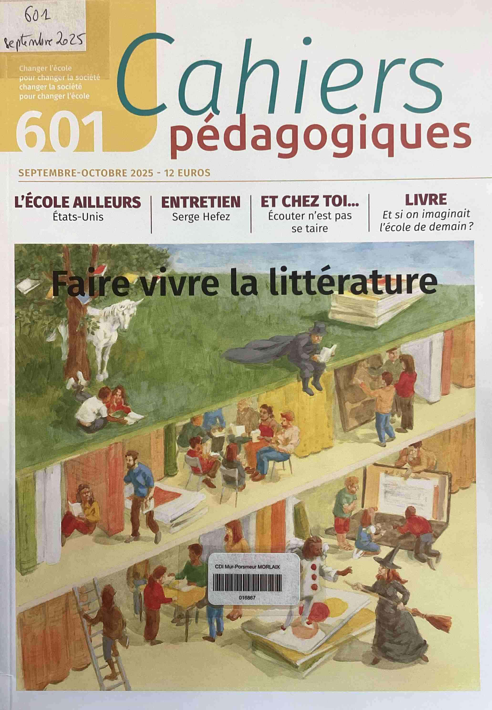

???+ example inline end "Actualités ECA.M"
       
    [{width=90% align=right}](https://www.ecmorlaix.fr/actualites/){target=_blank}

## Rendez-vous
???+ "**CAFE PHILO** ==<u>**Prochain rendez-vous CAFE PHILO**</u>=="
    {width=65% align=left}

    [**Les CAFE PHILO de l'année dernière**](./images/actualites/2024-2025_cafes_philo.pdf){target=_blank}

## Expositions et projets
???+ "**FETE DE LA SCIENCE** ==<u>**Du 3 au 13 octobre 2025 : Exposition "Les intelligences différenes par nature"**</u>=="
    Programme sur le [site officiel](https://www.fetedelascience.fr/){target=_blank} de la Fête de la science 2025 et ressources pour aller plus loin.

    [{width=35% align=left}](https://www.fetedelascience.fr/){target=_blank}

    [{width=25% align=left}](https://www.fetedelascience.fr/la-fete-de-la-science-2025-explore-les-intelligences){target=_blank}
  
??? "**Villes pour la vie, villes contre la peine de mort - ==<u>28/11/2025</u>==**"
    
    ==**Le combat de Souleyman Sow pour l'abolition de la peine de mort en Guinée**==

    [{width=35% align=right}](https://www.amnesty.org/fr/latest/news/2018/04/how-i-called-for-guinea-to-abolish-the-death-penalty/){targuet=_blank}
    
    Après la visite d'Antoinette Chahine, en 2023 et le spectacle "Sacco et Vanzetti" en 2024, dans le cadre de la journée mondiale des ==**"Villes pour la vie, villes contre la peine de mort"**==, nous accueillerons cette année Souleyman Sow, directeur d'Amnesty international Guinée, artisan de l'abolition de la peine de mort dans son pays. 

    Le 30 novembre 1786 est la date qui marque la Commémoration annuelle de la première abolition de la peine de mort par un Etat, le Grand Duché de Toscane, le 30 novembre 1786.
   
    Chaque 30 novembre, cette commémoration a pour objectif d'affirmer la valeur de la vie et de s'opposer à la peine de mort. Les « villes [engagées] villes pour la vie, villes contre la peine de mort » partout à travers le monde, s’illuminent pour dire à l'unisson ==**« Non à la peine de mort ! »**==. 

    La ville de Morlaix est engagée dans le combat contre la peine de mort relayé par les associations, [**Amnesty international**](https://www.amnesty.fr/){target=_blank}, l’[**ACAT**](https://www.acatfrance.fr/){target=_blank} et la [**Ligue des droits de l’homme**](https://www.ldh-france.org/){target=_blank}. Si ce combat vous intéresse, n'hésitez pas à vous rapprocher de l'une ou l'autre de ces associations.
    
  
## Nos élèves ont du talent
???+ "**CNRD 2024-2025**"
    **FELICITATIONS** aux onze élèves de TG2 et TG3 désignés ==**lauréats avec mention spéciale du jury, du Concours National de la Résistance et de la Déportation**== sur le thème **« Libérer et refonder la France »**. Encadrés par Mme GAMARD et Mme COZ, ils ont accompli un long travail de recherches et réalisé un film documentaire sur la libération de Morlaix : ==**« Morlaix 1944, l’aube de la liberté »**==. Pour répondre au format imposé par le concours les élèves avaient dû raccourcir leur film de 48mn à 17mn30 : un véritable crève-cœur ! Alors devant l’investissement et le travail colossal de tous et particulièrement de Pierre-Alain Wester, pour le montage final, les enseignantes avaient fait le choix d’envoyer les deux versions au concours. 
       
    *JEAN Henri – KINGUE PENSY Isaack - LARDEUX Samuel - LE MOULLEC Maëlie - LEPITRE Juliette - MORDELET--LIO Jade Lin - ROUAULT Jade - WESTER Pierre-Alain (TG2)*
        
    *HUON Emma - PINOTEAU Anaïs - PROUST-LABBE Théophile (TG3)*
    
    
    ==**BRAVO A TOUS !**==

    {width=65% align=left}

??? "**Concours d'éloquence**"
    Bravo aux 9 candidats qui se sont inscrits au concours cette année et ont présentés, lors du 1er tour, des discours qui ont su toucher, séduire ou enthousiasmer les élèves de première générale et technologique du lycée et les membres du jury. 
    
    Nous retrouverons six d'entre eux pour la demi-finale prévue le 29 janvier. 

    Rappel des sujets du 1er tour :
        
    * Et si nous étions tous fous ?
        
    * Vivre sans espoir, est-ce cesser de vivre ? 
    
    * Qui ne dit mot consent ?
        
    * "Soyez vous-mêmes, les autres sont déjà pris  ?" (Oscar Wilde)
    
    * Seul on va plus vite, ensemble on va plus loin.

    * La vérité sort-elle vraiment de la bouche des enfants ?

    {width=45% align=left}
   

## Nouveautés

### Presse
???+ Info "Visualiser les "Unes" "
    ==**Déroulez**== pour découvrir les "Unes" du kiosque du mois en cours, du mois précédent, ou des langues vivantes... puis ==**cliquez**== pour accéder au ==**sommaire du numéro**==.   
    Retrouvez tous ces périodiques au CDI pour lire, sur place, les articles qui vous intéressent ou emprunter un magazine.
   
??? "**Kiosque du mois** :newspaper:"
    
    [{width=20%}](./images/abonnements/01_janvier_2026/Aide-soignante_202601_273.pdf){target=_blank}
    [{width=20%}](./images/abonnements/01_janvier_2026/Alternatives_economiques_202601_132.pdf){target=_blank}
    [{width=20%}](./images/abonnements/01_janvier_2026/Alternatives_economiques_202601_466.pdf){target=_blank}
    [{width=20%}](./images/abonnements/01_janvier_2026/Ca_m_interesse_202601_539.pdf){target=_blank}
    [{width=20%}](./images/abonnements/01_janvier_2026/Capital_202601_412.pdf){target=_blank}
    [{width=20%}](./images/abonnements/11_novembre_2025/Documentation_photographique_202511_8168.pdf){target=_blank}
    [{width=20%}](./images/abonnements/01_janvier_2026/Journal_animation_202601_255.pdf){target=_blank}
    [{width=20%}](./images/abonnements/01_janvier_2026/Lire_magazine_202601_547.pdf){target=_blank}
    [{width=20%}](./images/abonnements/01_janvier_2026/Philosophie_magazine_202512_195.pdf){target=_blank}
    [{width=20%}](./images/abonnements/12_decembre_2025/Points_de_vente_202512_1341.pdf){target=_blank}
    [{width=20%}](./images/abonnements/01_janvier_2026/Que_choisir_202601_653.pdf){target=_blank}
    [{width=20%}](./images/abonnements/01_janvier_2026/Que_choisir_sante_202601_211.pdf){target=_blank}
    [{width=20%}](./images/abonnements/01_janvier_2026/Science_et_vie_202601_1300.pdf){target=_blank}
    [{width=20%}](./images/abonnements/01_janvier_2026/Science_et_vie_202601_323HS.pdf){target=_blank}
    [{width=20%}](./images/abonnements/01_janvier_2026/Science_et_vie_junior_202601_436.pdf){target=_blank}
    [{width=20%}](./images/abonnements/01_janvier_2026/Science_et_vie_junior_202601_175%20HS.pdf){target=_blank}
    [{width=20%}](./images/abonnements/01_janvier_2026/Sciences_et_avenir_202601_947.pdf){target=_blank}
    [{width=20%}](./images/abonnements/12_decembre_2025/Sciences_humaines_202512_384.pdf){target=_blank}
    [{width=20%}](./images/abonnements/01_janvier_2026/Sciences_ouest_202601_434.pdf){target=_blank}
    [{width=20%}](./images/abonnements/01_janvier_2026/Sport_et_vie_202601_214.pdf){target=_blank}
    [{width=20%}](./images/abonnements/12_decembre_2025/Sport_et_vie_202512_63HS.pdf){target=_blank}
    [{width=20%}](./images/abonnements/01_janvier_2026/Tangentes_202601_227.pdf){target=_blank}
    [{width=20%}](./images/abonnements/12_decembre_2025/Tangente_202512_96HS.pdf){target=_blank}
    [{width=20%}](./images/abonnements/01_janvier_2026/Virgule_202601_246.pdf){target=_blank}

??? "**Kiosque du mois précédent** :newspaper:"       

    [{width=20%}](./images/abonnements/12_decembre_2025/Aide-soignante_202512_272.pdf){target=_blank}
    [{width=20%}](./images/abonnements/12_decembre_2025/Alternatives_economiques_202512_465.pdf){target=_blank}
    [{width=20%}](./images/abonnements/12_decembre_2025/Ca_m_interesse_202512_538.pdf){target=_blank}
    [{width=20%}](./images/abonnements/12_decembre_2025/Capital_202512_411.pdf){target=_blank}
    [{width=20%}](./images/abonnements/11_novembre_2025/Documentation_photographique_202511_8168.pdf){target=_blank}
    [{width=20%}](./images/abonnements/11_novembre_2025/Journal_animation_202511_254.pdf){target=_blank}
    [{width=20%}](./images/abonnements/11_novembre_2025/Lire_magazine_202511_546.pdf){target=_blank}
    [{width=20%}](./images/abonnements/11_novembre_2025/Philosophie_magazine_202511_194.pdf){target=_blank}
    [{width=20%}](./images/abonnements/12_decembre_2025/Points_de_vente_202512_1341.pdf){target=_blank}
    [{width=20%}](./images/abonnements/12_decembre_2025/Que_choisir_202512_652.pdf){target=_blank}
    [{width=20%}](./images/abonnements/11_novembre_2025/Que_choisir_sante_202511_209.pdf){target=_blank}
    [{width=20%}](./images/abonnements/12_decembre_2025/Science_et_vie_202512_1299.pdf){target=_blank}
    [{width=20%}](./images/abonnements/11_novembre_2025/Science_et_vie_202511_322HS.pdf){target=_blank}
    [{width=20%}](./images/abonnements/12_decembre_2025/Science_et_vie_junior_202512_435.pdf){target=_blank}
    [{width=20%}](./images/abonnements/11_novembre_2025/Science_et_vie_junior_202511_174HS.pdf){target=_blank}
    [{width=20%}](./images/abonnements/12_decembre_2025/Sciences_et_avenir_202512_946.pdf){target=_blank}
    [{width=20%}](./images/abonnements/12_decembre_2025/Sciences_humaines_202512_384.pdf){target=_blank}
    [{width=20%}](./images/abonnements/09_septembre_2025/Sciences_ouest_202509_431.pdf){target=_blank}
    [{width=20%}](./images/abonnements/11_novembre_2025/Sport_et_vie_202511_213.pdf){target=_blank}
    [{width=20%}](./images/abonnements/12_decembre_2025/Sport_et_vie_202512_63HS.pdf){target=_blank}
    [{width=20%}](./images/abonnements/11_novembre_2025/Tangente_202511_226.pdf){target=_blank}
    [{width=20%}](./images/abonnements/12_decembre_2025/Tangente_202512_96HS.pdf){target=_blank}
    [{width=20%}](./images/abonnements/12_decembre_2025/Virgule_202512_245.pdf){target=_blank}
    
??? "**Kiosque des langues vivantes** :gb: :de: :es: :it: :cn:"
    
    ??? Example ":gb: **Anglais** :gb:"
    [{width=20%}](./images/abonnements/langues/Vocable_anglais_202504_908.pdf){target=_blank}
    [{width=20%}](./images/abonnements/langues/Vocable_anglais_202505_909.pdf){target=_blank}
    [{width=20%}](./images/abonnements/langues/Vocable_anglais_202506_910.pdf){target=_blank}
    [{width=20%}](./images/abonnements/langues/Vocable_anglais_202507_911.pdf){target=_blank}
    [{width=20%}](./images/abonnements/langues/Vocable_anglais_202508_912.pdf){target=_blank}
    [{width=20%}](./images/abonnements/langues/Vocable_anglais_202509_913.pdf){target=_blank}
    [{width=20%}](./images/abonnements/langues/Vocable_anglais_202510_914.pdf){target=_blank}
    [{width=20%}](./images/abonnements/langues/Vocable_anglais_202511_915.pdf){target=_blank}
    [{width=20%}](./images/abonnements/langues/Vocable_anglais_202512_916.pdf){target=_blank}
    [{width=20%}](./images/abonnements/langues/Vocable_anglais_202601_917.pdf){target=_blank}

    
    ??? Example ":de: **Allemand** :de:"
    [{width=20%}](./images/abonnements/langues/Vocable_allemand_202501_898.pdf){target=_blank}
    [{width=20%}](./images/abonnements/langues/Vocable_allemand_202502_899.pdf){target=_blank}
    [{width=20%}](./images/abonnements/langues/Vocable_allemand_202503_900.pdf){target=_blank}
    [{width=20%}](./images/abonnements/langues/Vocable_allemand_202504_901.pdf){target=_blank}
    [{width=20%}](./images/abonnements/langues/Vocable_allemand_202505_902.pdf){target=_blank}
    [{width=20%}](./images/abonnements/langues/Vocable_allemand_202506_903.pdf){target=_blank}
    [{width=20%}](./images/abonnements/langues/Vocable_allemand_202507_904.pdf){target=_blank}
    [{width=20%}](./images/abonnements/langues/Vocable_allemand_202508_905.pdf){target=_blank}
    [{width=20%}](./images/abonnements/langues/Vocable_allemand_202509_906.pdf){target=_blank}
    [{width=20%}](./images/abonnements/langues/Vocable_allemand_202510_907.pdf){target=_blank}
    [{width=20%}](./images/abonnements/langues/Vocable_allemand_202511_908.pdf){target=_blank}
    [{width=20%}](./images/abonnements/langues/Vocable_allemand_202512_909.pdf){target=_blank}
    [{width=20%}](./images/abonnements/langues/Vocable_allemand_202601_910.pdf){target=_blank}

    
    ??? Example ":es: **Espagnol** :es:"
    [{width=20%}](./images/abonnements/langues/Vocable_espagnol_202501_891.pdf){target=_blank}
    [{width=20%}](./images/abonnements/langues/Vocable_espagnol_202503_893.pdf){target=_blank}
    [{width=20%}](./images/abonnements/langues/Vocable_espagnol_202504_894.pdf){target=_blank}
    [{width=20%}](./images/abonnements/langues/Vocable_espagnol_202505_895.pdf){target=_blank}
    [{width=20%}](./images/abonnements/langues/Vocable_espagnol_202506_896.pdf){target=_blank}
    [{width=20%}](./images/abonnements/langues/Vocable_espagnol_202507_897.pdf){target=_blank}
    [{width=20%}](./images/abonnements/langues/Vocable_espagnol_202508_898.pdf){target=_blank}**
    [{width=20%}](./images/abonnements/langues/Vocable_espagnol_202509_899.pdf){target=_blank}
    [{width=20%}](./images/abonnements/langues/Vocable_espagnol_202510_900.pdf){target=_blank}
    [{width=20%}](./images/abonnements/langues/Vocable_espagnol_202511_901.pdf){target=_blank}
    [{width=20%}](./images/abonnements/langues/Vocable_espagnol_202512_902.pdf){target=_blank}
    [{width=20%}](./images/abonnements/langues/Vocable_espagnol_202601_903.pdf){target=_blank}

??? "**Pour les enseignants**"
    
    ??? Example "**Cahiers pédagogiques**"
    
    [{width=20%}](./images/abonnements/enseignants/Cahiers_pedagogiques_janvier_2024_590.pdf){target=_blank}
    [{width=20%}](./images/abonnements/enseignants/Cahiers_pedagogiques_fevrier_2024_591.pdf){target=_blank}
    [{width=20%}](./images/abonnements/enseignants/Cahiers_pedagogiques_avril_2024_592.pdf){target=_blank}
    [{width=20%}](./images/abonnements/enseignants/Cahiers_pedagogiques_mai_2024_593.pdf){target=_blank}
    [{width=20%}](./images/abonnements/enseignants/Cahiers_pedagogiques_2024_09_595.pdf){target=_blank}
    [{width=20%}](./images/abonnements/enseignants/Cahiers_pedagogiques_2024_11_596.pdf){target=_blank}
    [{width=20%}](./images/abonnements/enseignants/Cahiers_pedagogiques_202501_597.pdf){target=_blank}
    [{width=20%}](./images/abonnements/enseignants/Cahiers_pedagogiques_202502_598.pdf){target=_blank}
    [{width=20%}](./images/abonnements/enseignants/Cahiers_pedagogiques_202503_599.pdf){target=_blank}
    [{width=20%}](./images/abonnements/enseignants/Cahiers_pedagogiques_202505_600.pdf){target=_blank}
    [{width=20%}](./images/abonnements/enseignants/Cahiers_pedagogiques_202509_601.pdf){target=_blank}
    [{width=20%}](./images/abonnements/enseignants/Cahiers_pédagogiques_202511_602.pdf){target=_blank}
    [{width=20%}](./images/abonnements/enseignants/Cahiers_pedagogiques_202601_603.pdf){target=_blank}

    ??? Example "**NRP Lycée**"
    
    [{width=20%}](./images/abonnements/enseignants/NRP_lycee_202303_102.pdf){target=_blank}
    [{width=20%}](./images/abonnements/enseignants/NRP_lycee_202306_103.pdf){target=_blank}
    [{width=20%}](./images/abonnements/enseignants/NRP_lycee_202309_104.pdf){target=_blank}
    [{width=20%}](./images/abonnements/enseignants/NRP_Lycee_202312_105.pdf){target=_blank}
    [{width=20%}](./images/abonnements/enseignants/NRP_Lycee_202403_106.pdf){target=_blank}
    [{width=20%}](./images/abonnements/enseignants/NRP_lycee_202405_107.pdf){target=_blank}
    [{width=20%}](./images/abonnements/enseignants/NRP_lycee_202409_108.pdf){target=_blank}
    [{width=20%}](./images/abonnements/enseignants/NRP_lycee_202412_109.pdf){target=_blank}
    [{width=20%}](./images/abonnements/enseignants/NRP_lycee_202503_110.pdf){target=_blank}
    [{width=20%}](./images/abonnements/enseignants/NRP_lycee_202505_111.pdf){target=_blank}
    [{width=20%}](./images/abonnements/enseignants/NRP_Lycee_202509_112.pdf){target=_blank}

### **Orientation**
???+ "**Kiosque ONISEP**"
    Notices des dernières nouveautés à retrouver sur le [**Portail PMB**](https://ecmorlaix.basecdi.fr/pmb/opac_css/index.php?lvl=cmspage&pageid=4&id_article=62){target=_blank}.

    
### **Coups de coeur** :heart: 

- [**Littérature positive**](https://ecmorlaix.basecdi.fr/pmb/opac_css/index.php?lvl=cmspage&pageid=4&id_article=60){target=_blank} : sélection de romans pour tous. ==**A LIRE SANS MODERATION !**==

    
	

