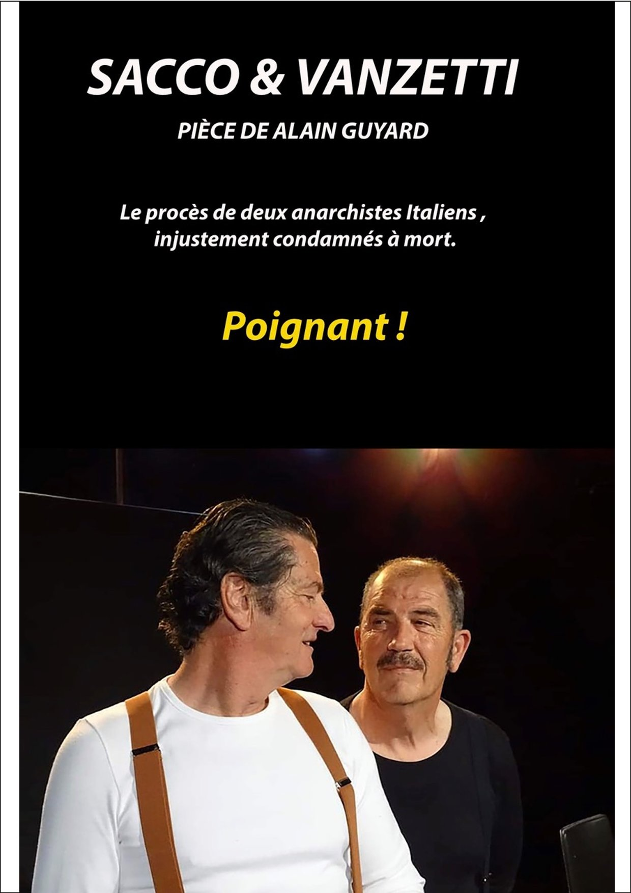
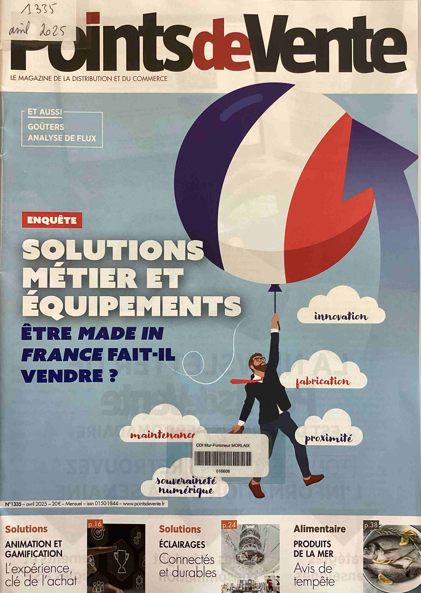
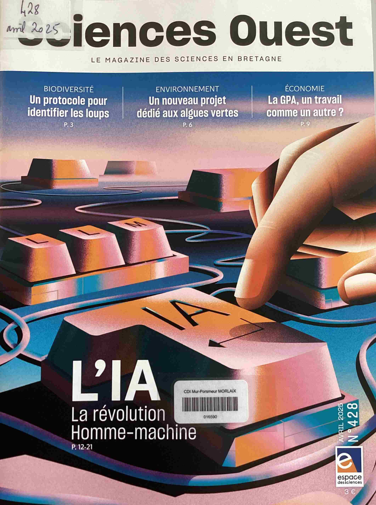
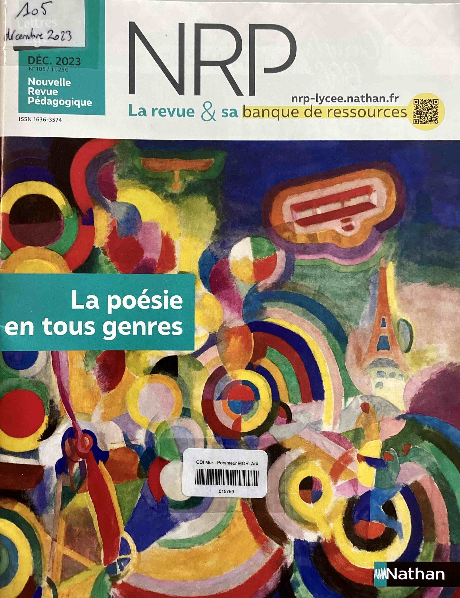
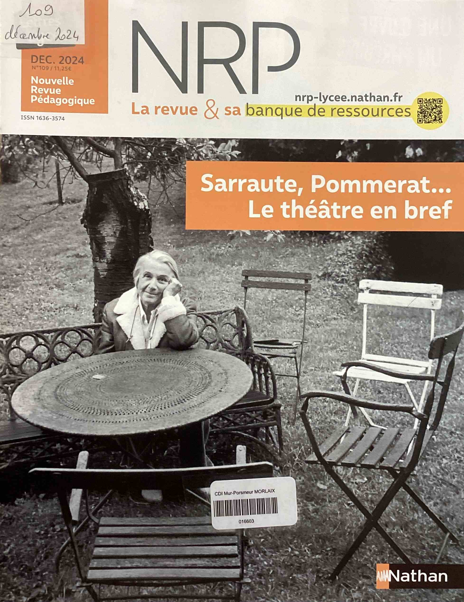

???+ example inline end "Actualités ECA.M"
       
    [{width=90% align=right}](https://www.ecmorlaix.fr/actualites/){target=_blank}

## Rendez-vous
???+ "**CAFE PHILO** ==<u>**Prochain RDV mardi 29/04/2025**</u>=="
    {width=80% align=left}

??? "**QUART D'HEURE DE LECTURE** ==<u>**RDV au CDI à 12h51, tous les jours sauf le mercredi**</u>=="
    {width=60% align=left}
    {width=60% align=left}

## Expositions et projets
??? "**Semaine de la presse et des médias** ==<u>**24 au 29 mars 2025**</u>=="
    [{width=70% align=left}](https://www.clemi.fr/actions-educatives/semaine-de-la-presse-et-des-medias){target=_blank}

  
??? "**Villes pour la vie, villes contre la peine de mort - ==<u>29/11/2024</u>==**"
    
    ==**Sacco et Vanzetti**==

    {width=35% align=right}
    
    Après la visite d'Antoinette Chahine, l'année dernière, dans le cadre de la journée mondiale des ==**"Villes pour la vie, villes contre la peine de mort"**==, plusieurs classes du lycée assisteront vendredi 29 novembre, au spectacle "Sacco et Vanzetti".
    Cette pièce d'Alain Guyard interprétée par Yves Briens et Dominique Babillote retrace l'histoire de deux anarchistes italiens Nicola Sacco et Bartolomeo Vanzetti, qui furent accusés de hold up et de crimes et exécutés le 23 août 1927, après un simulacre de procès. Le 23 août 1977, exactement 50 ans jour pour jour après leur exécution, le gouverneur du Massachusetts, Michael Dukakis, avait déclaré l'annulation du procès.
    
    Pour ceux qui n'ont pu assister à la représentation, vous pouvez la retourver [**ICI**](https://www.youtube.com/watch?v=knlNTig-Ino){target=_blank}

    Le 30 novembre 1786 est la date qui marque la Commémoration annuelle de la première abolition de la peine de mort par un Etat, le Grand Duché de Toscane, le 30 novembre 1786.
   
    Chaque 30 novembre, cette commémoration a pour objectif d'affirmer la valeur de la vie et de s'opposer à la peine de mort. Les « villes [engagées] villes pour la vie, villes contre la peine de mort » partout à travers le monde, s’illuminent pour dire à l'unisson ==**« Non à la peine de mort ! »**==. 

    Voilà 11 ans que la ville de Morlaix est engagée dans ce combat contre la peine de mort relayé par les associations, [**Amnesty international**](https://www.amnesty.fr/){target=_blank}, l’[**ACAT**](https://www.acatfrance.fr/){target=_blank} et la [**Ligue des droits de l’homme**](https://www.ldh-france.org/){target=_blank}. Si ce combat vous intéresse, n'hésitez pas à vous rapprocher de l'une ou l'autre de ces associations.
    
  
## Nos élèves ont du talent
??? "**Concours d'éloquence**"
    Les candidats étaient moins nombreux cette année, mais ils sont allés au bout de leur engagement et ont ainsi tous beaucoup progressé. La finale, jeudi 20 mars, se déroulait en deux temps : un **discours**, entre 5 et 8 minutes, sur un sujet tiré au sort (La démocratie, un régime en danger - L’IA, une amie qui vous veut du bien ? - L’union fait la force. - La fin justifie les moyens) et une **question d’improvisation** commune : Quel est votre plus grand rêve ? C’est Alexis qui a remporté la finale devant Thibault, Maël et Henri. Bravo à tous !

    {width=45% align=left}
    {width=45% align=left}
   

## Nouveautés

### Presse
???+ Info "Visualiser les "Unes" "
    ==**Déroulez**== pour découvrir les "Unes" du kiosque du mois en cours, du mois précédent, ou des langues vivantes... puis ==**cliquez**== pour accéder au ==**sommaire du numéro**==.   
    Retrouvez tous ces périodiques au CDI pour lire, sur place, les articles qui vous intéressent ou emprunter un magazine.
   
??? "**Kiosque du mois** :newspaper:"
    
    [{width=20%}](./images/abonnements/03_mars_2025/Aide-soignante_202503_265.pdf){target=_blank}
    [{width=20%}](./images/abonnements/04_avril_2025/Alternatives_economiques_202504_457.pdf){target=_blank}
    [{width=20%}](./images/abonnements/04_avril_2025/Alternatives_economiques_202504_131HS.pdf){target=_blank}
    [{width=20%}](./images/abonnements/04_avril_2025/Ca_m_interesse_202504_530.pdf){target=_blank}
    [{width=20%}](./images/abonnements/04_avril_2025/Capital_202504_403.pdf){target=_blank}
    [{width=20%}](./images/abonnements/03_mars_2025/Documentation_photographique_202503_8164.pdf){target=_blank}
    [{width=20%}](./images/abonnements/03_mars_2025/Journal_animation_202503_250.pdf){target=_blank}
    [{width=20%}](./images/abonnements/04_avril_2025/Lire_magazine_202504_539.pdf){target=_blank}
    [{width=20%}](./images/abonnements/04_avril_2025/Philosophie_magazine_202504_188.pdf){target=_blank}
    [{width=20%}](./images/abonnements/04_avril_2025/Points_de_vente_202504_1335.pdf){target=_blank}
    [{width=20%}](./images/abonnements/04_avril_2025/Points_de_vente_202504_1335_supplement.pdf){target=_blank}
    [{width=20%}](./images/abonnements/04_avril_2025/Que_choisir_202504_645.pdf){target=_blank}
    [{width=20%}](./images/abonnements/04_avril_2025/Que_choisir_sante_202504_203.pdf){target=_blank}
    [{width=20%}](./images/abonnements/04_avril_2025/Science_et_vie_202504_1291.pdf){target=_blank}
    [{width=20%}](./images/abonnements/03_mars_2025/Science_et_vie_202503_318HS.pdf){target=_blank}
    [{width=20%}](./images/abonnements/04_avril_2025/Science_et_vie_junior_202504_427.pdf){target=_blank}
    [{width=20%}](./images/abonnements/03_mars_2025/Science_et_vie_junior_202503_170HS.pdf){target=_blank}
    [{width=20%}](./images/abonnements/04_avril_2025/Sciences_et_avenir_202504_938.pdf){target=_blank}
    [{width=20%}](./images/abonnements/04_avril_2025/Sciences_et_avenir_202504_221HS.pdf){target=_blank}
    [{width=20%}](./images/abonnements/04_avril_2025/Sciences_humaines_202504_377.pdf){target=_blank}
    [{width=20%}](./images/abonnements/12_decembre_2024/Sciences_humaines_les_grands_dossiers_2024_12_77.pdf){target=_blank}
    [{width=20%}](./images/abonnements/04_avril_2025/Sciences_ouest_202504_428.pdf){target=_blank}
    [{width=20%}](./images/abonnements/03_mars_2025/Sport_et_vie_202503_209.pdf){target=_blank}
    [{width=20%}](./images/abonnements/12_decembre_2024/Sport_et_vie_2024_12_61HS.pdf){target=_blank}
    [{width=20%}](./images/abonnements/02_fevrier_2025/Tangente_202501_221.pdf){target=_blank}
    [{width=20%}](./images/abonnements/12_decembre_2024/Tangente_2024_12_92HS.pdf){target=_blank}
    [{width=20%}](./images/abonnements/04_avril_2025/Virgule_202504_238.pdf){target=_blank}

??? "**Kiosque du mois dernier** :newspaper:"       

    [{width=20%}](./images/abonnements/03_mars_2025/Aide-soignante_202503_265.pdf){target=_blank}
    [{width=20%}](./images/abonnements/03_mars_2025/Alternatives_economiques_202503_456.pdf){target=_blank}
    [{width=20%}](./images/abonnements/03_mars_2025/Ca_m_interesse_202503_529.pdf){target=_blank}
    [{width=20%}](./images/abonnements/12_decembre_2024/Capital_2024_12_399.pdf){target=_blank}
    [{width=20%}](./images/abonnements/03_mars_2025/Documentation_photographique_202503_8164.pdf){target=_blank}
    [{width=20%}](./images/abonnements/03_mars_2025/Journal_animation_202503_250.pdf){target=_blank}
    [{width=20%}](./images/abonnements/03_mars_2025/Lire_magazine_202503_538.pdf){target=_blank}
    [{width=20%}](./images/abonnements/03_mars_2025/Philosophie_magazine_202503_187.pdf){target=_blank}
    [{width=20%}](./images/abonnements/03_mars_2025/Points_de_vente_202503_1334.pdf){target=_blank}
    [{width=20%}](./images/abonnements/03_mars_2025/Que_choisir_202503_644.pdf){target=_blank}
    [{width=20%}](./images/abonnements/03_mars_2025/Que_choisir_sante_202503_202.pdf){target=_blank}
    [{width=20%}](./images/abonnements/03_mars_2025/Science_et_vie_202503_1290.pdf){target=_blank}
    [{width=20%}](./images/abonnements/03_mars_2025/Science_et_vie_202503_318HS.pdf){target=_blank}
    [{width=20%}](./images/abonnements/03_mars_2025/Science_et_vie_junior_202503_426.pdf){target=_blank}
    [{width=20%}](./images/abonnements/03_mars_2025/Science_et_vie_junior_202503_170HS.pdf){target=_blank}
    [{width=20%}](./images/abonnements/03_mars_2025/Sciences_et_avenir_202503_937.pdf){target=_blank}
    [{width=20%}](./images/abonnements/01_janvier_2025/Sciences_et_avenir_202501_220HS.pdf){target=_blank}
    [{width=20%}](./images/abonnements/03_mars_2025/Sciences_humaines_202503_376.pdf){target=_blank}
    [{width=20%}](./images/abonnements/12_decembre_2024/Sciences_humaines_les_grands_dossiers_2024_12_77.pdf){target=_blank}
    [{width=20%}](./images/abonnements/03_mars_2025/Sciences_ouest_202503_427.pdf){target=_blank}
    [{width=20%}](./images/abonnements/03_mars_2025/Sport_et_vie_202503_209.pdf){target=_blank}
    [{width=20%}](./images/abonnements/12_decembre_2024/Sport_et_vie_2024_12_61HS.pdf){target=_blank}
    [{width=20%}](./images/abonnements/02_fevrier_2025/Tangente_202501_221.pdf){target=_blank}
    [{width=20%}](./images/abonnements/12_decembre_2024/Tangente_2024_12_92HS.pdf){target=_blank}
    [{width=20%}](./images/abonnements/03_mars_2025/Virgule_202503_237.pdf){target=_blank}        
   
    
??? "**Kiosque des langues vivantes** :gb: :de: :es: :it: :cn:"
    
    ??? Example ":gb: **Anglais** :gb:"
    [{width=20%}](./images/abonnements/langues/Vocable_anglais_202504_908.pdf){target=_blank}
    
    ??? Example ":de: **Allemand** :de:"
    [{width=20%}](./images/abonnements/langues/Vocable_allemand_202501_898.pdf){target=_blank}
    [{width=20%}](./images/abonnements/langues/Vocable_allemand_202502_899.pdf){target=_blank}
    [{width=20%}](./images/abonnements/langues/Vocable_allemand_202503_900.pdf){target=_blank}
    [{width=20%}](./images/abonnements/langues/Vocable_allemand_202504_901.pdf){target=_blank}

    
    ??? Example ":es: **Espagnol** :es:"
    [{width=20%}](./images/abonnements/langues/Vocable_espagnol_202501_891.pdf){target=_blank}
    [{width=20%}](./images/abonnements/langues/Vocable_espagnol_202503_893.pdf){target=_blank}
    [{width=20%}](./images/abonnements/langues/Vocable_espagnol_202504_894.pdf){target=_blank}
    

??? "**Pour les enseignants**"
    
    ??? Example "**Cahiers pédagogiques**"
    
    [{width=20%}](./images/abonnements/enseignants/Cahiers_pedagogiques_janvier_2024_590.pdf){target=_blank}
    [{width=20%}](./images/abonnements/enseignants/Cahiers_pedagogiques_fevrier_2024_591.pdf){target=_blank}
    [{width=20%}](./images/abonnements/enseignants/Cahiers_pedagogiques_avril_2024_592.pdf){target=_blank}
    [{width=20%}](./images/abonnements/enseignants/Cahiers_pedagogiques_mai_2024_593.pdf){target=_blank}
    [{width=20%}](./images/abonnements/enseignants/Cahiers_pedagogiques_2024_09_595.pdf){target=_blank}
    [{width=20%}](./images/abonnements/enseignants/Cahiers_pedagogiques_2024_11_596.pdf){target=_blank}
    [{width=20%}](./images/abonnements/enseignants/Cahiers_pedagogiques_202501_597.pdf){target=_blank}
    [{width=20%}](./images/abonnements/enseignants/Cahiers_pedagogiques_202502_598.pdf){target=_blank}
    [{width=20%}](./images/abonnements/enseignants/Cahiers_pedagogiques_202503_599.pdf){target=_blank}

    ??? Example "**NRP Lycée**"
    
    [{width=20%}](./images/abonnements/enseignants/NRP_lycee_202303_102.pdf){target=_blank}
    [{width=20%}](./images/abonnements/enseignants/NRP_lycee_202306_103.pdf){target=_blank}
    [{width=20%}](./images/abonnements/enseignants/NRP_lycee_202309_104.pdf){target=_blank}
    [{width=20%}](./images/abonnements/enseignants/NRP_Lycee_202312_105.pdf){target=_blank}
    [{width=20%}](./images/abonnements/enseignants/NRP_Lycee_202403_106.pdf){target=_blank}
    [{width=20%}](./images/abonnements/enseignants/NRP_lycee_202405_107.pdf){target=_blank}
    [{width=20%}](./images/abonnements/enseignants/NRP_lycee_202409_108.pdf){target=_blank}
    [{width=20%}](./images/abonnements/enseignants/NRP_lycee_202412_109.pdf){target=_blank}
    [{width=20%}](./images/abonnements/enseignants/NRP_lycee_202503_110.pdf){target=_blank}

### **Orientation**
???+ "**Kiosque ONISEP**"
    Notices des dernières nouveautés à retrouver sur le [**Portail PMB**](https://ecmorlaix.basecdi.fr/pmb/opac_css/index.php?lvl=cmspage&pageid=4&id_article=62){target=_blank}.

    
### **Coups de coeur** :heart: 

- [**Littérature positive**](https://ecmorlaix.basecdi.fr/pmb/opac_css/index.php?lvl=cmspage&pageid=4&id_article=60){target=_blank} : sélection de romans pour tous. ==**A LIRE SANS MODERATION !**==

    
	

