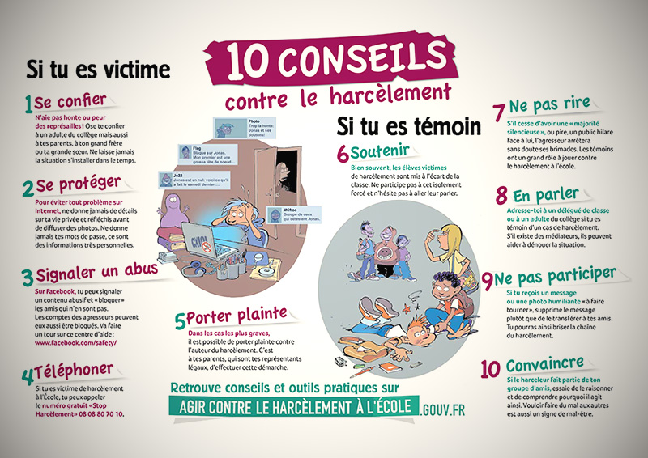

## Actualités
???+ tip "Guerre en Ukhraine"

       === "S'informer"
           - [**FranceInter**](https://www.franceinter.fr/monde/carte-quels-pays-aident-l-ukraine-dans-la-guerre-contre-la-russie-et-comment){target=_blank}
           - [**FranceInfo**](https://www.francetvinfo.fr/monde/europe/manifestations-en-ukraine/){target=_blank}
           - [**Le dessous des cartes**](https://www.arte.tv/fr/videos/RC-014036/le-dessous-des-cartes/){target=_blank}
       === "Soutenir"
           - [**Aider et soutenir l'Ukhraine**](https://www.service-public.fr/particuliers/actualites/A15542){target=_blank} : don en argent aux associations, accueil des réfugiés...
         

## Ressources

??? "Incontournables"
    - [**Service public**](https://www.service-public.fr/){target=_blank} le site officiel de l'administration française.
    - [**Fiches citoyenneté**](https://www.vie-publique.fr/fiches/citoyennete){target=_blank} du site Vie Publique.
    - [**Journée Défense et Citoyenneté**](https://presaje.sga.defense.gouv.fr/){target=_blank}

## Citoyenneté et enseignement
- Présentation du ==**parcours citoyen**== sur le site [**Eduscol**](https://www.education.gouv.fr/le-parcours-citoyen-5993){target=_blank}
- Rappel des [**valeurs de la République**](https://www.reseau-canope.fr/valeurs-de-la-republique.html){target=_blank} portées par l'enseignement.

## S'engager

### Contre le harcèlement

{width=30% align=left}

La prévention et la lutte contre le harcèlement est une des priorités du Ministère de l'Education Nationale [**Site du ministère**](https://www.education.gouv.fr/lutte-contre-le-harcelement-l-ecole-289530){target=_blank}

Le harcèlement peut prendre différentes formes. Pour comprendre et agir rendez-vous sur le site [**Eduscol**](https://eduscol.education.fr/974/le-harcelement-entre-eleves){target=_blank}.
{width=50% align=right}

### "SNU"
    - Présentation et principes du Service National Universel sur le [**site officiel**](https://www.snu.gouv.fr/){target=_blank}
    
### "Vie associative"

