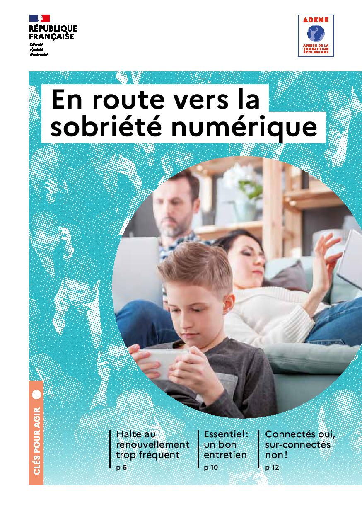
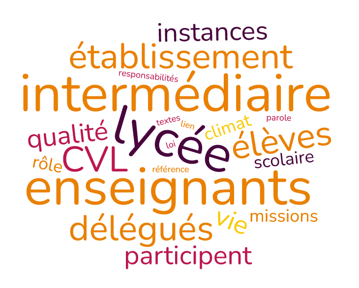

???+ example inline end "Liens utiles :"
    * [**Vie publique**](https://www.vie-publique.fr/){target=_blank}
    * [**Villes voisines**](https://demarchesadministratives.fr/cio-information-orientation/morlaix-29600){target=_blank}
    * [**Démarches administratives**](https://demarchesadministratives.fr/demarches/categorie/formation-recherche-demploi/etudier-en-france){target=_blank}
    * [**Vie associative**](https://www.ville.morlaix.fr/VIVRE-A-MORLAIX/Vie-associative){target=_blank}
    
## Actualités

[{width=20% align=left}](./pdf/guide-en-route-vers-sobriete-numerique.pdf){target=_blank}

* [**La sobriété numérique**](./pdf/guide-en-route-vers-sobriete-numerique.pdf){target=_blank} ou comment profiter du numérique en gardant le contrôle ? 

    **^^Au sommaire :^^** 
    
* La face cachée du numérique 
    
* Halte au renouvellement trop fréquent 
    
* Essentiel : un bon entretien

* Connectés oui, surconnectés non

* Limiter le poids et le parcours des données

## Citoyenneté et enseignement
- Présentation du ==**parcours citoyen**== sur le site [**Eduscol**](https://www.education.gouv.fr/le-parcours-citoyen-5993){target=_blank}
- Rappel des [**valeurs de la République**](https://www.reseau-canope.fr/valeurs-de-la-republique.html){target=_blank} portées par l'enseignement.         

## Ressources

??? "**Incontournables**"
    - [**Service public**](https://www.service-public.fr/){target=_blank} le site officiel de l'administration française.
    - [**Fiches citoyenneté**](https://www.vie-publique.fr/fiches/citoyennete){target=_blank} du site Vie Publique.
    - [**Journée Défense et Citoyenneté**](https://presaje.sga.defense.gouv.fr/){target=_blank}

## S'engager
    

### Délégués - CVL
??? "**Délégué pour quoi faire ?**"
    ???+ "**Présentation**"
        {width=50% align=right}
        Porte-paroles de tous les élèves auprès des enseignants et des autres adultes de l'établissement, les ==**délégués**==  et membres du ==**CVL**== font partie des ==**instances lycéennes**== qui participent à la qualité du ==**climat scolaire**==. 
    
        - Tout savoir sur le [**rôle des délégués et du CVL**](https://www.education.gouv.fr/les-representants-des-eleves-au-college-et-au-lycee-7514){target=_blank}
        
        - Accéder aux [**textes de référence**](https://www.service-public.fr/particuliers/vosdroits/F1370){target=_blank}.

        - Rôle spécifique des [**éco-délégués**](https://www.education.gouv.fr/des-eleves-eco-delegues-pour-agir-en-faveur-du-developpement-durable-10835){target=_blank} en faveur du développement durable. 

    ??? "**Actualités du CVL**"

    ??? "**Projets de l'année**"

### Contre le harcèlement

???+ info ""
    {width=30% align=left}

    La lutte contre le harcèlement est une des priorités du [**Ministère de l'Education Nationale**](https://www.education.gouv.fr/non-au-harcelement){target=_blank}. Le harcèlement peut prendre différentes formes. 
    
    {width=60% align=right}

### Service National Universel

???+ info ""
    
    Présentation et principes du **SNU** sur le [**site officiel**](https://www.snu.gouv.fr/){target=_blank}

    [{width=35% align=left}](https://www.snu.gouv.fr/){target=_blank}
    
    
### Vie associative

??? "Présentation"
    === "SITES INSTITUTIONNELS"
        - [**Associations.gouv.fr**](https://www.associations.gouv.fr/){target=_blank}
        - [**JeVeuxAider.gouv.fr**](https://www.jeveuxaider.gouv.fr/){target=_blank}
        - [**France Bénévolat**](https://www.francebenevolat.org/benevoles/devenir-benevole-un-geste-simple){target=_blank}
    === "A MORLAIX"
        - [**Vie associative**](https://www.morlaix.bzh/vivre-a-morlaix/vie-associative){target=_blank}

        
    

