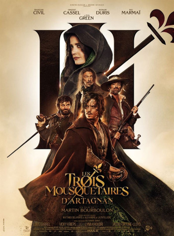
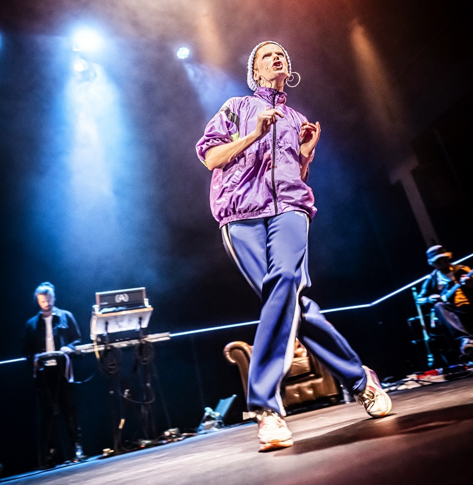

???+ example inline end "Liens utiles"
    [{width=90%}](https://pass.culture.fr/){target=_blank}
    [{width=85%}](https://www.cyrano.education/home){target=_blank}
    [{width=125%}](https://www.agendaculturel.fr/){target=_blank}
    [{width=90%}](https://melotick.com/)
    
    - [**Ministère de la culture**](https://www.culture.gouv.fr/){target=_blank}
    - [**Culture et patrimoine**](https://www.cultureetpatrimoine.com/){target=_blank}
    - [**Institut National d'Histoire de l'Art**](https://www.inha.fr/fr/ressources/eac/sitographie.html)
    - [**Histoire des arts**](https://histoiredesarts.culture.gouv.fr/){target=_blank}
    - [**Panorama des arts**](https://panoramadelart.com/){target=_blank}

## Actualités

???+ "**CYRANO la plateforme dédiée au théâtre**"
    Visionnez les captations intégrales des pièces de théâtre actuellement au programme.
    ==**Théâtre classique - Théâtre contemporain - Théâtre de Molière**== 
    
    [{width=20%}](https://www.cyrano.education/home){target=_blank}
        

???+ "**PASS CULTURE**"
    Ce qui change à compter du 1er mars 2025 - [**Actualité**](https://pass.culture.fr/actualite/reforme-du-pass-culture){target=_blank}

    Comment s'inscrire sur l'application [**PASS CULTURE**](https://pass.culture.fr/){target=_blank}
    
    [{width=35%}](https://educonnect.education.gouv.fr/){target=_blank}

## Projets culturels au lycée
???+ "**Projets d'éducation artistique et culturelle au lycée**"
  
    === "CINEMA"
        ???+ "Découvrir des oeuvres cinématographiques"

            L'[**Association Film&Culture - Brest**](https://www.film-et-culture.fr/){target=_blank} intervient au lycée pour des ateliers de lecture de l'image et des circuits.
        
            **Les films présentés cette année** (==*Cliquez sur l'affiche pour accéder à la fiche sur le film*==) :

            [{width=20%}](./images/culture/FC_Les_suffragettes.pdf){target=_blank}
            [{width=20%}](./images/culture/FC_1917_00.pdf){target=_blank}
            [{width=20%}]
       
            [{width=19%}](./images/culture/FC_Lecole_du_bout_du_monde.pdf){target=_blank}
            [{width=19%}](./pdf/Je_verrai_toujours_vos_visages.pdf){target=_blank}
            [{width=19%}](./images/culture/FC_The_good_lie.pdf){target=_blank}
            [{width=20%}]

            **Ci-dessous, les films présentés en 2023-2024** :

            [{width=20%}](./pdf/Illusions_perdues_fiche_film_et_culture.pdf){target=_blank}
            [{width=19%}](./pdf/Woman_at_war.pdf){target=_blank}
            [{width=19%}](./pdf/Je_verrai_toujours_vos_visages.pdf){target=_blank}

            [{width=19%}](./pdf/Le_discours_d_un_roi.pdf){target=_blank}
            [{width=19%}](./pdf/Un_triomphe.pdf){target=_blank}
            [{width=19%}](./pdf/La_Couleur_de_la_victoire.pdf){target=_blank}
            [{width=19%}](./pdf/Trois_mousquetaires.pdf){target=_blank}
       
    
    === "THEATRE"
        La proximité du [**Théâtre du Pays de Morlaix**](https://www.theatre-du-pays-de-morlaix.fr/){target=_blank} permet d'offrir aux élèves la possibilité d'assister à des représentations d'oeuvres de spectacle vivant.

        **Saison 2024-2025** :

        [{width=20%}](https://www.theatre-du-pays-de-morlaix.fr/Howl2122.html){target=_blank}
        [{width=20%}](https://www.theatre-du-pays-de-morlaix.fr/Iphigenie-a-Splott.html){target=_blank}
        [{width=26%}](https://www.theatre-du-pays-de-morlaix.fr/Macbeth.html){target=_blank}
        [{width=28%}](https://www.theatre-du-pays-de-morlaix.fr/18-34.html){target=_blank}
        [{width=28%}](https://www.theatre-du-pays-de-morlaix.fr/Le-Processus.html){target=_blank}
        [{width=28%}](https://www.theatre-du-pays-de-morlaix.fr/4211-km.html){target=_blank}
        [{width=28%}](https://www.theatre-du-pays-de-morlaix.fr/Camarades.html){target=_blank}
        [{width=28%}](https://www.theatre-du-pays-de-morlaix.fr/Nos-corps-empoisonnes.html){target=_blank}
        [{width=28%}](https://www.theatre-du-pays-de-morlaix.fr/Un-Misanthrope.html){target=_blank}

        **Saison 2023-2024** :

        [{width=28%}](https://www.theatre-du-pays-de-morlaix.fr/A-la-renverse.html){target=_blank}
        [{width=28%}](https://www.theatre-du-pays-de-morlaix.fr/37-Cielskaia.html){target=_blank}
        [{width=28%}](https://www.theatre-du-pays-de-morlaix.fr/Normalito.html){target=_blank}
        [{width=28%}](https://www.theatre-du-pays-de-morlaix.fr/Peter-Pan.html){target=_blank}
        [{width=28%}](https://www.theatre-du-pays-de-morlaix.fr/Fahrenheit-451.html){target=_blank}
        [{width=28%}](https://www.theatre-du-pays-de-morlaix.fr/A-la-ligne.html){target=_blank}
        [{width=28%}](https://www.theatre-du-pays-de-morlaix.fr/Mes-parents.html){target=_blank}

  
    === "EXPOSITIONS"
        ???+ "**Exposition en cours au FHEL - Landerneau**"
    
            [{width=45%}](https://www.fonds-culturel-leclerc.fr/en-cours-henri-cartier-bresson-642-26-0-0.html){target=_blank}
        
                        
        ???+ "**Les élèves de l'option ARTS PLASTIQUES en visite à Brest**"
            
            Mercredi 3 mai, les élèves de 2nde de l'option arts plastiques ont visité l'[EESAB](https://www.eesab.fr/){target=_blank} école des Beaux-Arts de Brest : l'occasion de découvrir les modalités du concours et les spécificités pédagogiques en post-bac.  Après la visite du musée des Beaux-Arts, où s'est improvisé un petit atelier, le groupe s'est rendu à l'espace des Capucins, puis au centre d'art contemporain "La Passerelle" où ils ont découvert le travail d'artistes en résidence.
            
            {width=40% align=left}
            {width=40% align=left}

    
    === "JEUNES EN LIBRAIRIE"
            
        Les élèves de 1AEPA, Term EPC et AEPE ont participé cette année au programme [**Jeunes en librairie**](https://daac.ac-rennes.fr/spip.php?article2268){target=_blank}, projet d’éducation artistique et culturelle autour des professionnels du livre et de la librairie.
 
        Dans ce cadre, ils ont rencontré Yuna de la [**Librairie Dialogues Morlaix**](https://www.dialoguesmorlaix.com/){target=_blank} partenaire du projet, d'abord au lycée puis à la librairie. Ce fut l'occasion pour eux, de découvrir en quoi consiste le travail d'une librairie indépendante, mais aussi d'en apprendre un peu plus sur le circuit du livre ou les métiers en lien avec l'édition et le monde du livre.
        
        Les élèves ont également eu la chance de rencontrer l'autrice [**Louise Delgado**](https://www.librinova.com/auteur/louise-delgado){target=_blank}, le 24 janvier, à l'occasion de la sortie de son livre "Vers les ténébres" (2ème tome de la série "Les derniers gardiens"). Les élèves ont questionné l'autrice sur ses sources d'inspiration, ses habitudes de travail, mais aussi ses projets futurs : des échanges très appréciés et parfois utiles pour certains d'entre eux qui ayant des projets d'écriture, ont découvert les possibilités offertes par l'autoédition. 

        Les élèves étaient ravis de leurs achats en librairie avec le chèque livre de 20 € qui leur était offert dans le cadre du dispositif "Jeunes en librairie".
   
      
        {width=45% align=right}
        {width=45% align=right}
        {width=45% align=right}
        {width=45% align=right}

        
        

## La culture à Morlaix

La [**ville de Morlaix**](https://www.ville.morlaix.fr/VIVRE-A-MORLAIX/Culture-Loisirs){target=_blank} propose une offre culturelle diversifiée. Sur le site de la ville, vous  trouverez des informations pratiques concernant les animations, expositions, et infrastuctures diverses : adresses, horaires, programmations des salles de spectacles, cinémas, bibliothèques...

???+ "Accéder aux sites officiels de ces lieux culturels"

    === "CINEMA"
        * [**Cinéma Le Rialto**](https://www.allocine.fr/seance/salle_gen_csalle=P0357.html){target=_blank}
        * [**La Salamandre**](https://cinemalasalamandre.fr/){target=_blank}
    === "MUSEES"
        * [**Artothèque Les moyens du bord**](https://lesmoyensdubord.wordpress.com/){target=_blank}
        * [**Espace des sciences**](https://www.espace-sciences.org/morlaix){target=_blank}
        * [**Musée de Morlaix**](https://musee.ville.morlaix.fr/){target=_blank}
        * [**La Virgule**](https://www.ville.morlaix.fr/VIVRE-A-MORLAIX/Culture-Loisirs/La-Virgule){target=_blank}
    === "SPECTACLES VIVANTS"
        * [**MJC**](https://www.mjcmorlaix.com/){target=_blank} (Maison des Jeunes et de la Culture)
        * [**Le Roudour**](https://www.espace-roudour.com/){target=_blank}
        * [**Sew**](https://www.sew-morlaix.com/){target=_blank}
        * [**Théâtre du Pays de Morlaix**](https://www.theatre-du-pays-de-morlaix.fr/){target=_blank}
    === "EXPOSITIONS - CONFERENCES"
        ???+ info "**L'Espace des sciences**"
     
            Le [**Programme**](https://www.espace-sciences.org/morlaix/programme){target=_blank} du mois de l'[**Espace des sciences**](https://www.espace-sciences.org/morlaix){target=_blank} 
        
            Collection [**Les Mardis de l'Espace des sciences **](https://www.espace-sciences.org/conferences/conferenciers){target=_blank} (Les Champs libres - Rennes)

## et un peu plus loin...

??? "Finistère"
    * [**FHEL - Landerneau**](https://www.fonds-culturel-leclerc.fr/){target=_blank}
    * [**Ateliers des Capucins**](https://www.ateliersdescapucins.fr/fr){target=_blank}
    * [**Le Quartz - Brest**](https://www.lequartz.com/){target=_blank}
    * [**Musée National de la Marine - Brest**](https://www.musee-marine.fr/brest){target=_blank}
    * [**Musée des Beaux-Arts - Quimper**](https://www.mbaq.fr/){target=_blank}

    
??? "Bretagne"
    * [**Les Champs Libres**](https://www.espace-sciences.org/){target=_blank} : Espace des sciences à Rennes.
    * [**Cycle de conférences : les Mardis de l'Espace des sciences**](https://www.espace-sciences.org/conferences/conferenciers){target=_blank}
    * [**Annuaire des salles culturelles**](https://www.spectable.com/bretagne/annuaire-culture/salles-spectacles/n_187-l_31.php){target=_blank}

## Ressources

### Culture et enseignement

??? "Sites incontournables"
    * [**Eduscol**](https://eduscol.education.fr/2347/disciplines){target=_blank}
    * [**Actions éducatives**](https://eduscol.education.fr/100/je-mene-un-projet-avec-mes-eleves){target=_blank}

### Cinéma

??? "Sites incontournables"
    * [**Cinémathèque de Bretagne**](https://www.cinematheque-bretagne.bzh/){target=_blank}
    * [**Centre National du cinéma et de l'image animée**](https://www.cnc.fr/){target=_blank}

### Théâtre

??? "Sites incontournables"
    * [**Théâtral magazine**](https://www.theatral-magazine.com/){target=_blank} : L'actualité de la création théâtrale.
    * [**Sceneweb**](https://sceneweb.fr/){target=_blank} : L'actualité du spectacle vivant.
    * [**Captations complètes ou extraits**](http://www.pearltrees.com/bordeauxdaac/captation-complete-extraits/id12715437){target=_blank} de pièces de théâtre.

### Musées

??? "En France"

    Pour rechercher un musée en France, par régions ou par départements, cet [**annuaire des musées**](https://www.omusee.com/){target=_blank} est bien utile.
    
    Tout comme le site des  plus beaux [**musées de France**](https://www.les-musees-de-france.fr/){target=_blank}.
    
    Autre lien intéressant les [**Expositions virtuelles de le BNF**](http://expositions.bnf.fr/){target=blank}

    ???info "Sites des musées"
        * [**Grand Palais**](https://www.grandpalais.fr/fr){target=_blank}
        * [**Le Louvre**](https://www.louvre.fr/visites-en-ligne){target=_blank}
        * [**Musée d'Orsay**](https://www.musee-orsay.fr/fr){target=_blank}
    
??? "A l'étranger"

    * [**British Museum**](https://www.britishmuseum.org/){target=_blank}

