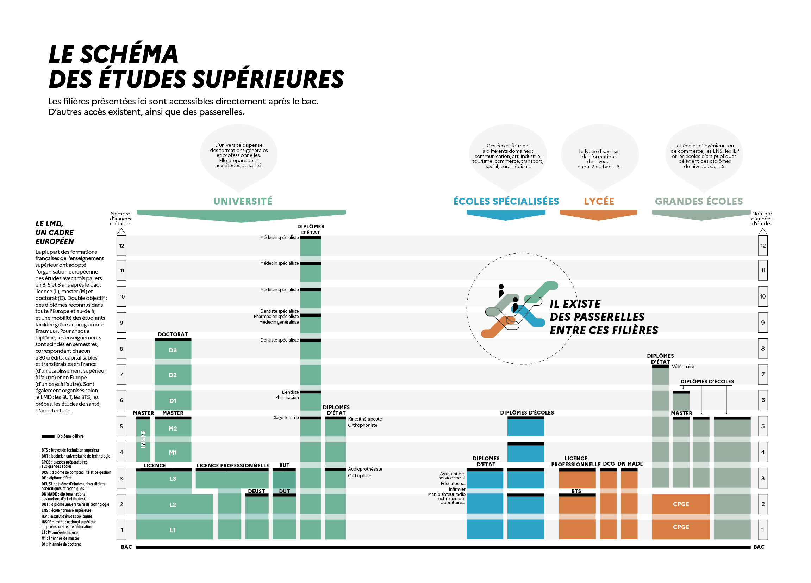

# Actualités

==**MESSAGE DE M. QUINIO** (24/02/2021) à l'intention des élèves de terminale==

{align=left width=40%}
La période des portes ouvertes des établissements supérieurs bat son plein et nous recevons chaque jour des invitations à vous transmettre. Il est important de vous rendre aux portes ouvertes des formations qui vous intéressent le plus dans la mesure de vos disponibilités.

En parallèle, vous allez devoir remplir votre dossier Parcoursup et en particulier renseigner vos projets motivés. Pour vous accompagner dans ces démarches et bien davantage, je vous joins ci-dessous des liens et une proposition de l'association morlaisienne "L'atelier des Parcours".

- Conseils pour rédiger le [**projet de formation motivé**](https://eduscol.education.fr/document/5013/download?attachment) + [**la vidéo**](https://www.youtube.com/watch?v=v-yUg8LTahQ&feature=youtu.be)
- Conseils pour rédiger la rubrique [**activités et centres d’intérêt**](https://eduscol.education.fr/document/5010/download?attachment){target=_blank}, l’équivalent du CV sur Parcoursup.
- Conseils pour remplir le [**dossier social de l’étudiant**](https://eduscol.education.fr/document/33383/download?attachment) : dossier de Bourse (logement et bourse d’études)
- La [**FAQ**](https://www.parcoursup.fr/index.php?desc=questions) très détaillée de Parcoursup.

Les invitations aux portes ouvertes, des établissements du supérieur, sont à retrouver sur le PADLET du CDI, dans les ressources ci-dessous, onglet terminale.

  {width=80%}
  
???+ info "Orientation et Parcours avenir"  
    L'actualité de l'orientation, les sites incontournables, des ressources par niveau, les salons et forums, la vie étudiante...
    
# Ressources  
    
=== "Parcours AVENIR"
    - [**Réussir au lycée et après**](https://www.education.gouv.fr/reussir-au-lycee/2021-2022-bien-preparer-son-bac-et-son-entree-dans-le-superieur-326326)
    - [**Ressources communes pour les lycéens**](https://padlet.com/cdinddmporsmeur/ORI_2020)
    
    - [**Guide Entrer dans le SUP 2022**](./pdf/GUIDE_ENTRER_DANS_LE_SUP_2022.pdf){target=_blank}
=== "SECONDE"
    [**Vers le PADLET second**e](https://padlet.com/cdinddmporsmeur/orientation_seconde_2020){target=_blank}
=== "PREMIERE"
    [**Vers le PADLET première**](https://padlet.com/cdinddmporsmeur/orientation_premiere_2020){target=_blank}
=== "TERMINALE"
    - [**PARCOURSUP - Site officiel**](https://www.parcoursup.fr/index.php?desc=){target=_blank} 
    - [**Vidéo PARCOURSUP - Comment choisir une formation ?**](https://youtu.be/WJzf3wRqcWo){target=_blank}
    - [**Ensemble des ressources de la DGESIP**](https://services.dgesip.fr/T454/S743/ressources){target=_blank}
    - [**Vers le PADLET terminale**](https://padlet.com/cdinddmporsmeur/orientation_terminale_2020){target=_blank}
    - [**Site pour les terminales**](https://ericecmorlaix.github.io/TG_VDC_AP/){target=_blank}
    - [**Que faire après un BAC STMG ?**](https://padlet.com/cdinddmporsmeur/post_bac_STMG){target=_blank}
    <figure><iframe width="560" height="315" src="https://www.youtube-nocookie.com/embed/Xg6QcfmgYXo" title="YouTube video player" frameborder="0" allow="accelerometer; autoplay; clipboard-write; encrypted-media; gyroscope; picture-in-picture" allowfullscreen></iframe></figure>
=== "VOIE PRO"
    - [**Vers le PADLET voie pro**](https://padlet.com/cdinddmporsmeur/LP_2020){target=_blank}
    - [**PARCOURSUP - Site officiel**](https://www.parcoursup.fr/index.php?desc=){target=_blank}
    - [**Vidéo PARCOURSUP - Comment choisir une formation ?**](https://youtu.be/WJzf3wRqcWo){target=_blank}
=== "SALONS-FORUMS"
    - [**Azimut**](https://www.salon-azimut.com/){target=_blank}
    - [**Salons - Forums de l'orientation**](https://www.onisep.fr/Cap-vers-l-emploi/Recherche-d-emploi/Les-salons-de-recrutement){target=_blank}
=== "VIE ETUDIANTE"
    - [**FAQ vie étudiante**](https://www.etudiant.gouv.fr/fr/rentree2021){target=_blank}
    - [**Vie étudiante : Infos, services, FAQ**](https://www.etudiant.gouv.fr/fr){target=_blank}
    - [**Jeunes.gouv.fr**](https://jeunes.gouv.fr/){target=_blank}
    - [**CROUS**](https://trouverunlogement.lescrous.fr/){target=_blank}
    - [**Mes services étudiants**](https://www.messervices.etudiant.gouv.fr/envole/){target=_blank}
        
    
    
  

    
	
	

