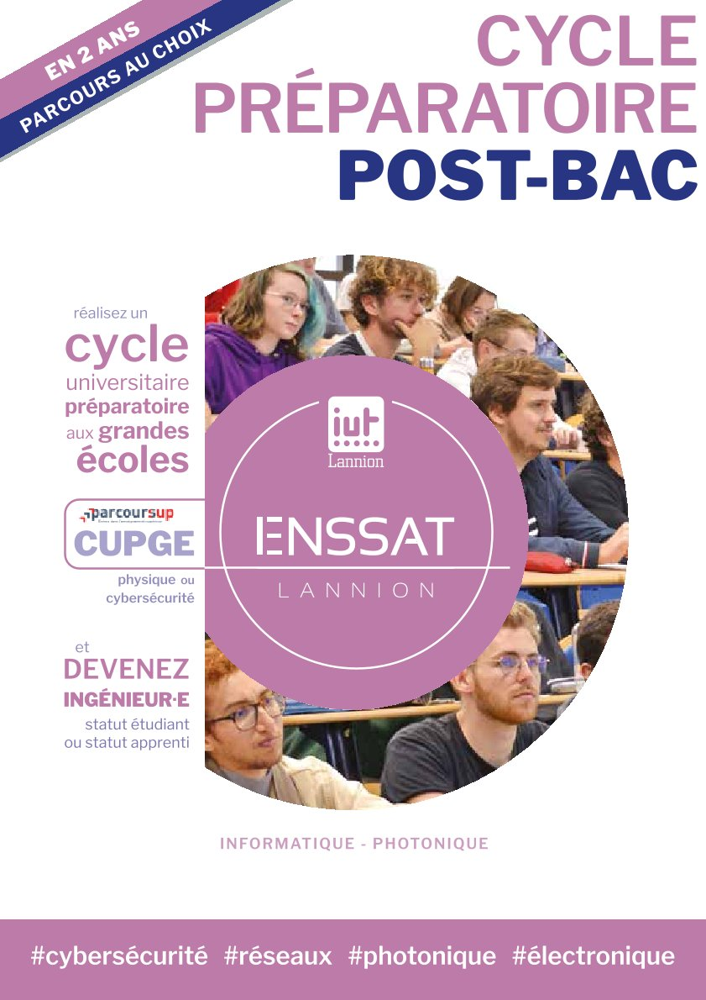
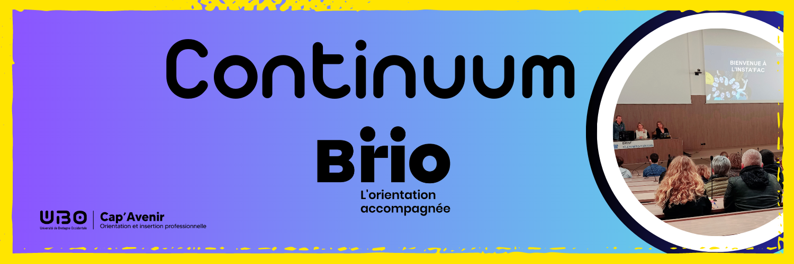
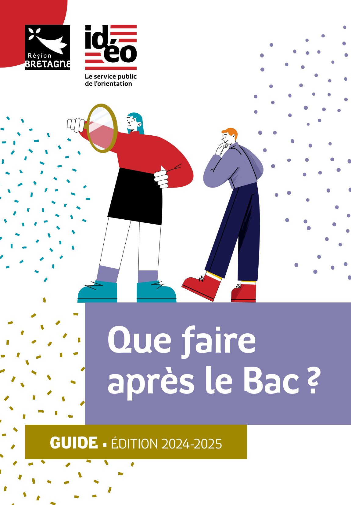
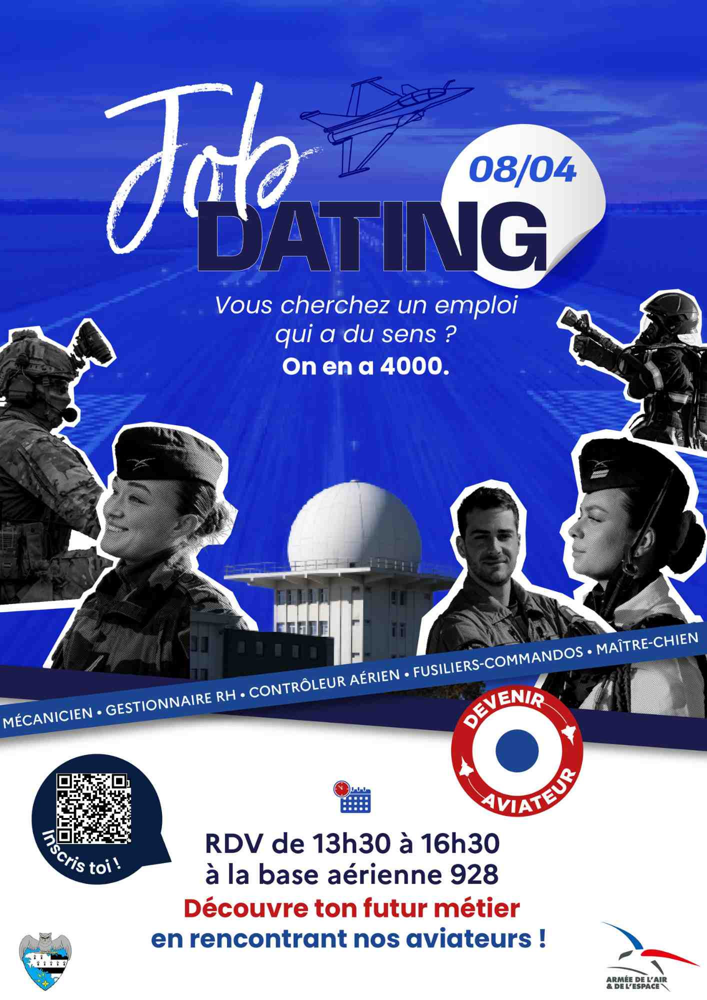
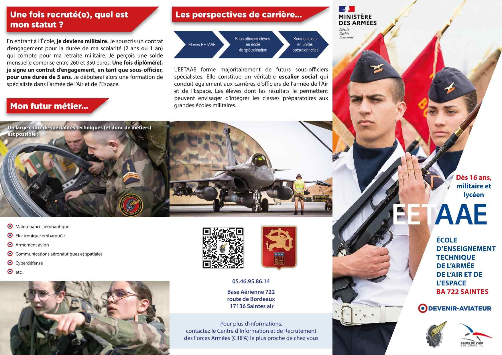
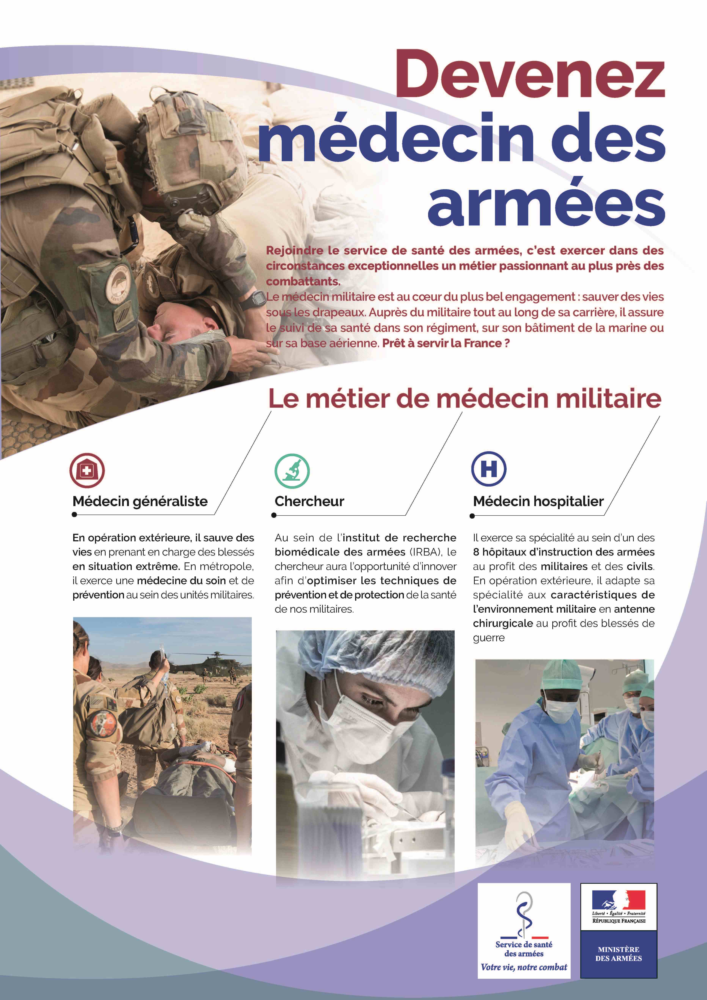
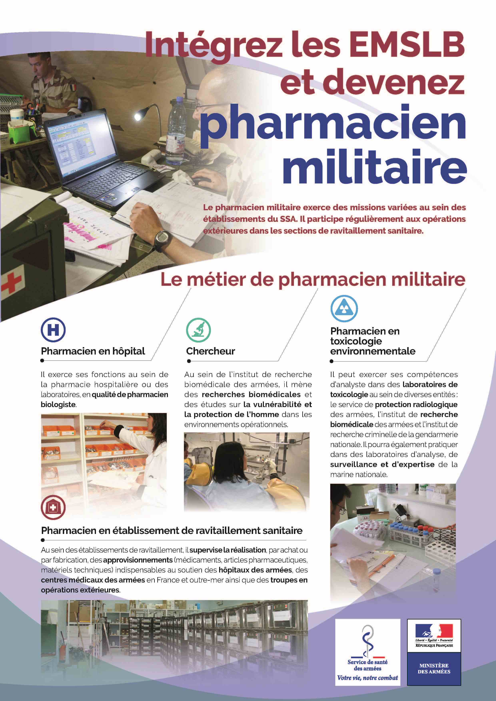

???+ example inline end "Liens utiles :"
    [{width=90%}](https://www.onisep.fr/){target=_blank}
    [{width=90%}](https://www.parcoursup.fr/index.php?desc=){target=_blank}
    
    * [**CIO Morlaix**](https://www.ac-rennes.fr/cio-morlaix){target=_blank}
    * [**CIO Région Bretagne**](https://demarchesadministratives.fr/cio-information-orientation/morlaix-29600){target=_blank}
    * [**Démarches administratives**](https://demarchesadministratives.fr/demarches/categorie/formation-recherche-demploi/etudier-en-france){target=_blank}
    * [**Vie associative**](https://www.morlaix.bzh/vivre-a-morlaix/vie-associative){target=_blank}

L'actualité de l'orientation au lycée et dans la région, les ==**sites incontournables**== pour construire son ==**parcours avenir**==, des ==**ressources par niveau**==, les informations concernant les ==**salons et forums**==, la ==**vie étudiante**==...

## ACTUALITES

???+ info "**IMMERSIONS - JOURNEES DECOUVERTES - PORTES OUVERTES**"
    [{width=35%}](https://www.connect-comtogether.com/flipbook/22c40d4ccbf0f2a17461eee1ce0380e5/#p=1){target=_blank}

    [{width=35%}](https://www.lp-rosaparks-rostrenen.ac-rennes.fr/){target=_blank}
    
    [{width=35%}](https://iut-lannion.univ-rennes.fr/){target=_blank}

    [{width=35%}](./images/orientation/2025-2026_CUPGE_Lannion_plaquette.pdf){target=_blank}

    [{width=35%}](https://www.lycee-rabelais-saint-brieuc.ac-rennes.fr/){target=_blank}
    
    [{width=45%}](https://www.linscription.com/pro/activite.php?P1=164264){target=_blank} 

    [{width=45%}](https://www.linscription.com/pro/activite.php?P1=227696){target=_blank}

    [{width=45%}](https://nouveau.univ-brest.fr/cap-avenir/fr/page/insta-fac){target=_blank}

    [{width=45%}](https://forms.office.com/pages/responsepage.aspx?id=gQWqPAeCVEaEOorw19tTeWGjZIomZ5NHgGlSRtQ5ETtUMVVIQVZXSUxLMkxXUkcyODhEOFJCRFlXNS4u&route=shorturl){target=_blank}
    
    
??? info "**Un espace au service de l'emploi**"
    - [**L'Espace métiers**](https://www.brest.fr/travailler-entreprendre/emploi-insertion/des-evenements-et-un-espace-au-service-de-lemploi-a-brest-1768.html){target=_blank} : un lieu pour s'informer à Brest métropole...
   
___ 
## RESSOURCES  

___ 
### Pour TOUS
???+ "Pour TOUS"

    [{width=80%}](https://www.onisep.fr/orientation/l-enseignement-superieur/le-schema-des-etudes-apres-le-bac){target=_blank}

    === "INCONTOURNABLES"
        - [**Réussir au lycée et APRES...**](https://www.education.gouv.fr/reussir-au-lycee/2021-2022-bien-preparer-son-bac-et-son-entree-dans-le-superieur-326326){target=_blank}
        - [**Construire ses PROJETS D'AVENIR au lycée**](https://lycee-avenirs.onisep.fr/){target=_blank} 
        - [**ONISEP**](https://www.onisep.fr/){target=_blank} : Éditeur public, l'Onisep produit et diffuse toute l'information sur les formations et les métiers.
        - [**Orientation pour tous**](https://www.orientation-pour-tous.fr/){target=_blank} : recherche par formations et par régions.
        - [**1001 orientation**](https://1001orientations.fr/){target=_blank} : 1001 conseils, 1001 parcours pour choisir sa voie...
        - [**L'Etudiant**](https://www.letudiant.fr/orientation.html){target=_blank} : des outils pour réussir son orientation, des tests en ligne pour affiner sa réflexion sur l'orientation, le service de coaching du site de l'Etudiant...
        - [**THOTIS - Le média étudiant**](https://thotismedia.com/){target=_blank} : découvrir les formations et trouver sa voie - Affiner son projet en contactant des étudiants - Se renseigner sur Parcoursup. 
        - [**SNU**](https://www.education.gouv.fr/le-service-national-universel-snu-jeunesse-engagee-5381){target=_blank} : présentation du **Service National Universel** et accès au [**portail**](https://www.snu.gouv.fr/){target=_blank} pour s'inscrire.
    === "GUIDES"
        Tous les [**guides IDEO**](https://ideo.bretagne.bzh/publications){target=_blank} pour l'aide à l'orientation.
    
        -[{width=20%}](./images/orientation/2024-2025_Que_faire_après_la_3e.pdf){target=_blank}
        -[{width=20%}](./images/orientation/2024-2025_Guide_IDEO_Apres_Bac.pdf){target=_blank}
       
    === "QUIZ"
        - [**QUIZ de l'ONISEP**](https://www.onisep.fr/decouvrir-les-metiers/les-quiz-de-l-onisep/){target=_blank} :

            [==**1-**==](https://www.onisep.fr/decouvrir-les-metiers/les-quiz-de-l-onisep/Quiz-Quels-metiers-selon-mes-gouts){target=_blank} Des métiers selon mes goûts

            [==**2-**==](https://www.onisep.fr/metier/quels-metiers-demain/quels-metiers-demain){target=_blank} Quels métiers demain ?

            [==**3-**==](https://www.onisep.fr/cap-vers-l-emploi/alternance/quiz-apprentissage){target=_blank} Quiz apprentissage 

            [==**4-**==](https://www.onisep.fr/metier/les-quiz-de-l-onisep/quiz-etudes-superieures){target=_blank} Quelles études supérieures ?
            
            [==**5**==](https://www.onisep.fr/decouvrir-les-metiers/les-quiz-de-l-onisep/Quiz-secteurs){target=_blank} Quiz secteurs.

            [==**6**==](https://www.onisep.fr/metier/les-quiz-de-l-onisep/egalite-filles-garcons/quiz-egalite-filles-garcons){target=_blank} Quiz égalité filles-garçons.

            [==**7-**==](https://www.onisep.fr/metier/les-quiz-de-l-onisep/quiz-universite){target=_blank} Vraies-fausses idées sur la FAC.

        - [**Tests d'orientation**](https://test-orientation.studyrama.com/){target=_blank} : pour mieux se connaître et découvrir des pistes pour mon avenir. (*sources : Studyrama*)
        - [**Quel métier est fait pour moi ?**](https://www.letudiant.fr/test/metiers/orientation/pour-quels-metiers-etes-vous-fait.html){target=_blank} : pour trouver sa voie, son futur métier et construire son projet professionnel. (*Sources : L'Etudiant*)
        - [**Les métiers de demain**](https://www.onisep.fr/metier/des-metiers-qui-recrutent/les-metiers-de-demain){target=_blank} : les métiers qui recrutent (*Sources : Onisep*)
        
    === "ALTERNANCE"
        - [**Portail de l'Alternance**](https://www.alternance.emploi.gouv.fr/decouvrir-lalternance){target=_blank}
        - [**Pôle emploi**](https://www.pole-emploi.fr/accueil/){target=_blank}
        - [**L'Etudiant**](https://www.letudiant.fr/etudes/alternance.html){target=_blank} : dossier sur l'alternance (Ecoles, formations, entreprises, offres...)
        - [**AREP29**](https://www.arep29.fr/){target=_blank} : CFA et centre de formation continue à Brest (CAP, BTS et Bac+3 en alternance, formation continue des salariés d'établissements...)
        - [**Chambre des métiers et de l'artisanat**](https://www.artisanat.fr/){target=_blank}
        - [**IBEP-Morlaix**](https://www.ibepformation.fr/formation/formation-adulte/morlaix/){target=_blank} : toutes les formations professionnelles sur Morlaix.
        - [**ISFFEL**](https://www.isffel.fr/){target=_blank} : chercher sa formation en alternance sur le site de l'Institut Supérieur de Formation. 
        - [**Les compagnons du devoir**](https://www.compagnons-du-devoir.com/){target=_blank}
    === "VIE ETUDIANTE"
        - [==**Guide de la vie étudiante - 2023**==](https://www.enseignementsup-recherche.gouv.fr/fr/guide-etudiant-2023){target=_blank}
        - [**Vie étudiante : Infos, services, FAQ**](https://www.etudiant.gouv.fr/fr){target=_blank}
        - [**FAQ vie étudiante**](https://www.etudiant.gouv.fr/fr/faq){target=_blank}
        - [**Jeunes.gouv.fr**](https://jeunes.gouv.fr/){target=_blank}
        - [**CROUS**](https://trouverunlogement.lescrous.fr/){target=_blank} et [**CROUS Bretagne**](https://www.crous-rennes.fr/){target=_blank}
        - [**Mes services étudiants**](https://www.messervices.etudiant.gouv.fr/envole/){target=_blank}
        - [**Etudes, vie étudiante et handicap**](https://www.univ-brest.fr/deve/menu/vie_etudiante/Handiversit%C3%A9/HANDIVERSITE){target=_blank}: **Handiversité** dispositif d’accompagnement spécifique de l'UBO.
    === "MOBILITE"
        - [**ERASMUS+**](https://info.erasmusplus.fr){target_blank}
        - [**Etudions à l'étranger**](https://www.etudionsaletranger.fr/){target=_blank}
        - [**Easylangues**](https://www.centre-easylangues.com/){target=_blank} : trouver un job ou un stage à l'étranger...
___ 
### SPECIALITES
??? "Enseignements de SPECIALITE"
    === "DECOUVRIR et CHOISIR"
        - [**Les spécialités du BAC**](https://www.education.gouv.fr/reussir-au-lycee/choisir-ses-enseignements-de-specialite-au-lycee-pour-preparer-ses-etudes-superieures-325475){target=_blank} : calendrier, conseils, témoignages d'étudiants, attendus Parcoursup...
        - [**Programmes et attendus des 13 spécialités ?**](https://www.studyrama.com/formations/diplomes/bac/les-programmes-et-attendus-des-12-specialites){target=_blank} (*Sources : Studyrama*)
        - [**SIMULATEUR**](https://www.letudiant.fr/lycee/simulateur-de-specialites.html){target=_blank} (*Sources :L'Etudiant*)
    === "ET APRES..."
        - [**Quelles spécialités pour quelles études ?**](https://www.letudiant.fr/lycee/specialites-bac-general/article/reforme-lycee-quelles-specialites-pour-quelles-etudes.html){target=_blank} : les spécialités recommandées par type de formation ou par domaine d'études.
        
___ 
### Niveau 2nde
??? "SECONDE"
    === "RESSOURCES"
        - [**Horizons21**](https://www.horizons21.fr/){target=_blank} : pour simuler des combinaisons de spécialités et découvrir des pespectives de formations et des métiers.
        - [**MODULE AVENIRS LYCEE**](https://lycee-avenirs.onisep.fr/){target=_blank} : les étapes pour construire mon avenir au lycée.
    === "CHOISIR UN METIER"
        - [**Selon mes goûts**](https://www.onisep.fr/decouvrir-les-metiers/Des-metiers-selon-mes-gouts){target=_blank}
        - [**Par centre d'intérêts**](https://www.orientation-pour-tous.fr/tutoriel/decouvrir-les-metiers/je-veux-decouvrir-des-metiers-en-fonction-de-mes-centres-d-interet/article/les-metiers-par-centre-d-interet){target=_blank}
        - [**Par secteur ou domaine**](https://www.onisep.fr/decouvrir-les-metiers#Des-metiers-par-secteur){target=_blank}
    === "QUELLES SPECIALITES CHOISIR ?"
        Pour choisir les spécialités du BAC, reportez-vous à la rubrique [**SPECIALITES**](https://cdi-lycee.ecmorlaix.fr/orientation/#specialites){target=_blank} plus haut.
___ 
### Niveau 1re
??? "PREMIERE"
    === "RESSOURCES"
        - [**Réussir au lycée**](https://www.education.gouv.fr/reussir-au-lycee/choisir-ses-enseignements-de-specialite-au-lycee-pour-preparer-ses-etudes-superieures-325475){target=_blank} : le choix des spécialités.
        - [**Horizons21**](https://www.horizons21.fr/){target=_blank} : pour simuler des combinaisons de spécialités et découvrir des pespectives de formations et des métiers. 
        - [**MODULE AVENIRS LYCEE**](https://lycee-avenirs.onisep.fr/){target=_blank} : les étapes pour construire mon avenir au lycée.
    === "SPECIALITES"
        - [**Quelle spécialité abandonner ?**](https://www.letudiant.fr/lycee/premiere/premiere-comment-choisir-la-specialite-a-abandonner.html){target=_blank}
        
        Reportez-vous aussi à la rubrique [**SPECIALITES**](https://cdi-lycee.ecmorlaix.fr/orientation/#specialites){target=_blank} plus haut.
    === "CHOISIR UN METIER"
        - [**Selon mes goûts**](https://www.onisep.fr/decouvrir-les-metiers/Des-metiers-selon-mes-gouts){target=_blank}
        - [**Par centre d'intérêts**](https://www.orientation-pour-tous.fr/tutoriel/decouvrir-les-metiers/je-veux-decouvrir-des-metiers-en-fonction-de-mes-centres-d-interet/article/les-metiers-par-centre-d-interet){target=_blank}
        - [**Par secteur ou domaine**](https://www.onisep.fr/decouvrir-les-metiers#Des-metiers-par-secteur){target=_blank}
    === "SALONS - FORUMS"
        - [**Salons - Forums de l'orientation**](https://www.onisep.fr/recherche?text=SALONS%20FORUMS){target=_blank} : comment préparer sa visite à un salon ?
        - [**AZIMUT**](https://www.salon-azimut.com/){target=_blank} : site officiel du salon les ==**23-24 janvier 2026 Parc des expositions à Brest**==.
        - [**SUP'ARMOR**](https://www.suparmor.fr/){target=_blank} : l'équivalent d'Azimut dans le 22 du ==**11 au 13 décembre 2025**==.
        - [**STUDYRAMA**](https://www.studyrama.com/){target=_blank} : dates des prochains salons étudiants...
___ 
### Niveau Tle
??? "TERMINALE"
    === "RESSOURCES"
        - [**MODULE AVENIRS LYCEE**](https://lycee-avenirs.onisep.fr/){target=_blank} : les étapes pour construire mon avenir au lycée.(*Sources : Onisep*)
        - [**Enseignement supérieur**](https://www.enseignementsup-recherche.gouv.fr/fr){target=_blank} : Ministère chargé de l'enseignement supérieur. (*Sources : Ministère de l'enseignement supérieur et de la recherche*)
        - [**Quelles études après le BAC**](https://www.onisep.fr/formation#apres-le-bac-les-etudes-superieures){target=_blank} : étude courtes, longues, licence, BUT, BTS, écoles spécialisée... découvrez toutes les possibilités qui s'offrent à vous. (*Sources : Onisep*)
        - [**Quelle école après le BAC ?**](https://www.ipesup.fr/){target=_blank} : IPESUP, préparations aux examens et concours de l’enseignement supérieur.
        - [**Ensemble des ressources de la DGESIP**](https://services.dgesip.fr/T454/S743/ressources){target=_blank} : Direction Générale de l'Enseignement Supérieur et de l'Insertion.
        - [**Annuaire de l'enseignement supérieur en Finistère**](https://www.letudiant.fr/etudes/annuaire-enseignement-superieur/etablissement/departement-finistere.html){target=_blank} : Formations, écoles, témoignages d'étudiants... (*Sources : L'Etudiant*)
        - [**Enseignement supérieur Côtes d'Armor**](https://sup.cotesdarmor.fr/){target=_blank} : Formations, écoles, témoignages d'étudiants...
        - [**Témoignages d'étudiants**](https://www.onisep.fr/formation/apres-le-bac-les-etudes-superieures/ma-premiere-annee-en){target=_blank} : Série web, ma première année en... (*Sources : Onisep*)
    
                        
    === "PARCOURSUP"
        [{width=20%}](https://www.parcoursup.fr/index.php?desc=){target=_blank}
        

    === "PO - IMMERSIONS"
        
        - [**PORTES OUVERTES DU SUPERIEUR - 2025/2026 - Accéder au moteur de recherche**](https://www.onisep.fr/recherche?context=jpo&sf[common_niveau_enseignement_mid][]=apr%C3%A8s%20bac&not_show_facets=common_niveau_enseignement_mid){target=_blank}
        - [**Catalogue IDEO des IMMERSIONS - Bretagne**](https://www.linscription.com/pro/catalogue-immersion-brio-ideo-actions-pour-lyceens.php){target=_blank}
        - [**Printemps de l'orientation**](https://www.education.gouv.fr/reussir-au-lycee/les-semaines-de-l-orientation-327179/){target=_blank}
        
        ==*ATTENTION : Certaines dates peuvent ne pas être à jour. N'hésitez pas à vérifier directement sur les sites des établissements.*==

       
        ???+ info "UNIVERSITES"
            - ==**UBO - CAP'AVENIR**== : inscriptions à partir de mi-janvier 2026 pour de nouvelles [**immersions**](https://www.univ-brest.fr/cap-avenir/fr/page/immersion-individuelle-lubo){target=_blank} pendant les vacances de février.
            - ==**UCO Guingamp**== : événements à venir de l'[**UCO**](https://guingamp.uco.fr/fr/fr/actualites-guingamp){target=_blank}
        
    === "SALONS - FORUMS"
        - [**Salons - Forums de l'orientation**](https://www.onisep.fr/recherche?text=SALONS%20FORUMS){target=_blank} : comment préparer sa visite à un salon ?
        - [**SALONS DE L'ETUDIANT**](https://www.letudiant.fr/etudes/salons.html){target=_blank} : en France, recherche par région et domaine.
        - [**AZIMUT**](https://www.salon-azimut.com/){target=_blank} : site officiel du salon les ==**23-24 janvier 2026**==.
        - [**SUP'ARMOR**](https://www.suparmor.fr/){target=_blank} : l'équivalent d'Azimut dans le 22 du ==**11 au 13 décembre 2025**==.
        - [**STUDYRAMA**](https://www.studyrama.com/){target=_blank} : dates des prochains salons étudiants...
    === "CONCOURS"
        - [**EMSLB**](https://uniformesdefrance.com/actualites-site-dates-concours-metiers-uniforme-ouverts-inscriptions-postes-vacants.php){target=_blank} : dates des concours pour l'entrée en Ecoles Militaires de Santé de Lyon-Bron. 
        - [**EMSLB - infirmier**](https://emslb.defense.gouv.fr/){target=_blank} : devenir infirmier militaire  en intégrant les écoles militaires de santé Lyon-Bron. [**Voir la plaquette**](./pdf/EMSLB_Plaquette_infirmier_militaire.pdf){target=_blank}
        - [**IPESUP**](https://www.ipesup.fr/){target=_blank} : préparation aux concours des filères sélectives telles que Sciences PO, ENA, HEC, SESAME, ACCES, ALPHA, AVENIR, GEIPI/POLYTECH, MATH SUP, MATH SPE, DSCG, CELSA...
    === "STMG"  
        - [**Que faire après un BAC STMG ?**](https://www.onisep.fr/formation/apres-le-bac-les-etudes-superieures/apres-un-bac-techno/que-faire-apres-le-bac-stmg){target=_blank}

___ 
### Voie professionnelle
??? "VOIE PRO"
    === "RESSOURCES"
        - [**Recherche de stage, mode d'emploi**](./pdf/IDEO_Recherche_de_stage_mode_d_emploi.pdf){target=_blank}
        - [**Je choisis mon CAP**](https://ideo.bretagne.bzh/publications/guide-cap){target=_blank}
    === "PARCOURSUP"    
        - [**PARCOURSUP - Site officiel**](https://www.parcoursup.fr/index.php?desc=){target=_blank}
    === "PO - IMMERSIONS"
        - [**PORTES OUVERTES DU SUPERIEUR - 2025/2026 - Accéder au moteur de recherche**](https://www.onisep.fr/recherche?context=jpo&sf[common_niveau_enseignement_mid][]=apr%C3%A8s%20bac&not_show_facets=common_niveau_enseignement_mid){target=_blank}
        - [**Catalogue IDEO des IMMERSIONS - Bretagne**](https://www.linscription.com/pro/catalogue-immersion-brio-ideo-actions-pour-lyceens.php){target=_blank}
        - [**Printemps de l'orientation**](https://www.education.gouv.fr/reussir-au-lycee/les-semaines-de-l-orientation-327179/){target=_blank}
        
        ==*ATTENTION : Certaines dates peuvent ne pas être à jour. N'hésitez pas à vérifier directement sur les sites des établissements.*==

        ???+ info "UNIVERSITES"
            - ==**UBO - CAP'AVENIR**== : inscriptions à partir de mi-janvier 2026 pour de nouvelles [**immersions**](https://www.univ-brest.fr/cap-avenir/fr/page/immersion-individuelle-lubo){target=_blank} pendant les vacances de février.
            - ==**UCO Guingamp**== : événements à venir de l'[**UCO**](https://guingamp.uco.fr/fr/fr/actualites-guingamp){target=_blank}
    
    === "SALONS - FORUMS"
        - [**Salons - Forums de l'orientation**](https://www.onisep.fr/recherche?text=SALONS%20FORUMS){target=_blank} : comment préparer sa visite à un salon ?
        - [**Azimut**](https://www.salon-azimut.com/){target=_blank} : site officiel du salon des ==**23-24 janvier 2026**== 
___ 

## DOMAINES

___ 
### Agriculture - Bois
??? "Liens utiles"
    === "AGRICULTURE"
        - [**APETICA**](https://www.apecita.com/){target=_blank} : spécialiste de l'emploi en agriculture, agroalimentaire et environnement.
        - [**Métiers et formations dans l'agriculture**](https://www.onisep.fr/decouvrir-les-metiers/des-metiers-par-secteur/agriculture){target=_blank} (*Sources : Onisep*)

___ 
### Architecture - Construction - Travaux publics
??? "Liens utiles"
    === "ARCHITECTURE"
        - [**ENSAB**](https://www.rennes.archi.fr/){target=_blank} : Ecole Nationale Supérieure d'Architecture de Bretagne.

??? info "**Semaine de l'industrie**"

    Pilotée par la Direction générale des Entreprises, la ==**Semaine de l’industrie**== contribue à changer le regard du grand public et des jeunes sur l’industrie et ses métiers au travers d’événements organisés partout en France.

    En Bretagne, la prochaine édition aura lieu du ==**17 au 23 novembre 2025**== et est pilotée par [**AJIR Bretagne**](https://www.ajir-industrie.bzh/){target=_blank}. 
    Découvrez tous les événements en [**Bretagne**](https://www.semaine-industrie-bretagne.fr/){target=_blank} et au [**niveau national**](https://www.semaine-industrie.gouv.fr/){target=_blank}.

    <u>**L’objectif :**</u> renforcer l’attractivité du secteur et promouvoir les filières et métiers de l’industrie auprès des collégiens, lycéens, apprentis ou toute personne en recherche d’emploi.

___ 
### Armée - Sécurité
??? "Liens utiles"
    === "ARMEE"
        - [**Armée de l'air**](https://devenir-aviateur.fr/){target=_blank} : devenir aviateur.
        - [**EETAA**](https://eetaa722.fr/){target=_blank} : Ecole d'Enseignement Technique de l'Armée de l'Air et de l'Espace. Avis de recrutement d'élèves en [**1ère**](./pdf/EETAA_20230123_avis_recrutement_premiere.pdf){target=_blank} et [**terminale**](./pdf/EETAA_20230123_avis_recrutement_terminale.pdf){target=-blank}.
        - [**Armée de terre**](https://www.sengager.fr/){target=_blank} : **117 spécialités** dans **16 domaines d'activité**.
        - [**Marine Nationale**](https://www.lamarinerecrute.fr/){target=_blank} : La marine recrute, rejoignez l’équipage...
        - [**ENSM**](https://www.supmaritime.fr/){target=_blank} : Ecole Nationale Supérieure Maritime (Le Havre - Marseille - Nantes - Saint-Malo).
        
        [{width=40%}](https://demarche.numerique.gouv.fr/commencer/job-dating){target=_blank}
        [{width=40%}](https://eetaa722.fr/){target=_blank}
        [{width=35%}](./images/orientation/2025-2026_Air_Actu_08-09.pdf){target=_blank}
        [{width=35%}](./pdf/brochure-efsoaa.pdf){target=_blank}
    === "SECURITE"
        - [**Devenir gendarme**](https://www.devenir-gendarme.fr/){target=_blank}
        - [**Devenir policier**](https://www.devenirpolicier.fr/){target=_blank}
    === "CONCOURS"
        [**Concours des Ecoles Militaires de Santé Lyon-Bron**](https://www.emslb.defense.gouv.fr/nous-rejoindre-concours){target=_blank} 
        
              
        [{width=25%}](./images/orientation/ESA_Fiche_Medecin_militaire.pdf){target=_blank}
        [{width=25%}](./images/orientation/ESA_Fiche_Pharmacien_militaire.pdf){target=_blank}

___ 
### Arts - Artisanat - Culture
??? "Liens utiles"
    === "ARTS"
        - [**Etudes d'art**](https://www.onisep.fr/recherche?context=onisep&text=%C3%A9tudes%20d%27art){target=_blank} (*Sources : Onisep*)
        - [**CMA Chambre des métiers de l'artisanat d'art**](https://www.artisanat.fr/){target=_blank}
        - [**Ecoles Nationales d'art**](https://www.culture.gouv.fr/Thematiques/arts-plastiques/Enseignement-superieur-Ecoles-d-art/Ecoles-nationales){target=_blank} (*Ministère de la Culture*)
        - [**CREAPOLE**](https://www.creapole.fr/){target=_blank} Ecole de désign (*Paris*).
    === "THEATRE"
        - [**Etudes Arts du spectacle**](http://www.ecoles-arts.com/domaine/arts-du-spectacle/){target=_blank} (*ONISEP*)
        - [**Ecoles du spectacle**](https://www.onisep.fr/formation/les-principaux-domaines-de-formation/les-ecoles-d-art/les-ecoles-du-spectacle){target=_blank} (*ONISEP*)
        - [**Ecoles et formations**](https://www.letudiant.fr/etudes/secteurs/arts-du-spectacle.html){target=_blank} (*L'Etudiant*)
        - [**Option études théâtrales**](https://lycee-de-cornouaille-quimper.ac-rennes.fr/spip.php?article1306){target=_blank} au Lycée de Cornouailles à Quimper.

___ 
### Audiovisuel - Information - Communication
??? "Liens utiles"
    === "CINEMA"
        - [**Les écoles d'audiovisuel**](https://www.onisep.fr/formation/les-principaux-domaines-de-formation/les-ecoles-d-audiovisuel){target=_blank} (*Sources : Onisep*)
        - [**Ecole des métiers du cinéma et de l'audiovisuel**](https://www.esec.fr/){target=_blank} : L'ESEC propose une formation reconnue par le ministère de la Culture, sur Paris et lyon.
___ 
### Commerce - Vente - Marketing
??? "Liens utiles"
    === "COMMERCE"
        - [**Commerce et distribution**](https://www.onisep.fr/decouvrir-les-metiers/des-metiers-par-secteur/commerce-et-distribution){target=_blank} : métiers, emploi et formation dans le commerce et la distribution. (*Sources : Onisep*)
    === "MARKETING"
        - [**Marketing, publicité**](https://www.onisep.fr/decouvrir-les-metiers/des-metiers-par-secteur/marketing-publicite){target=_blank} : métiers, emploi et formations dans le marketing et la publicité. (*Sources : Onisep*)
    === "CONCOURS"
        - [**SESAME**](https://www.concours-sesame.net/){target=_blank} : concours d'entrée commun à 17 programmes postbac de 14 grandes écoles de commerce et de management international.
    === "ECOLES"
        - [**ESDES**](https://www.itcformation.com/){target=_blank} : grande école de commerce et de management, membre de la Conférence des Grandes Écoles (*lyon - Annecy*)
        - [**ITC**](https://www.itcformation.com/){target=_blank} : école supérieure de management et de commerce (*Brest - Quimper - St-Brieuc*)

___ 
### Droit - Economie - Gestion
??? "Liens utiles"
    === "DROIT"
        - [**Droit et justice**](https://www.onisep.fr/decouvrir-les-metiers/des-metiers-par-secteur/droit-et-justice){target=_blank} : métiers, emploi et formations dans le droit et la justice. (*Sources : Onisep*)
    === "ECONOMIE - GESTION"
        - [**Comptabilité -  Gestion - Ressources humaines**](https://www.onisep.fr/decouvrir-les-metiers/des-metiers-par-secteur/comptabilite-gestion-ressources-humaines){target=_blank} : métiers et emploi dans le secteur. (*Sources : Onisep*)
   

___ 
### Energies - Environnement
??? "Liens utiles"
    === "ENERGIE"
        - [**Energie**](https://www.onisep.fr/decouvrir-les-metiers/des-metiers-par-secteur/energie){target=_blank} : métiers, emploi et formations dans le secteur de l'énergie. (*Sources : Onisep*)
    === "ENVIRONNEMENT"
        - [**Environnement**](https://www.onisep.fr/decouvrir-les-metiers/des-metiers-par-secteur/environnement){target=_blank} : métiers, emploi et formations dans le secteur de l'environnement. (*Sources : Onisep*)
        - A découvrir au **Lycée Notre-Dame de Guingamp** : [**BTS Métiers de l'eau**](https://www.notredameguingamp.fr/superieur/bts-me-metiers-de-leau/){target=_blank} et [**BUT MA ME - Maintenance Avancée Parcours Métiers de l'eau**](https://www.notredameguingamp.fr/bachelor-maintenance-avancee-parcours-metiers-de-leau/){target=_blank}

___ 
### Enseignement
??? "Liens utiles"
    === "ENSEIGNEMENT"
        - [**Devenir enseignant - MEN**](https://www.devenirenseignant.gouv.fr/){target=_blank} : Comment devenir enseignant, se répérer dans les concours des premier et second degrés ? Découvrir le métier et les voies qui y mènent sur le site du Ministère de l'Education Nationale et de la Jeunesse.
        - [**Dossier Enseignement**](https://www.onisep.fr/decouvrir-les-metiers/des-metiers-par-secteur/enseignement){target=_blank} : métiers et emploi dans l'enseignement. (*Sources : Onisep*)

___ 
### Informatique - Internet
??? "Liens utiles"
    === "INFORMATIQUE & RESEAUX - NUMERIQUE"
        - [**Métiers et emploi dans le secteur**](https://www.onisep.fr/decouvrir-les-metiers/des-metiers-par-secteur/informatique-et-reseaux){target=_blank} (*Sources : Onisep*)
        - [**EPITECH**](https://www.epitech.eu/fr/){target=_blank} : école référence de l'expertise informatique.
        - [**Grande école du  numérique**](https://www.grandeecolenumerique.fr/){target=_blank} : actualités, portes ouvertes, les tendances du secteur, les métiers les plus recherchés, la place des filles dans les métiers du numérique...

    === "JEUX VIDEOS"
        - [**Métiers et emploi dans le jeu vidéo**](https://www.onisep.fr/decouvrir-les-metiers/des-metiers-par-secteur/jeu-video){target=_blank} (*Sources : Onisep*)
        - [**CREAPOLE**](https://www.creapole.fr/cinema-danimation-et-jeu-video/){target=_blank} : formation pour devenir Game designer ou réalisateur de films d'animation.
    
___ 
### Santé - Social - Sport
??? "Liens utiles"
    === "COMMUN"
        - [**IRSS**](https://www.irss.fr/){target=_blank} : Organisme de formation et de préparation aux métiers du sport, de la santé, de la sécurité, du social et de la petite enfance.
        - [**ARS Mon métier mon histoire**](https://www.youtube.com/hashtag/monmetiernoshistoires){target=_blank} : l'ARS présente sur cette chaîne Youtube des témoignages de professionnels des métiers de la santé et du social.
    === "SANTE"
        - [**Les études de santé**](https://www.onisep.fr/formation/les-principaux-domaines-de-formation/les-etudes-de-sante){target=_blank} : Maïeutique, médecine, odontologie, pharmacie (*Sources : Onisep*)
        - [**ICO**](https://ico.asso.fr/){target=_blank} : Institut et Campus d'Optique.
        - [**IFAS**](https://www.esnd.bzh/ifas/selection-2025/){target=_blank} : Institut de Formation Aide-soignant Notre Dame Le Ménimur (*Vannes - 56*).
        - [**IFEC**](https://www.ifec.net/){target=_blank} : Institut Franco-Européen de Chiropraxie.
        - [**IFPS**](https://www.ifps-lannion.bzh/){target=_blank} : Institut de Formation des Professionnels de Santé (*Lannion - 22*).
        - [**ISO**](https://www.iso.fr/){target=_blank} : Institut Supérieur d'Optique.
        - [**ISRP**](https://www.isrp.fr/){target=_blank} : Institut Supérieur de Rééducation Psychomotrice. (Paris - Marseille - Vichy - Metz)
        - [**Etiopathie**](https://www.etiopathie.com/){target=_blank} : Institut Français d'Ethiopathie.
        - [**PASS ou L.AS**](https://pass-sante.com/){target=_blank} : que maîtriser pour réussir sa rentrée en [**PASS**](https://www.letudiant.fr/etudes/medecine-sante/ce-qu-il-faut-maitriser-pour-reussir-sa-rentree-en-pass-1.html){target=_blank}.
        - [**Appareillage médical**](https://www.youtube.com/watch?v=b2T9387AzkY){target=_blank} : enseignement supérieur santé du [**Lycée Mongazon**](https://www.mongazon.org/){target=_blank} (BTS Podo orthésiste - BTS Prothésiste orthésiste - CP Orthopédiste orthésiste) (*Angers - 49*)
    === "SOCIAL"
        - [**ITES**](https://www.ites-formation.com/){target=_blank} : Institut de Formation au Travail Educatif et Social. [**Portes ouvertes**](https://www.ites-formation.com/evenements/portes-ouvertes-brest/){target=_blank} ==**Samedi 22 novembre 2025**== : informations pratiques, programme...
        - [**ASKORIA**](https://www.askoria.eu/les-metiers/){target=_blank} : Les métiers de la solidarité (Accompagnement socio-éducatif - Animation sociale et de loisirs - Economie sociale et solidaire - Enfance, familles et parentalité - Handicap et logique inclusive)
    === "SPORT"
        - [**Travailler dans le sport**](https://sport.onisep.fr/){target=_blank} : je construis mon projet dans le sport sur le site de l'**ONISEP**.
        - [**Fiches métiers**](https://www.letudiant.fr/metiers/secteur/sport.html){target=_blank} : site de **L'Etudiant**.
        - [**Fiches métiers**](https://www.studyrama.com/formations/fiches-metiers/sport){target=_blank} : site **Studyrama**.
        - [**IFEPSA**](https://ifepsa.uco.fr/fr){target=_blank} : Institut de Formation en Education Physique et en Sport (*Les Ponts de Cé - 49*)

### Sciences - Technologie
??? "Liens utiles"
    === "METIERS DANS LE SECTEUR DES SCIENCES"
        - [**Imagine ton futur - Métiers dans le domaine des sciences**](https://www.imaginetonfutur.com/les-metiers/domaine/sciences.html){target=_blank}
        - [**CEA - Découvrir les métiers scientifiques**](https://www.cea.fr/comprendre/jeunes/Pages/metiers.aspx){target=_blank}
        - [**Les métiers et l'emploi dans la recherche**](https://www.onisep.fr/metier/decouvrir-le-monde-professionnel/recherche/les-metiers-et-l-emploi-dans-la-recherche){target=_blank} (*Sources : Onisep*)
        - [**CIDJ - Les métiers scientifiques**](https://www.cidj.com/s-orienter/metiers/sciences+physiques+-+maths+-+data){target=_blank} (*Sources : CIDJ*)
    === "PREPAS SCIENTIFIQUES"
        - [**Prépas scientifiques**](https://www.onisep.fr/formation/apres-le-bac-les-etudes-superieures/les-principales-filieres-d-etudes-superieures/les-cpge-classes-preparatoires-aux-grandes-ecoles/les-prepas-scientifiques){target=_blank} (*Sources : Onisep*)
    === "CPES"
        - [**CPES ou CPES : Classe ou cycle... ?**](https://www.onisep.fr/formation/apres-le-bac-les-etudes-superieures/les-principales-filieres-d-etudes-superieures/les-cpes-classes-preparatoires-aux-etudes-superieures/les-cpes-classes-preparatoires-aux-etudes-superieures){target=_blank} (*Sources : Onisep*)
        - [**CPES - Cycle pluridisciplinaire d'études supérieures**](https://www.enseignementsup-recherche.gouv.fr/fr/le-cycle-pluridisciplinaire-d-etudes-superieures-84197){target=_blank} (*Sources : Ministère de l'enseignement supérieur et de la recherche*)
    === "LICENCES"
        - [**Licences de sciences**](https://www.onisep.fr/formation/les-principaux-domaines-de-formation/les-licences-de-sciences){target=_blank} (*Sources : ONISEP*)
        - [**Licences de sciences et technologies**](https://www.onisep.fr/formation/les-principaux-domaines-de-formation/les-licences-de-sciences/la-licence-sciences-et-technologies){target=_blank} (*Sources : ONISEP*)

        

___ 
## FORMATIONS
___ 
### BTS
 
??? "Liens utiles"
    === "PRESENTATION"
        - [**Les BTS**](https://www.onisep.fr/formation/apres-le-bac-les-etudes-superieures/les-principales-filieres-d-etudes-superieures/les-bts-brevet-de-technicien-superieur){target=_blank} : organisation des études, admission, aménagements spécifiques, poursuite d'études. (*Sources : Onisep*)
        - [**Liste des BTS**](https://www.letudiant.fr/etudes/bts.html){target=_blank} : tout savoir sur le BTS et accéder à la liste des BTS par domaine.(*Sources : L'étudiant*)
    === "ECOLES"
        - [**Les 2 Rives**](https://les-2-rives.fr/enseignement-superieur/){target=_blank} : BTS Conseiller de Clientèle - BTS Assurance - BTS CRSA (Conception et réalisation de systèmes automatiques) - BUT Banque assurance chargé de clientèle. (*Landerneau - 29*)
        - [**Campus de Pouillé**](https://www.campus-pouille.com/){target=_blank} : BTS dans le domaine de la nature, du vivant et de l'environnement. (*Angers - 49*)
        - [**Chaptal**](https://lycee-chaptal-quimper.ac-rennes.fr/){target=_blank} : BTS Bioqualité - Diététique - ESF - Collaborateur-juriste - SAM - SIO - SP3S - DECESF (*Quimper - 29*)
        - [**Fénelon**](https://www.fenelonsup.org/formations/brevet-technicien-superieur-economie-sociale-familiale/){target=_blank} : BTS EFS (Economie Familiale et Sociales). (*Brest - 29*)
        - [**Javouhey - Rive Droite**](https://www.javouhey-brest.fr/le-sup/les-formations/){target=_blank} : BTS Gestion de la PME - BTS Support à l'action Managériale - BTS Comptabilité et Gestion -  BTS Communication. (*Brest - 29*)
        - [**Jules Lesven**](https://www.lycee-jules-lesven.org/formations-593-0-0-0.html){target=_blank} : BTS CG (Comptabilité Gestion) - BTS PI (Professions Immobilières) - BTS CI (Commerce International) - BTS G PME (Gestion de la PME) - BTS MMV (Métiers de la Mode et du Vêtement). (*Brest - 29*)
        - [**Lammenais**](https://www.lycee-lamennais.fr/parcours-services-au-entreprises/){target=_blank} : BTS MCO (*Ploërmel - 56*)
        - [**Lycée du Léon**](https://www.lycee-landivisiau.fr/les-formations/le-bts-mco/){target=_blank} : BTS MCO (*landivisiau - 29*)
        - [**Notre-Dame-de-Guingamp**](https://www.notredameguingamp.fr/superieur/bts-me-metiers-de-leau/){target=_blank} : BTS Métiers de l'eau (*Guingamp - 22*) - Témoignage [**vidéo**](https://www.dropbox.com/scl/fi/5s8svigqtn2ruce5ftjp4/IMG_1947.MOV?rlkey=eraphbq37bb551ecvr1r3i16f&dl=0){target=_blank} d'un ancien étudiant. D'autres informations sur [**instagram**](https://www.instagram.com/bts_meguingamp/){target=_blank}.
        - [**Notre-Dame Le Ménimur**](https://www.ndlm56.bzh/pole-sup-notre-dame/){target=_blank} : BTS SP3S - ESF - DECESF - L3PRO APS - Licence 3 Gestion des Organisations du champ de l'Economie sociale et solidaire (en apprentissage) (*Vannes - Saint Avé - 56*)
        - [**Le Paraclet**](https://www.leparaclet.org/formations-quimper/enseignement-superieur/bts-management-en-hotellerie-restauration/){target=_blank} : BTS Management en hôtellerie restauration (*Quimper - 29*)
        - [**Rosa Parks**](https://www.lp-rosaparks-rostrenen.ac-rennes.fr/spip.php?article273){target=_blank} : BTS MOS (Management Opérationnel de la Sécurité) [**Fiche de présentation**](./pdf/fiche_bts_mos.pdf){target=_blank} (*Rostrenen - 22*)
        - [**Saint-Louis**](http://www.saint-louis29.net/){target=_blank} : BTS SIO (Services Informatiques aux Organisations) (*Chateaulin - 29*)
        - [**Sainte-Thérèse**](https://www.sainte-therese-quimper.org/bts-sam-enseignement-superieur/){target=_blank} : BTS SAM (Support à l'action manageriale) (*Quimper - 29*)
        - [**Tristan Corbière**](https://www.lyceetristancorbiere.fr/brevets-de-technicien-superieurs-bts/){target=_blank} : BTS Aéronautique - BTS CIM (Conception des produits industriels) (*Morlaix - 29*)

___ 
### BUT
  
??? "Liens utiles"
    === "PRESENTATION"
        - [**BUT**](hhttps://www.onisep.fr/formation/apres-le-bac-les-etudes-superieures/les-principales-filieres-d-etudes-superieures/les-but-bachelors-universitaires-de-technologie){target=_blank} - Bachelors Universitaires de Technologie (*Sources : Onisep*)
        - [**Quelle reconnaissance pour les diplômes du supérieur**](https://www.onisep.fr/orientation/l-enseignement-superieur/quelle-reconnaissance-pour-les-diplomes-du-superieur/les-bachelors){target=_blank} : Quelle reconnaissance pour les diplômes du supérieur ? (*Sources : Onisep*)
        - [**Qu'est-ce qu'un BACHELOR ?**](https://www.letudiant.fr/etudes/ecole-de-commerce/qu-est-ce-qu-un-bachelor-1.html){target=_blank} : (*L'Etudiant  : Onisep*)
    === "IUT et SPECIALITES"  
        - [**Annuaire des IUT**](https://www.iut.fr/){target=_blank} : 108 IUT, 170 campus partout en France, 24 spécialités.
        - [**Les IUT vers le BUT**](https://www.iut.fr/le-but-et-ses-specialites/){target=_blank}
        - [**Les 24 spécialités de BUT**](https://www.iut.fr/bachelor-universitaire-de-technologie/){target=_blank}
    === "OU SE FORMER ?"
        - [**IUT Brest-Morlaix**](https://www.iut-brest.fr/){target=_blank}
        - [**IUT Lannion-Rennes1**](https://iut-lannion.univ-rennes1.fr/){target=_blank}
        - [**IUT St-Brieuc-Rennes1**](https://iut-stbrieuc.univ-rennes1.fr/){target=_blank}
        - [**IUT Saint-Malo**](https://iut-stmalo.univ-rennes.fr/){target=_blank} - Visite virtuelle [**ICI**](https://www.iut-saintmalo.plateforme360.fr/){target=_blank}

___ 
### CPEG
??? "Liens utiles"
    === "PRESENTATION"
        - [**Les études en classe PREPA**](https://www.onisep.fr/formation/apres-le-bac-les-etudes-superieures/les-principales-filieres-d-etudes-superieures/les-cpge-classes-preparatoires-aux-grandes-ecoles/les-etudes-en-classes-preparatoires){target=_blank} : Comment ça marche ? Pourquoi faire une classe préparatoire ? Les différentes classes préparatoires. (*Sources : Onisep*)
        - [**Classes prépas - CPEG**](https://www.letudiant.fr/etudes/classes-prepa.html){target=_blank} : les différents types de classes prépas. Classement des écoles prépas. (*Sources : L'Etudiant*)
        - [**Classes prépas - CPEG**](https://www.enseignementsup-recherche.gouv.fr/fr/classes-preparatoires-aux-grandes-ecoles-cpge-46496){target=_blank} : les différents types de classes prépas. Classement des écoles prépas. (*Sources : L'Etudiant*)
        - [**Lycée La Pérouse-Kérichen**](https://lycee-la-perouse-kerichen-brest.ac-rennes.fr/spip.php?rubrique273){target=_blank} : Pourquoi faire une Prépa ?(*Brest - 29*)
    === "ECONOMIQUE ET SOCIALE"
        - [**Quelle Prépa choisir ?**](https://www.onisep.fr/formation/apres-le-bac-les-etudes-superieures/les-principales-filieres-d-etudes-superieures/les-cpge-classes-preparatoires-aux-grandes-ecoles/les-prepas-economiques-et-commerciales){target=_blank} : ECG (Economique et commerciale générale) - ECT (Economique et Commerciale Technologique) - D1 (Droit, économie, management)- D2 (Economie et gestion). (*Sources : Onisep*)
    === "LITTERAIRE"
        - [**ENS**](https://www.ens.psl.eu/une-formation-d-exception/admission-concours/concours-voie-cpge/concours-voie-cpge-lettres){target=_blank} : Concours Lettres (concours A/L) et Sciences sociales (concours B/L).
        - [**Prépa littéraire**](https://www.prepalitteraire.fr/#){target=_blank} : le site des classes préparatoires littéraires.
        - [**Lycée de Cornouailles**](https://lycee-de-cornouaille-quimper.ac-rennes.fr/spip.php?rubrique94){target=_blank} : CPEG Lettres A/L, comment choisir ?. (*Quimper - 29*)
        - [**Lycée Ernest Renan**](https://www.saintbrieuc-prepas.org/classes-prepas/classes-litteraires/){target=_blank} : CPEG littéraire (*Sy-Brieuc - 22*)
    === "SCIENTIFIQUE"
        - [**Brizeux**](https://www.cpge-brizeux.fr/wordpress/){target=_blank} : PCSI (Physique Chimie Sciences de l’Ingénieur) et deux classes de deuxième année (PC : Physique Chimie et PSI : Physique Sciences de l’Ingénieur) (*Quimper - 29*)
        - [**ENS**](https://www.ens.psl.eu/une-formation-d-exception/admission-concours/concours-voie-cpge/concours-voie-cpge-sciences){target=_blank} : voie CPEG Sciences à l'Ecole Normale Supérieure.
        - [**La Croix-Rouge**](https://www.lacroixrouge-brest.fr/ecoles-formations/enseignement-superieur/){target=_blank} : PTSI (Physique Technologie Sciences de l'Ingénieur) - MPSI-PSI. (*Brest - 29*)
        - [**Lycée Chaptal**](https://www.saintbrieuc-prepas.org/classes-prepas/prepa-tsi-chaptal/){target=_blank} : TSI (Technologie et Sciences Industrielles) - (*St-Brieuc - 22*)
        - [**Lycée Rabelais**](https://www.saintbrieuc-prepas.org/classes-prepas/prepa-scientifique-rabelais/){target=_blank} : MPSI PCSI MP PSI (*St-Brieuc - 22*)
        - [**Lycée Sainte-Anne**](https://www.sainte-anne-brest.fr/){target=_blank} : MPSI (Mathématiques Physique et Sciences de l'ingénieur) - PCSI (Physique Chimie Sciences de l'Ingénieur) - MP (Mathématiques Physique) - PC (Physique Chimie) - PSI (Physique Sciences de l'Ingénieur) - PT (Physique et Technologie). (*Brest - 29*)
        
    === "SCIENCES PO"
        - [**SCIENCES PO**](https://www.sciencespo.fr/fr/){target=_blank} : pour s'inscrire au webinar [IEP et Sciences Politiques](https://hodea.fr/events/9/){target=_blank}

___ 
### Ecoles de commerce
??? "Liens utiles"
    === "PRESENTATION"
        - [**Ecoles de commerce**](https://www.onisep.fr/formation/les-principaux-domaines-de-formation/les-ecoles-de-commerce){target=_blank} : Pour quel profil ? Comment choisir son école ? (*Sources : Onisep*)
        - [**Ecoles de commerce**](https://www.letudiant.fr/etudes/ecole-de-commerce.html){target=_blank} : Quelles sont les spécificités des études en écoles de commerce ? A quels métiers préparent-elles ? Quels sont les critères pour choisir ? Comment intégrer une école ? Comment préparer les concours ? (*Sources : L'Etudiant*)
___ 
### Ecoles d'ingénieurs
??? "Liens utiles"
    === "CONCOURS"
        - [**ADVANCE**](https://concours-advance.fr/){target=_blank} : concours commun permettant aux élèves  de Terminales générales et STL d’intégrer 4 écoles d’ingénieurs (EPITA, ESME, IPSA et Sup’Biotech) dans le domaine d el'innovation responsable. 
        - [**AVENIR**](https://www.concoursavenir.fr/){target=_blank} : 1 concours, 7 Grandes Ecoles d'Ingénieurs, 18 Campus.
        - [**GEIPI POLYTECH**](https://www.geipi-polytech.org/){target=_blank} : concours d'entrée commun à 35 écoles d'ingénieurs publiques. 
        - [**IPESUP**](https://www.ipesup.fr/){target=_blank} : prépa concours AVENIR - PUISSANCE ALPHA - GEPI POLYTECH.
        - [**Puissance ALPHA**](https://www.puissance-alpha.fr/){target=_blank} : les 19 grandes écoles d'ingénieurs du groupe, modalités d'admission.

    === "ECOLES"
        - [**CPE Lyon**](https://www.cpe.fr/){target=_blank} : Ecole d'Ingénieurs en Chimie et Sciences du Numérique (*Lyon - 69*).
        - [**ENSCR Rennes**](https://www.ensc-rennes.fr/){target=_blank} : Ecole Nationale Supérieure de Chimie de Rennes (*Rennes - 35*)
        - [**ENSSAT Lannion**](https://www.enssat.fr/){target=_blank} : Ecole Nationale Supérieure des Sciences Appliquées et de Technologie (*Lannion - 22*)
        - [**EPITA**](https://www.epita.fr/){target=_blank} : Ecole des ingénieurs en intelligence informatique.
        - [**ESGT**](https://www.esgt.cnam.fr/presentation/){target=_blank} : École Supérieure d'Ingénieurs Géomètres et Topographes. Plaquette  [**ESGT**](./pdf/ESGT_plaquette_ecole.pdf){target=_blank} - Présentation du cycle [**ingénieur**](./pdf/ESGT_cycle_ingenieur.pdf){target=_blank} spécialité géomètre et du cycle [**préparatoire**](./pdf/ESGT_cycle_preparatoire_integre.pdf){target=_blank} (*Le Man - 72*).
        - [**ESIGELEC**](https://www.esigelec.fr/fr){target=_blank} : Ecole d'Ingénieurs généralistes (*Saint-Étienne-du-Rouvray - 76*).
        - [**ESME**](https://www.esme.fr/){target=_blank} : les ingénieurs qui transforment le monde (numérique, robotique et IA et transition énergétique).
        - [**ESEO**](https://eseo.fr/){target=_blank} : Ecole d'Ingénieurs généralistes des technologies de la transformation numérique et électronique (*Angers - 49 ; Paris-Vélizy - 78 ; Dijon - 21*).
        - [**ESTACA**](https://www.estaca.fr/){target=_blank} : Ecole d'Ingénieurs dans le domaine des transports (aéronautique - automobile - ferroviaire - spatial - naval) (*Talence - 33 ; Laval - 53 ; Saint-Quentin-en-Yvelines - 78*).
        - [**ICAM**](https://www.icam.fr/){target=_blank} : Ecoles d'Ingénieurs généralistes. [**Formulaire**](https://www.icam.fr/inscription-journee-immersion/){target=_blank} journées d'immersion.
        - [**INSA**](https://www.insa-rennes.fr/){target=_blank} : Institut National des Sciences Appliquées (*Rennes - 35*).
        - [**IPSA**](https://www.ipsa.fr/){target=_blank} : École d'ingénieurs de l'air, de l'espace et de la mobilité durable (*Paris - Toulouse*).
        - [**ISAE-SUPAERO**](https://www.isae-supaero.fr/fr/){target=_blank} : Leader mondial de l’enseignement supérieur dans le domaine de l’ingénierie aérospatiale  (*Toulouse - 31*)
        - [**ISEN**](https://www.isen.fr/){target=_blank} : Formations d'ingénieurs dans le numérique.
        - [**ONIRIS - VetAgroBio Nantes**](https://www.oniris-nantes.fr/){target=_blank} : Formations techniciens supérieurs dans l'industrie agroalimentaire pour devenir ingénieur ou vétérinaire.
        - [**SUP'BIOTECH**](https://www.supbiotech.fr/){target=_blank} : l'école des ingénieur·e·s en Biotechnologies.
        - [**UNGE**](https://www.unge.net/index.php){target=_blank} : Union Nationale des Géomètres-Experts.
    === "IngénieurEs"
        **100 FEMMES - 100 METIERS ingénieure demain !** 
        Site de l'[**ENSTA Bretagne**](https://www.ensta-bretagne.fr/fr/100-femmes-100-metiers-ingenieure-demain){target=_blank}.

___ 
### Universités
??? info "Journées découvertes"
    === "UBO"
        ==**Dates d'immersions et liens pour s'inscrire**== sur le site de l'[**UBO**](https://www.univ-brest.fr/cap-avenir/fr/page/immersion-individuelle-lubo){target=_blank} .
    === "UCO Brest-Guingamp"
        
        L'actualité de l'[**UCO**](https://guingamp.uco.fr/fr/fr/actualites-guingamp){target=_blank} Université Catholique de l'Ouest : portes ouvertes, immersions...
    
    
??? "Liens utiles pour l'université"
    === "PRESENTATION"
        - [**Pourquoi choisir la Fac ?**](https://www.letudiant.fr/etudes/fac/universite-les-10-bonnes-raisons-de-choisir-la-fac.html){target=_blank} (*Sources : L'Etudiant*).
    === "CAMPUS"
        - [**CNRS Sorbonne Université**](https://www.sb-roscoff.fr/){target=_blank} : Station biologique de Roscoff / CNRS-Sorbonne.
        - [**ICR**](https://www.icrennes.org/){target=_blank} : Institut Catholique de Rennes.
        - [**RENNES1**](https://www.univ-rennes1.fr/){target=_blank} : Université de Rennes1.
        - [**RENNES2**](https://www.univ-rennes2.fr/){target=_blank} : Université de Rennes2.
        - [**UBO**](https://nouveau.univ-brest.fr/fr){target=_blank} : Université de Bretagne Occidentale.
        - [**UBS**](https://www.univ-ubs.fr/fr/index.html){target=_blank} : Université Bretagne Sud.
        - [**UCO**](https://www.uco.fr/fr){target=_blank} : Université Catholique de l'Ouest. 
        - [**UTBM**](https://www.utbm.fr/){target=_blank} : Université de Technologie de Belfort-Montbéliard.
        - [**UTC**](https://www.utc.fr/){target=_blank} : Université de Technologie de Compiègne.
 
        

  

    
	
	

