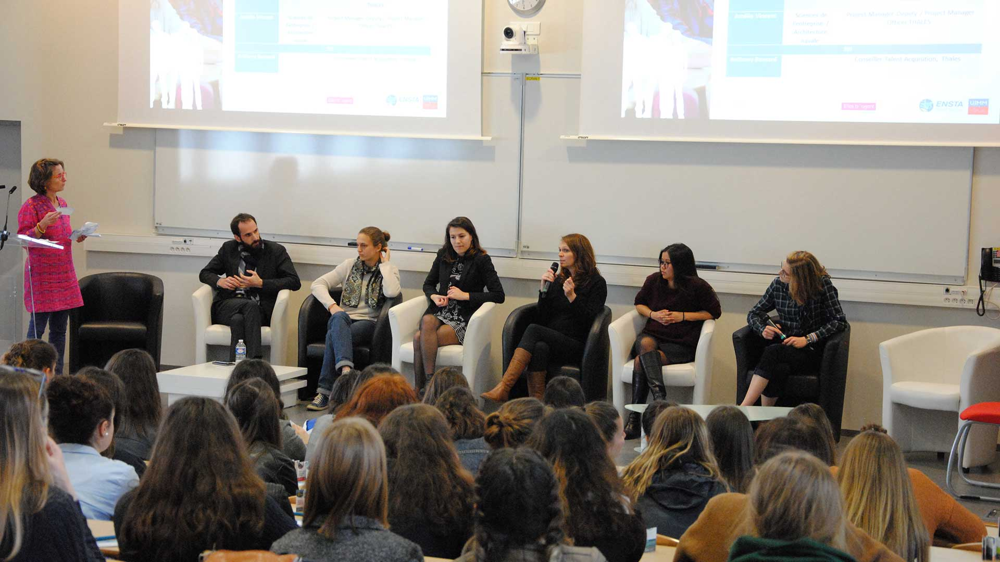
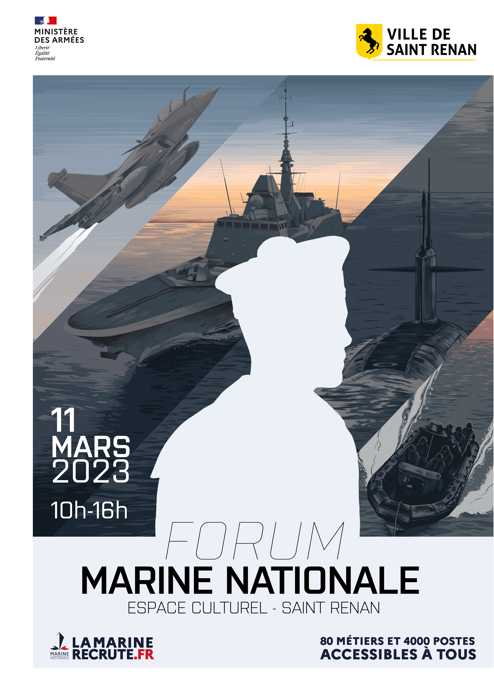
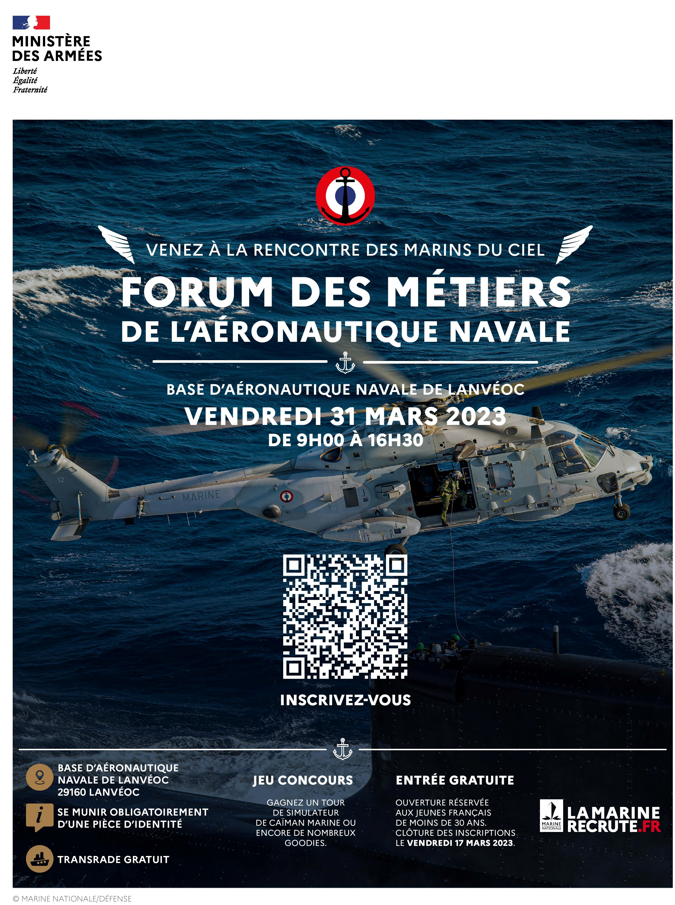
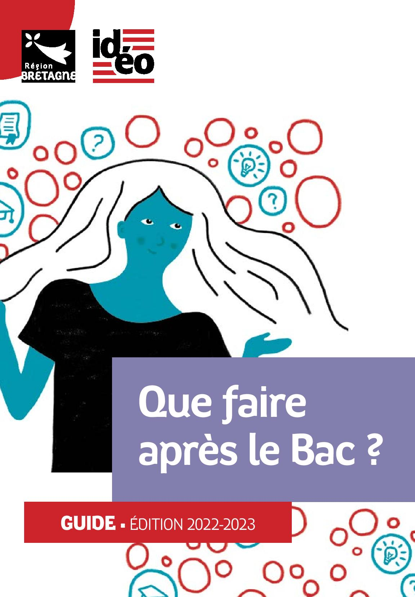
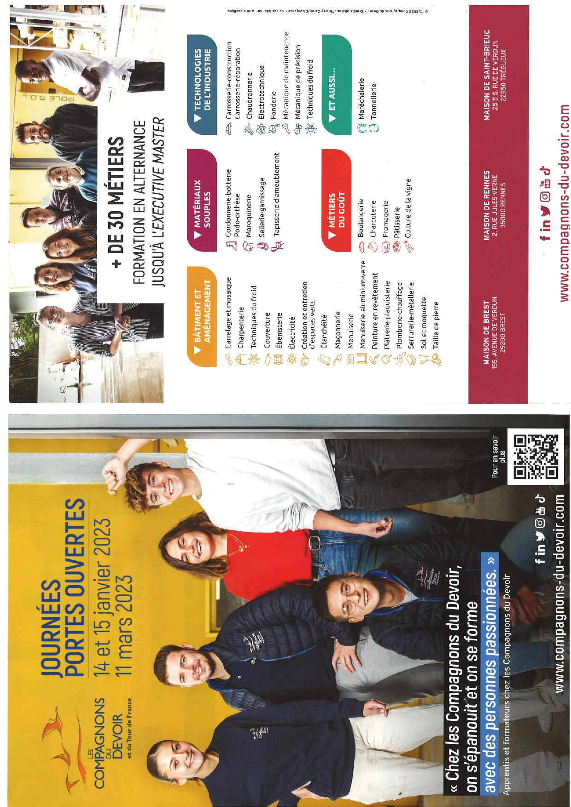
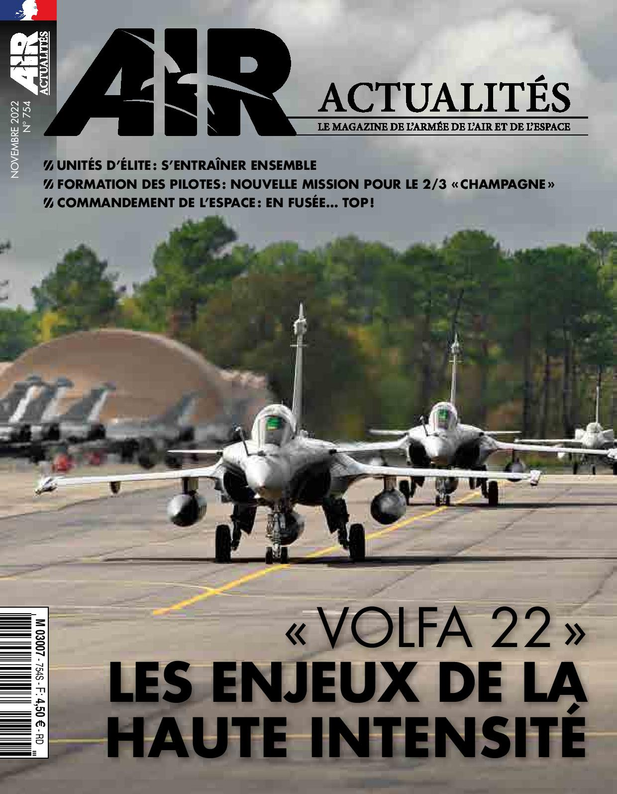
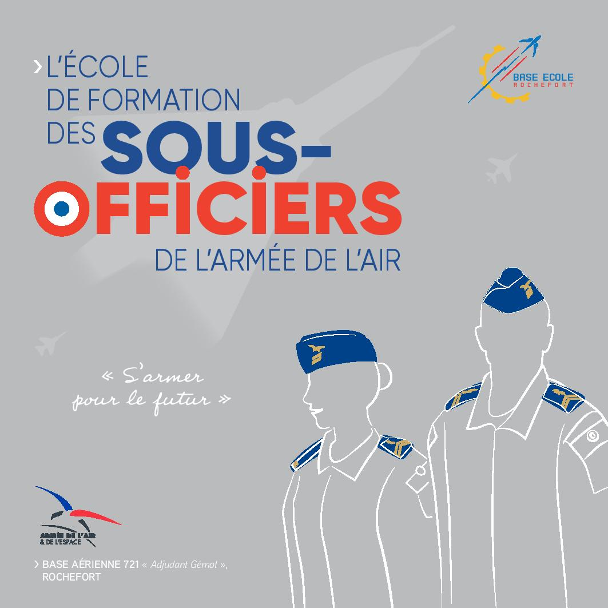
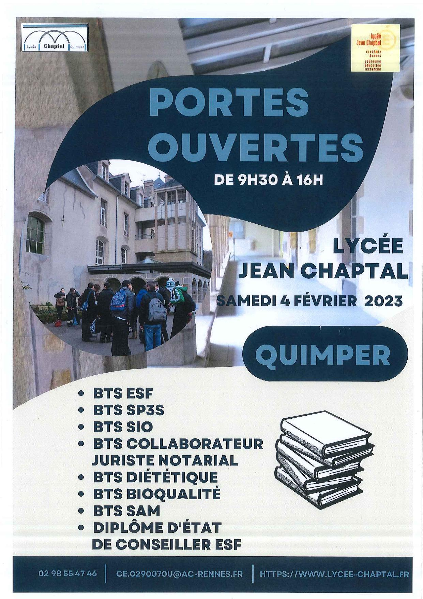
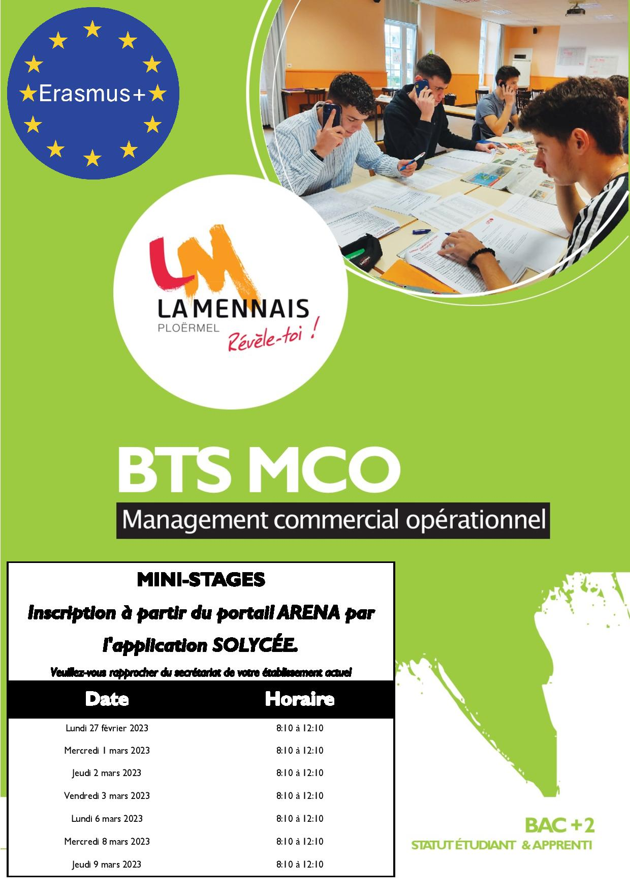

???+ example inline end "Liens utiles :"
    [{width=90%}](https://folios.onisep.fr/){target=_blank}
    [{width=90%}](https://www.onisep.fr/){target=_blank}
    [{width=90%}](https://www.parcoursup.fr/index.php?desc=){target=_blank}
    
    * [**CIO Morlaix**](https://www.ac-rennes.fr/cio-morlaix){target=_blank}
    * [**Villes voisines**](https://demarchesadministratives.fr/cio-information-orientation/morlaix-29600){target=_blank}
    * [**Démarches administratives**](https://demarchesadministratives.fr/demarches/categorie/formation-recherche-demploi/etudier-en-france){target=_blank}
    * [**Vie associative**](https://www.ville.morlaix.fr/VIVRE-A-MORLAIX/Vie-associative){target=_blank}

L'actualité de l'orientation au lycée et dans la région, les ==**sites incontournables**== pour construire son ==**parcours avenir**==, des ==**ressources par niveau**==, les ==**salons et forums**==, la ==**vie étudiante**==...

N'oubliez pas de conserver vos recherches et vos réflexions concernant votre ==**parcours avenir**== et les autres parcours (santé, citoyen, artistique et culturel) dans votre dossier ==**FOLIOS**==.

    

## Actualités

==**100 FEMMES - 100 METIERS ingénieure demain ! Jeudi 23 mars 2023 de 13h30 à 16h15**== 

Invitation et formulaire d'inscription pour rencontrer des ingénieurEs de l'[**UIMM**](https://uimm.lafabriquedelavenir.fr/industrie/){target=_blank} et du site de l'[**ENSTA Bretagne**](https://www.ensta-bretagne.fr/fr/100-femmes-100-metiers-ingenieure-demain){target=_blank}.

[{width=45%}](./pdf/2023_invitation_inscription_100_femmes_100_metiers.pdf){target=_blank}

[{width=28%}](https://www.ifps-vannes.fr/){target=_blank}
[{width=30%}](https://www.lamarinerecrute.fr/){target=_blank}
[{width=30%}](https://www.eventbrite.fr/e/billets-forum-des-metiers-de-laeronautique-navale-438995967757){target=_blank}

??? attention "**Communication de l'UBO**"

    Vous avez raté les Portes Ouvertes à l'==**UBO**==, ou alors il vous reste encore des questions ?

    N'oubliez pas que vous pouvez contacter par mail les équipes pédagogiques (via l'onglet ==**"échanger avec l'établissement"**== de la fiche Parcoursup) pour tout renseignement sur la formation, vos chances d'admission...

    En complément, pour avoir un témoignage et un ressenti d'étudiante ou étudiant de la filière, une adresse est également disponible dans cette même rubrique de la fiche Parcoursup.

    Voici la [**liste**](./pdf/UBO_listes_ambassadeurs.pdf){target=_blank} de l'ensemble des adresses d'étudiant.es ambassadeurs.drices disponibles à l'UBO pour discuter avec vous jusqu'au 6 avril.

??? info "**Informations de M. QUINIO, coordinateur pour l'orientation**"
    
    Quelques informations en ce début d'année concernant les dispositifs d'aide à l'orientation :

    - ==**Ouverture des dossiers *Parcoursup* à partir du 18/01**== 
    L'ouverture se fera en classe avec votre prof référent.

    - ==**Salon *Azimut* à Brest du 19 au 21/01**==
    Visite du salon pour le niveau terminale vendredi après-midi entre 12h15 et 16h20.

    - ==**Immersions**==  Ne pas hésiter à contacter la ou les formations qui vous intéressent pour leur demander la possibilité d'une immersion. Voir toutes les propositions d'immersions ci-dessous [**Niveau Tle**](https://cdi-lycee.ecmorlaix.fr/orientation/#niveau-tle){target=_blank}

    - ==**Portes ouvertes**== : La saison des portes ouvertes bat son plein entre janvier et mars. Le plus simple pour connaitre les dates est de rechercher la formation sur **Parcoursup**. Liste des portes ouvertes de l'[**académie de Rennes**](https://cdi-lycee.ecmorlaix.fr/pdf/JPO_superieur_2023_Ac_Rennes_ONISEP_Bretagne_20230110.pdf){target=_blank}

    - ==**Forum en ligne**== : Deux dernières séances - ==**Lundi 23/01**== - Licence arts et spectacles (Rennes) et ==**lundi 30/01**== - BUT Techniques de Commercialisations (Quimper).

    - ==**Forum de l'orientation au lycée**== : Vendredi 10/02 entre 15h30 et 16h20 pour les élèves de terminales (plus d'informations à venir)

???+ info "**Au fil de la presse...**"
    - [**Le Télégramme - 30/12/2022**](https://www.letelegramme.fr/finistere/morlaix/a-23-ans-il-est-regisseur-dans-une-salle-mythique-loan-peron-de-plougonven-aux-coulisses-de-l-olympia-30-12-2022-13250759.php){target=_blank} : À 23 ans, il est régisseur « dans une salle mythique » : Loan Péron, de Plougonven, aux coulisses de l’Olympia. Bravo à cet ancien élève du lycée.
    - [**Le Télégramme - 14/09/2022**](https://www.letelegramme.fr/finistere/morlaix/gwenael-morel-l-atout-drone-des-pompiers-finisteriens-14-09-2022-13178211.php){target=_blank} : Gwenaël Morel, l'atout drone des pompiers finistériens"
    - [**Ouest-france - 24/05/2022**](https://www.ouest-france.fr/bretagne/morlaix-29600/dans-le-pays-de-morlaix-comme-ailleurs-tous-les-metiers-sont-en-tension-6a181b20-db6e-11ec-84fd-0d1f31a3fa84){target=_blank} : Dans le pays de Morlaix comme ailleurs , "tous les métiers sont en tension"...

??? info "**Un espace au service de l'emploi**"
    - [**L'Espace métiers**](https://www.brest.fr/travailler-entreprendre/emploi-insertion/des-evenements-et-un-espace-au-service-de-lemploi-a-brest-1768.html){target=_blank} : un lieu pour s'informer à Brest métropole...
    
___ 
## RESSOURCES  

___ 
### Pour tous
???+ "Pour tous"
    === "INCONTOURNABLES"
        - [**Réussir au lycée et APRES...**](https://www.education.gouv.fr/reussir-au-lycee/2021-2022-bien-preparer-son-bac-et-son-entree-dans-le-superieur-326326){target=_blank}
        - [**ONISEP**](https://www.onisep.fr/){target=_blank} : Éditeur public, l'Onisep produit et diffuse toute l'information sur les formations et les métiers.
        - [**Orientation pour tous**](https://www.orientation-pour-tous.fr/){target=_blank} : pour ne rien manquer de l'actualité de l'orientation, découvrir des informations sur les métiers, les études par région...
        - [**1001 orientation**](https://1001orientations.fr/){target=_blank} : 1001 conseils, 1001 parcours pour choisir sa voie...
        - [**L'Etudiant**](https://www.letudiant.fr/orientation.html){target=_blank} : les outils pour réussir son orientation, des tests en ligne pour affiner sa réflexion sur l'orientation, le service de coaching du site de l'Etudiant...
        - [**Quelles spécialités pour quelles études ?**](https://www.letudiant.fr/lycee/specialites-bac-general/article/reforme-lycee-quelles-specialites-pour-quelles-etudes.html){target=_blank} : les spécialités recommandées par type de formation ou par domaine d'études...
        - [**Témoignages**](https://www.onisep.fr/Choisir-mes-etudes/ma-premiere-annee-en){target=_blank} : ma première année en... CAP, BAC PRO, BAC TECHNO, diplôme du sport, du paramédical, DUT/BUT, classe préparatoire, DN MADE, licence...
        - [**THOTIS - Le média étudiant**](https://thotismedia.com/){target=_blank} : découvrir les formations et trouver sa voie - Affiner son projet en contactant des étudiants - Se renseigner sur Parcoursup. 
        - [**MOOC**](https://www.mooc-orientation.fr/){target=_blank} : suivre les **MOOC** de l'orientation pour choisir son avenir...
        - [**SNU**](https://www.education.gouv.fr/le-service-national-universel-snu-jeunesse-engagee-5381){target=_blank} : présentation du **Service National Universel** et accès au [**portail**](https://www.snu.gouv.fr/){target=_blank} pour s'inscrire.
    === "GUIDES"
        Tous les [**guides IDEO**](https://ideo.bretagne.bzh/publications){target=_blank} pour l'aide à l'orientation.
    
        -[{width=20%}](./pdf/IDEO_2022_que_faire_apres_la_3e.pdf){target=_blank}
        -[{width=20%}](./pdf/IDEO_Apres_BAC_2022-2023.pdf){target=_blank}
        -[{width=20%}](./pdf/GUIDE_ENTRER_DANS_LE_SUP_2022.pdf){target=_blank}
    === "QUIZ"
        - [**Quiz de l'ONISEP**](https://www.onisep.fr/decouvrir-les-metiers/les-quiz-de-l-onisep/){target=_blank} :

            [==**1-**==](https://www.onisep.fr/decouvrir-les-metiers/les-quiz-de-l-onisep/Quiz-Quels-metiers-selon-mes-gouts){target=_blank} Des métiers selon mes goûts

            [==**2-**==](https://www.onisep.fr/decouvrir-les-metiers/Quels-metiers-demain/quels-metiers-demain/Quiz-Quels-metiers-demain){target=_blank} Quels métiers pour demain ?

            [==**3-**==](https://www.onisep.fr/cap-vers-l-emploi/alternance/quiz-apprentissage){target=_blank} Quiz apprentissage 

            [==**4-**==](https://www.onisep.fr/decouvrir-les-metiers/les-quiz-de-l-onisep/vrai-faux-sur-la-voie-pro){target=_blank} Vrai/faux sur la voie professionnelle

            [==**5-**==](https://www.onisep.fr/decouvrir-les-metiers/les-quiz-de-l-onisep/quiz-etudes){target=_blank} Quiz études 

            [==**6-**==](https://www.onisep.fr/decouvrir-les-metiers/les-quiz-de-l-onisep/Quiz-secteurs){target=_blank} Quiz secteurs

            [==**7-**==](https://www.onisep.fr/equipes-educatives/egalite-filles-garcons/quiz-egalite-filles-garcons){target=_blank} Quiz égalité filles-garçons

            [==**8-**==](https://www.onisep.fr/Choisir-mes-etudes/apres-le-bac/Conseils-et-strategies-d-etudes/quiz-universite-les-vraies-fausses-idees-sur-la-fac){target=_blank} Vraies-fausses idées sur la fac

        - [**Quels métiers pour moi ?**](https://www.onisep.fr/Media/Multimedia/Quiz-de-positionnement/quiz-quels-metiers-pour-moi){target=_blank} : quiz pour trouver des exemples de métiers qui vous correspondent. (*Onisep*)
        - [**Quelles études après le BAC ?**](https://m.onisep.fr/Media/Multimedia/Quiz-de-positionnement/quelles-etudes-apres-le-bac){target=_blank} : quiz numérique pour appréhender les différentes formations après le BAC. (*Onisep*)
        - [**Tests d'orientation**](https://test-orientation.studyrama.com/){target=_blank} : pour mieux se connaître et découvrir des pistes pour mon avenir. (*Studyrama*)
        - [**Quel métier est fait pour moi ?**](https://www.letudiant.fr/test/metiers/orientation/pour-quels-metiers-etes-vous-fait.html){target=_blank} : pour trouver sa voie, son futur métier et construire son projet professionnel. (*LEtudiant*)
        
    === "ALTERNANCE"
        - [**Portail de l'Alternance**](https://www.alternance.emploi.gouv.fr/decouvrir-lalternance){target=_blank}
        - [**Pôle emploi**](https://www.pole-emploi.fr/accueil/){target=_blank}
        - [**L'Etudiant**](https://www.letudiant.fr/etudes/alternance.html){target=_blank} : dossier sur l'alternance (Ecoles, formations, entreprises, offres...)
        - [**AREP29**](https://www.arep29.fr/){target=_blank} : CFA et centre de formation continue à Brest (CAP, BTS et Bac+3 en alternance, formation continue des salariés d'établissements...)
        - [**Chambre des métiers et de l'artisanat**](https://www.cma29.bzh/finistere/finistere/){target=_blank} : portes ouvertes samedi 28 janvier 2023 (9h-16h) et [**formulaire**](./pdf/CMA_Quimper_mercredis_apprentissage_formulaire.pdf){target=_blank} d'inscription aux mercredis de l'apprentissage du Campus des métiers de Quimper. 
        - [**IBEP-Morlaix**](https://www.ibepformation.fr/formation/formation-adulte/morlaix/){target=_blank} : les vendredis de l'alternance pour se former en étant salarié ([**contact**](./pdf/vendredi_alternance_ibep.pdf){target=_blank})
        - [**ISFFEL**](https://www.isffel.fr/){target=_blank} : chercher sa formation en alternance sur le site de l'Institut Supérieur de Formation. 
        - [**Les compagnons du devoir**](https://www.compagnons-du-devoir.com/){target=_blank} : journées portes ouvertes les ==**14-15 janvier** / **11 mars 2023**==.
        [{width=50%}](https://www.compagnons-du-devoir.com/){target=_blank}
    === "VIE ETUDIANTE"
        - [**Vie étudiante : Infos, services, FAQ**](https://www.etudiant.gouv.fr/fr){target=_blank}
        - [**FAQ vie étudiante**](https://www.etudiant.gouv.fr/fr/faq){target=_blank}
        - [**Jeunes.gouv.fr**](https://jeunes.gouv.fr/){target=_blank}
        - [**CROUS**](https://trouverunlogement.lescrous.fr/){target=_blank} et [**CROUS Bretagne**](https://www.crous-rennes.fr/){target=_blank}
        - [**Mes services étudiants**](https://www.messervices.etudiant.gouv.fr/envole/){target=_blank}
        - [**Dossier "vie étudiante"**](https://www.onisep.fr/Choisir-mes-etudes/Apres-le-bac/La-vie-etudiante){target=_blank} du site de l'ONISEP.
        - [**Etudes, vie étudiante et handicap**](https://www.univ-brest.fr/deve/menu/vie_etudiante/Handiversit%C3%A9/HANDIVERSITE){target=_blank}: **Handiversité** dispositif d’accompagnement spécifique de l'UBO.
    === "MOBILITE"
        - [**ERASMUS+**](https://info.erasmusplus.fr){target_blank}
        - [**Etudions à l'étranger**](https://www.etudionsaletranger.fr/){target=_blank}
        - [**Easylangues**](https://www.centre-easylangues.com/){target=_blank} : trouver un job ou un stage à l'étranger...

___ 
### Niveau 2nde
??? "SECONDE"
    === "RESSOURCES"
        - [**Horizons21**](https://www.horizons21.fr/){target=_blank} : pour simuler des combinaisons de spécialités et découvrir des pespectives de formations et des métiers.
        - [**Secondes/Premières 2022-2023**](https://www.secondes-premieres2022-2023.fr/){target=_blank} : les étapes pour construire mon avenir au lycée.
        - [**Quelles spécialités choisir pour le BAC?**](https://www.letudiant.fr/lycee/simulateur-de-specialites.html){target=_blank}
    === "CHOISIR UN METIER"
        - [**Selon mes goûts**](https://www.onisep.fr/decouvrir-les-metiers/Des-metiers-selon-mes-gouts){target=_blank}
        - [**Par centre d'intérêts**](https://www.orientation-pour-tous.fr/tutoriel/decouvrir-les-metiers/je-veux-decouvrir-des-metiers-en-fonction-de-mes-centres-d-interet/article/les-metiers-par-centre-d-interet){target=_blank}
        - [**Par secteur ou domaine**](https://www.onisep.fr/decouvrir-les-metiers#Des-metiers-par-secteur){target=_blank}

___ 
### Niveau 1re
??? "PREMIERE"
    === "RESSOURCES"
        - [**Réussir au lycée**](https://www.education.gouv.fr/reussir-au-lycee/choisir-ses-enseignements-de-specialite-au-lycee-pour-preparer-ses-etudes-superieures-325475){target=_blank} : le choix des spécialités.
        - [**Horizons21**](https://www.horizons21.fr/){target=_blank} : pour simuler des combinaisons de spécialités et découvrir des pespectives de formations et des métiers. 
        - [**Secondes/Premières 2022-2023**](https://www.secondes-premieres2022-2023.fr/){target=_blank} : les étapes pour construire mon avenir au lycée...
        - [**Terminales 2022-2023**](https://www.terminales2022-2023.fr/){target=_blank} : ...et après le lycée.
        - [**Quelles études après le BAC**](https://www.onisep.fr/Choisir-mes-etudes/apres-le-bac/quelles-etudes-apres-le-bac){target=_blank} : étude courtes longues, licence, BUT, BTS, écoles spécialisée... découvrez toutes les possibilités qui s'offrent à vous.
        - [**Témoignages d'étudiants**](https://www.onisep.fr/Choisir-mes-etudes/ma-premiere-annee-en){target=_blank} : Série web, ma première année en...
    === "CHOISIR UN METIER"
        - [**Selon mes goûts**](https://www.onisep.fr/decouvrir-les-metiers/Des-metiers-selon-mes-gouts){target=_blank}
        - [**Par centre d'intérêts**](https://www.orientation-pour-tous.fr/tutoriel/decouvrir-les-metiers/je-veux-decouvrir-des-metiers-en-fonction-de-mes-centres-d-interet/article/les-metiers-par-centre-d-interet){target=_blank}
        - [**Par secteur ou domaine**](https://www.onisep.fr/decouvrir-les-metiers#Des-metiers-par-secteur){target=_blank}
    === "SALONS - FORUMS"
        - [**Salons - Forums de l'orientation**](https://www.onisep.fr/recherche?text=SALONS%20FORUMS){target=_blank} : comment préparer sa visite à un salon ?
        - [**Azimut**](https://www.salon-azimut.com/){target=_blank} : site officiel du salon les ==**19-21 janvier 2023**==. Pour préparer ta visite au salon Azimut découvre le [**Kit de l'élève de 1ère**](./pdf/Azimut_kit_1ere.pdf){target=_blank}.

___ 
### Niveau Tle
??? "TERMINALE"
    === "RESSOURCES"
        - [**Terminales 2022-2023**](https://www.terminales2022-2023.fr/){target=_blank}
        - [**Quelles études après le BAC**](https://www.onisep.fr/Choisir-mes-etudes/apres-le-bac/quelles-etudes-apres-le-bac){target=_blank} : étude courtes, longues, licence, BUT, BTS, écoles spécialisée... découvrez toutes les possibilités qui s'offrent à vous.
        - [**Quelle école après le BAC ?**](https://www.ipesup.fr/){target=_blank} : IPESUP, préparations aux examens et concours de l’enseignement supérieur.
        - [**Ensemble des ressources de la DGESIP**](https://services.dgesip.fr/T454/S743/ressources){target=_blank} : Direction Générale de l'Enseignement Supérieur et de l'Insertion
        - [**Témoignages d'étudiants**](https://www.onisep.fr/Choisir-mes-etudes/ma-premiere-annee-en){target=_blank} : Série web, ma première année en...
    === "FORUM EN LIGNE"
        - [**FORUM EN LIGNE**](https://padlet.com/cdinddmporsmeur/forum_en_ligne_2022){target=_blank} 
        
            Prochain rendez-vous :
            
            ==**lundi 30/01 (18h30-19h)**== : présentation du BUT Techniques de commercialisation - [**Inscription à la visio**](https://docs.google.com/forms/d/e/1FAIpQLSfVKyDIJaA2I0R05okvmnbV5vELdgsNEc-JQODJle34cUL0tg/viewform){target=_blank} ==**avant dimanche - 17h**==
            
                        
    === "PARCOURSUP"
        [{width=20%}](https://www.parcoursup.fr/index.php?desc=){target=_blank}
        
        - [**Vidéo PARCOURSUP - Comment choisir une formation ?**](https://youtu.be/WJzf3wRqcWo){target=_blank}
    === "PO - IMMERSIONS"
        - [**PORTES OUVERTES DU SUPERIEUR - Académie de Rennes**](./pdf/JPO_superieur_2023_Ac_Rennes_ONISEP_Bretagne_20230110.pdf){target=_blank}
        - [**PORTES OUVERTES DU SUPERIEUR - National**](https://www.onisep.fr/Choisir-mes-etudes/apres-le-bac/les-journees-portes-ouvertes-2022-2023-dans-l-enseignement-superieur){target=_blank}
        - [**Catalogue IDEO des IMMERSIONS - Bretagne**](https://www.linscription.com/pro/catalogue-immersion-brio-ideo-actions-pour-lyceens.php){target=_blank}
        - [**Printemps de l'orientation**](https://www.education.gouv.fr/reussir-au-lycee/le-printemps-de-l-orientation-327179){target=_blank} : ==20, 21 et 22 mars 2023==
        
        ???+ info "BTS"
            - [**BTS - Lycée Chaptal - Quimper**](https://www.lycee-chaptal.fr/actualite/les-podcasts-des-bts-sp3s-1-ere-annee/){target=_blank} : ==04 février 2023 - 9h30-16h30==. 
                [**7 BTS à découvrir**](./pdf/Lycee_Chaptal_PO_post-bac.pdf){target=_blank} : [**Bioqualité**](https://www.lycee-chaptal.fr/bts-bioqualite/){target=_blank} - 
                [**Diététique**](https://www.lycee-chaptal.fr/nos-formations/enseignement-superieur/bts-dietetique/){target=_blank}  - [**ESF**](https://www.lycee-chaptal.fr/nos-formations/enseignement-superieur/bts-esf/){target=_blank} - [**Collaborateur juriste notarial**](https://www.lycee-chaptal.fr/nos-formations/enseignement-superieur/bts-notariat/){target=_blank} - [**SAM (Support à l'action managériale)**](https://www.lycee-chaptal.fr/nos-formations/enseignement-superieur/bts-sam/){target=_blank} - [**SIO (Services informatiques aux organisations)**](https://www.lycee-chaptal.fr/nos-formations/enseignement-superieur/bts-sio/){target=_blank} - [**SP3S (Services et Prestations des Secteurs Sanitaire et Social)**](https://www.lycee-chaptal.fr/nos-formations/enseignement-superieur/bts-sp3s/){target=_blank}
            - [**Lycée Mongazon**](https://www.mongazon.org/){target=_blank} présentation des BTS du pôle santé (BTS Podo orthésiste - BTS Prothésiste orthésiste - CP Orthopédiste orthésiste) lors des portes ouvertes les ==13 et 14 janvier 2023== (*Angers - 49*)
            - [**BTS Audiovisuel**](http://www.btsaudiovisuelsfnd.fr/){target=_blank} : journées portes-ouvertes  ==vendredi 9 Décembre 2022 (17h00 à 20h00)== et ==samedi 10 Décembre (10h00 à 15h00)== (*Lesneven - 29*)
            - [**BTS SIO**](http://www.saint-louis29.net/wp-content/uploads/2023/01/plaquette-BTS-22-23.pdf){target=_blank} : journées portes-ouvertes  ==vendredi 3 mars 2023 (17h00 à 19h00)== et ==samedi 4 mars (9h00 à 12h00)== (*Chateaulin - 29*)
            - [**BTS SP3S**](https://www.lycee-campostal-gouarec.com/A-VOS-AGENDAS-MINI-STAGE-DECOUVERTE-BTS-SP3S){target=_blank} : mini-stages découverte  ==jeudi 19 janvier 2023 (9h45 à 16h)== (*Rostrenen - Gouarec 22*)
            - [**Lycée Le Sage**](https://www.lycee-lesage.fr/La-formation/5/brevet-de-technicien-superieur){target=_blank} : BTS commerce international - BTS Comptabilité et gestion - BTS Systèmes numériques option électronique et communication ==Vendredi 3 février 2023 de 17h30 à 20h30==  et ==Samedi 4 février 2023 de 9h à 12h30== (*Vannes - 56*)
            - [**BTS CI**](https://www.lekreisker.fr/accueil-lycee-notre-dame-du-kreisker/nos-formations/bts-commerce-international/){target=_blank} (Commerce International): portes ouvertes ==vendredi 10 mars 2023 (17h à 20h)== et ==samedi 11 mars (9h à 13h)== préinscriptions et modalités d'inscriptions. (*Saint-Pol-de-Léon - 29*)

        ???+ info "IUT"
            - ==**IUT Brest-Morlaix**== : demi-journées d'immersion pour les lycéens de terminale en Génie Biologique (GB), Génie Mécanique et Productique (GMP) et Gestion Administrative et Commerciale (GACO). [**Inscription obligatoire sur weezent**](https://www.iut-brest.fr/evenements/journees-dimmersion-des-lyceens-a-liut/){target=_blank}. 
            - ==**Matinales de l'orientation**== : à l'IUT de Saint-Nazaire ==mercredi 30 novembre==. [**Formulaire d'inscription**](https://questionnaires.univ-nantes.fr/index.php/573826?newtest=Y&lang=fr){target=_blank}.
        
        ???+ info "PREPA - CPEG"
            - [**CPGE PTSI-PT**](./pdf/Campus_LaSalle_CPGES_2022.pdf){target=_blank} : ==samedi 3 décembre 2022 - 9h-12h==. [**La Croix Rouge/La Salle - Brest**](https://www.lacroixrouge-brest.fr/ecoles-formations/enseignement-superieur/prepas-scientifiques-aux-grandes-ecoles-ptsi-pt/){target=_blank} 
            
            - [**Faire sa PREPA au Lycée Chateaubriand**](https://lycee-chateaubriand.live/){target=_blank} : visioconférence  ==mercredi 11 janvier 2023 (de 19h à 21h)== et portes ouvertes ==Vendredi 3 février 2023 (de 16h à 19h)== présentation du **CPES** (Cycle  Pluridisciplinaire d‘Etudes Supérieures Sciences Environnement et Société) et ==samedi 4 février 2023 (de 9h à 13h)== **CPGE** (classes préparatoires aux grandes écoles)(*Rennes - 35*)
        
        ???+ info "UNIVERSITES"
            - ==**UBO - CAP'AVENIR**== : toutes les informations pour vous inscrire aux prochaines [**immersions**](https://www.univ-brest.fr/cap-avenir/menu/Bloc-Lyceen/Inscriptions-individuelles-Continuum){target=_blank} en février 2023.
            - ==**UCO Guingamp**== : événements à venir de l'[**UCO**](https://guingamp.uco.fr/fr/fr/actualites-guingamp){target=_blank} prochaines [**immersions**](https://guingamp.uco.fr/fr/publication/testez-l-universite-grace-aux-journees-decouvertes){target=_blank} en février.
        
        ???+ info "ECOLES SPECIALISEES"
            - [**IFPS**](https://www.ifps-brest.bzh/){target=_blank} : l'Institut de Formation des Professionnels de santé (IFPS) du CHU e Brest  réunit instituts paramédicaux et écoles spécialisées proposant des formations iniitales et continues à Brest et Carhaix.
            - [**ITES**](./pdf/Affiche_Portes-Ouvertes-ITES-18-19-nov-2022.pdf){target=_blank} : [**calendrier**](./pdf/JPO-ITES-Programme_2022-2023.pdf){target=_blank} des portes ouvertes de l'[**Institut de formation au travail Educatif et Social**](https://www.ites-formation.com/){target=_blank}.
    === "SALONS - FORUMS"
        - [**Salons - Forums de l'orientation**](https://www.onisep.fr/recherche?text=SALONS%20FORUMS){target=_blank} : comment préparer sa visite à un salon ?
        - [**Azimut**](https://www.salon-azimut.com/){target=_blank} : site officiel du salon les ==**19-21 janvier 2023**==. Pour préparer ta visite au salon Azimut découvre le [**Kit de l'élève de Terminale**](./pdf/Azimut_kit_terminale.pdf){target=_blank}. 
        - [**Flyers soirées Azimut**](./pdf/Flyer_soirees_Azimut.pdf){target=_blank} : ==**novembre 2022**==.
        - [**Sup'Armor**](https://www.suparmor.fr/){target=_blank} : l'équivalent d'Azimut dans le 22 du ==**08 au 10 décembre 2022**==.
        - [**Studyrama**](https://www.studyrama.com/){target=_blank} : dates des prochains salons étudiants...
    === "CONCOURS"
        - [**EMSLB**](https://service-sante-des-armees.uniformesdefrance.com/secours-militaire-ssa-dates-concours-emsbl-esa-eppa-medecin-infirmier.php){target=_blank} : dates des concours pour l'entrée en Ecoles Militaires de Santé de Lyon-Bron. [**Voir fiche**](./pdf/Fiche_conditions_acce%CC%80s_concours_ESA_2023.pdf) conditions d'accès au concours de médecin ou pharmacien militaire. 
        - [**EMSLB - infirmier**](https://www.emslb.defense.gouv.fr/nous-rejoindre-concours/concours-eppa){target=_blank} : devenir infirmier militaire  en intégrant les écoles militaires de santé Lyon-Bron. [**Voir la plaquette**](./pdf/EMSLB_Plaquette_infirmier_militaire.pdf){target=_blank}
    === "STMG"  
        - [**Que faire après un BAC STMG ?**](https://www.onisep.fr/Choisir-mes-etudes/Apres-le-bac/Que-faire-apres-le-bac/Apres-un-bac-techno/Que-faire-apres-le-bac-STMG){target=_blank}

___ 
### Voie professionnelle
??? "VOIE PRO"
    === "RESSOURCES"
        - [**Vers le PADLET voie pro**](https://padlet.com/cdinddmporsmeur/LP_2020){target=_blank}
        - [**Recherche de stage, mode d'emploi**](./pdf/IDEO_Recherche_de_stage_mode_d_emploi.pdf){target=_blank}
        - [**Je choisis mon CAP**](./pdf/IDEO_2022_je_choisis_mon_CAP.pdf){target=_blank}

    === "PARCOURSUP"    
        - [**PARCOURSUP - Site officiel**](https://www.parcoursup.fr/index.php?desc=){target=_blank}
        - [**Vidéo PARCOURSUP - Comment choisir une formation ?**](https://youtu.be/WJzf3wRqcWo){target=_blank}
    === "PO - IMMERSIONS"
        - [**ITES**](./pdf/Affiche_Portes-Ouvertes-ITES-18-19-nov-2022.pdf){target=_blank} : [**calendrier**](./pdf/JPO-ITES-Programme_2022-2023.pdf){target=_blank} des portes ouvertes de l'[**Institut de formation au travail Educatif et Social**](https://www.ites-formation.com/){target=_blank}.
        - [**BTS SP3S**](https://www.lycee-campostal-gouarec.com/A-VOS-AGENDAS-MINI-STAGE-DECOUVERTE-BTS-SP3S){target=_blank} : mini-stages découverte  ==jeudi 19 janvier 2023 (9h45 à 16h)== (*Rostrenen - Gouarec 22*)
    === "SALONS - FORUMS"
        - [**Salons - Forums de l'orientation**]https://www.onisep.fr/recherche?text=SALONS%20FORUMS){target=_blank} : comment préparer sa visite à un salon ?
        - [**Azimut**](https://www.salon-azimut.com/){target=_blank} : site officiel du salon les ==**19-21 janvier 2023**== et pour préparer ta visite au salon Azimut : 
            * [**Kit de l'élève de 1ère**](./pdf/Azimut_kit_1ere.pdf){target=_blank} 
            * [**Kit de l'élève de Terminale**](./pdf/Azimut_kit_terminale.pdf){target=_blank} 
___ 
## DOMAINES

___ 
### Agriculture - Bois
??? "Liens utiles"
    === "AGRICULTURE"
        - [**APETICA**](https://www.apecita.com/){target=_blank} : spécialiste de l'emploi en agriculture, agroalimentaire et environnement.
        - [**Métiers et formations dans l'agriculture**](https://www.onisep.fr/decouvrir-les-metiers/des-metiers-par-secteur/agriculture){target=_blank} (*Sources : Onisep*)

___ 
### Architecture - Construction - Travaux publics
??? "Liens utiles"
    === "ARCHITECTURE"
        - [**ENSAB**](https://www.rennes.archi.fr/){target=_blank} : Ecole Nationale Supérieure d'Architecture de Bretagne.

___ 
### Armée - Sécurité
??? "Liens utiles"
    === "ARMEE"
        - [**Armée de l'air**](https://devenir-aviateur.fr/){target=_blank} : devenir aviateur.
        - [**EETAA**](https://eetaa722.fr/){target=_blank} : Ecole d'Enseignement Technique de l'Armée de l'Air et de l'Espace. Avis de recrutement d'élèves en [**1ère **](./pdf/EETAA_20230123_avis_recrutement_premiere.pdf){target=_blank} et [**terminale**](./pdf/EETAA_20230123_avis_recrutement_terminale.pdf){target=-blank}.
        - [**Forum des métiers de l'aéronautique**](https://www.eventbrite.fr/e/billets-forum-des-metiers-de-laeronautique-navale-179481121867){target=_blank} : le **31 mars 2023** à la base aéronavale de Landivisiau.
        - [**Armée de terre**](https://www.sengager.fr/){target=_blank} : **117 spécialités** dans **16 domaines d'activité**.
        - [**CIRFA**](https://www.sengager.fr/ou-nous-rencontrer?xtor=SEC-229-GOO-[24018634367]-[353506367]-g-[cirfa]&ds_rl=1210417&gclid=EAIaIQobChMI6PzavM2g7QIV_P3VCh1GLQ1eEAAYASAAEgK7z_D_BwE){target=_blank} : L'armée de terre recrute et forme **16000 postes**. Vous trouverez ici les centres de recrutement.
        - [**Marine Nationale**](https://www.lamarinerecrute.fr/){target=_blank} : En 2022, la marine recrute **4000 jeunes femmes et hommes**, rejoignez l’équipage...
        - [**ENSM**](https://www.supmaritime.fr/){target=_blank} : Ecole Nationale Supérieure Maritime - [**Dates et inscriptions**](https://www.supmaritime.fr/jpo-ensm-2023/){target=_blank} aux journées portes ouvertes par site (Le Havre - Marseille - Nantes - Saint-Malo).
        
        [{width=25%}](https://www.eventbrite.fr/e/billets-forum-des-metiers-de-laeronautique-navale-438995967757){target=_blank}
        [{width=25%}](./pdf/Air_actualites_20221101.pdf){target=_blank}
        [{width=25%}](./pdf/brochure-efsoaa.pdf){target=_blank}
    === "SECURITE"
        - [**Devenir gendarme**](https://www.devenir-gendarme.fr/){target=_blank}
        - [**Devenir policier**](https://www.devenirpolicier.fr/){target=_blank}

___ 
### Arts - Artisanat - Culture
??? "Liens utiles"
    === "ARTS"
        - [**CREAPOLE**](https://www.creapole.fr/){target=_blank} eécole de désign (*Paris*).
    === "THEATRE"
        - [**Option études théâtrales**](https://lycee-de-cornouaille-quimper.ac-rennes.fr/spip.php?article1306){target=_blank} au Lycée de Cornouailles à Quimper.

___ 
### Audiovisuel - Information - Communication
??? "Liens utiles"
    === "CINEMA"
        - [**Métiers de l'audiovisuel**](https://esra.edu/){target=_blank} le groupe ESRA forme aux métiers du cinéma, de l’audiovisuel, du son et du film d’animation.
___ 
### Commerce - Vente - Marketing
??? "Liens utiles"
    === "COMMERCE"
        - [**Commerce et distribution**](https://www.onisep.fr/decouvrir-les-metiers/des-metiers-par-secteur/commerce-et-distribution){target=_blank} : métiers, emploi et formation dans le commerce et la distribution. (*Sources : Onisep*)
    === "MARKETING"
        - [**Marketing, publicité**](https://www.onisep.fr/decouvrir-les-metiers/des-metiers-par-secteur/marketing-publicite){target=_blank} : métiers, emploi et formations dans le marketing et la publicité. (*Sources : Onisep*)
    === "CONCOURS"
        - [**SESAME**](https://www.concours-sesame.net/){target=_blank} : concours d'entrée commun à 17 programmes postbac de 14 grandes écoles de commerce et de management international.
    === "ECOLES"
        - [**ESDES**](https://www.itcformation.com/){target=_blank} : grande école de commerce et de management, membre de la Conférence des Grandes Écoles (*lyon - Annecy*)
        - [**ITC**](https://www.itcformation.com/){target=_blank} : école supérieure de management et de commerce (*Brest - Quimper - St-Brieuc*)

### Droit - Economie - Gestion
??? "Liens utiles"
    === "DROIT"
        - [**Droit et justice**](https://www.onisep.fr/decouvrir-les-metiers/des-metiers-par-secteur/droit-et-justice){target=_blank} : métiers, emploi et formations dans le droit et la justice. (*Sources : Onisep*)
    === "ECONOMIE - GESTION"
        - [**Comptabilité -  Gestion - Ressources humaines**](https://www.onisep.fr/decouvrir-les-metiers/des-metiers-par-secteur/comptabilite-gestion-ressources-humaines){target=_blank} : métiers et emploi dans le secteur. (*Sources : Onisep*)

### Energies - Environnement
??? "Liens utiles"
    === "ENERGIE"
        - [**Energie**](https://www.onisep.fr/decouvrir-les-metiers/des-metiers-par-secteur/energie){target=_blank} : métiers, emploi et formations dans le secteur de l'énergie. (*Sources : Onisep*)
    === "ENVIRONNEMENT"
        - [**Environnement**](https://www.onisep.fr/decouvrir-les-metiers/des-metiers-par-secteur/environnement){target=_blank} : métiers, emploi et formations dans le secteur de l'environnement. (*Sources : Onisep*)
        - A découvrir au **Lycée Notre-Dame de Guingamp** : [**BTS Métiers de l'eau**](https://www.notredameguingamp.fr/superieur/bts-me-metiers-de-leau/){target=_blank} et [**BUT MA ME - Maintenance Avancée Parcours Métiers de l'eau**](https://www.notredameguingamp.fr/bachelor-maintenance-avancee-parcours-metiers-de-leau/){target=_blank}
### Enseignement - Recherche
??? "Liens utiles"
    === "ENSEIGNEMENT"
        - [**Devenir enseignant - MEN**](https://www.devenirenseignant.gouv.fr/){target=_blank} : Comment devenir enseignant, se répérer dans les concours des premier et second degrés ? Découvrir le métier et les voies qui y mènent sur le site du Ministère de l'Education Nationale et de la Jeunesse.
        - [**Dossier Enseignement**](https://www.onisep.fr/decouvrir-les-metiers/des-metiers-par-secteur/enseignement){target=_blank} : métiers et emploi dans l'enseignement. (*Sources : Onisep*)

___ 
### Informatique - Internet
??? "Liens utiles"
    === "INFORMATIQUE & RESEAUX"
        - [**Métiers et emploi dans le secteur**](https://www.onisep.fr/decouvrir-les-metiers/des-metiers-par-secteur/informatique-et-reseaux){target=_blank} (*Sources : Onisep*)
        - [**EPITECH**](https://www.epitech.eu/fr/){target=_blank} : école référence de l'expertise informatique.
    === "JEUX VIDEOS"
        - [**Métiers et emploi dans le jeu vidéo**](https://www.onisep.fr/decouvrir-les-metiers/des-metiers-par-secteur/jeu-video){target=_blank} (*Sources : Onisep*)
        - [**CREAPOLE**](https://www.creapole.fr/cinema-danimation-et-jeu-video/){target=_blank} : formation pour devenir Game designer ou réalisateur de films d'animation.
    
___ 
### Santé - Social - Sport
???+ "Liens utiles"
    === "COMMUN"
        - [**IRSS**](https://www.irss.fr/){target=_blank} : Organisme de formation et de préparation aux métiers du sport, de la santé, de la sécurité, du social et de la petite enfance.
    === "SANTE"
        - [**Les études de santé**](https://www.onisep.fr/Choisir-mes-etudes/apres-le-bac/principaux-domaines-d-etudes/les-etudes-de-sante){target=_blank} : Maïeutique, médecine, odontologie, pharmacie (*Sources : Onisep*)
        - [**ICO**](https://ico.asso.fr/){target=_blank} : Institut et Campus d'Optique.
        - [**IFEC**](https://www.ifec.net/){target=_blank} : Institut Franco-Européen de Chiropraxie.
        - [**ISO**](https://www.iso.fr/){target=_blank} : Institut Supérieur d'Optique.
        - [**Etiopathie**](https://www.etiopathie.com/){target=_blank} : Institut Français d'Ethiopathie.
        - [**PASS ou L.AS**](https://pass-sante.com/){target=_blank} : que maîtriser pour réussir sa rentrée en [**PASS**](https://www.letudiant.fr/etudes/medecine-sante/ce-qu-il-faut-maitriser-pour-reussir-sa-rentree-en-pass-1.html){target=_blank}.
        - [**Appareillage médical**](https://www.youtube.com/watch?v=b2T9387AzkY){target=_blank} : enseignement supérieur santé du [**Lycée Mongazon**](https://www.mongazon.org/){target=_blank} (BTS Podo orthésiste - BTS Prothésiste orthésiste - CP Orthopédiste orthésiste) (*Angers - 49*)
    === "SOCIAL"
        - [**ITES**](https://www.ites-formation.com/){target=_blank} : Institut de Formation au Travail Educatif et Social. [**Visio conférence**](https://www.ites-formation.com/evenements/information-collective-accompagnant-educatif-et-social-2/){target=_blank} ==**Jeudi 9 mars 2023**== pour devenir [**Accompagnant Educatif et Social**](https://www.ites-formation.com/formations/accompagnant-educatif-et-social/){target=_blank}.
        - [**ASKORIA**](https://www.askoria.eu/index.php/formations/toutes-nos-formations-qualifiantes){target=_blank}  activateur de solidarités : 1ère école française de travail social, formant à l’ensemble des métiers de l’intervention sociale (action  sociale - Education et prévention spécialisée - Accompagnement éducatif et social - Animation sociale et territoriale - Fonctions tutorales - Protection des majeurs et des mineurs - Management d’équipes, de projets et de dispositifs). [**Dates des réunions d'information**](https://askoria.eu/index.php/les-reunions-d-information){target=_blank} pour construire son projet professionnel dans les métiers du social : ==**Jeudi 2 mars 2023**== de 14h à 15h sur le campus des solidarités de Morlaix.
    === "SPORT"
        - [**Travailler dans le sport**](https://sport.onisep.fr/){target=_blank} : je construis mon projet dans le sport sur le site de l'**ONISEP**.
        - [**Fiches métiers**](https://www.letudiant.fr/metiers/secteur/sport.html){target=_blank} : site de **L'Etudiant**.
        - [**Fiches métiers**](https://www.studyrama.com/formations/fiches-metiers/sport){target=_blank} : site **Studyrama**.
        - [**IFEPSA**](https://ifepsa.uco.fr/fr){target=_blank} : Institut de Formation en Education Physique et en Sport (*Les Ponts de Cé - 49*) 

___ 
## FORMATIONS

___ 
### BTS

    

??? "Liens utiles"
    === "PRESENTATION"
        - [**Les BTS**](https://www.onisep.fr/Choisir-mes-etudes/apres-le-bac/organisation-des-etudes-superieures/Les-BTS){target=_blank} : organisation des études, poursuite d'études. (*Sources : Onisep*)
        - [**Liste des BTS**](https://www.letudiant.fr/etudes/bts.html){target=_blank} : tout savoir sur le BTS et accéder à la liste des BTS par domaine.(*Sources : L'étudiant*)
    === "ACTUALITES - PO"
        [{width=25%}](https://www.lycee-chaptal.fr/nos-formations/enseignement-superieur/){target=_blank}
        [{width=25%}](https://www.lycee-lamennais.fr/parcours-services-au-entreprises/){target=_blank}
        [{width=25%}](https://www.ndlm56.bzh/ifas/){target=_blank}
    === "ECOLES"
        - [**Les 2 Rives**](https://les-2-rives.fr/enseignement-superieur/){target=_blank} : BTS Conseiller de Clientèle - BTS Assurance - BTS CRSA (Conception et réalisation de systèmes automatiques). (*Landerneau - 29*)
        - [**Campus de Pouillé**](https://www.campus-pouille.com/){target=_blank} : BTS dans le domaine de la nature, du vivant et de l'environnement. (*Angers - 49*)
        - [**Chaptal**](https://www.lycee-chaptal.fr/nos-formations/enseignement-superieur/){target=_blank} : BTS Bioqualité - Diététique - ESF - Collaborateur-juriste - SAM - SIO - SP3S - DECESF) (*Quimper - 29*)
        - [**Fénelon**](https://www.fenelonsup.org/formations/brevet-technicien-superieur-economie-sociale-familiale/){target=_blank} : BTS EFS (Economie Familiale et Sociales). (*Brest - 29*)
        - [**Jules Lesven**](https://www.lycee-jules-lesven.org/formations-593-0-0-0.html){target=_blank} : BTS CG (Comptabilité Gestion) - BTS PI (Professions Immobilières) - BTS CI (Commerce International) - BTS G PME (Gestion de la PME) - BTS MMV (Métiers de la Mode et du Vêtement). (*Brest - 29*)
        - [**Lammenais**](https://www.lycee-lamennais.fr/parcours-services-au-entreprises/){target=_blank} : BTS MCO (*Ploërmel - 56*)
        - [**Notre-Dame-de-Guingamp**](https://www.notredameguingamp.fr/superieur/bts-me-metiers-de-leau/){target=_blank} : BTS Métiers de l'eau (*Guingamp - 22*)
        - [**Notre-Dame Le Ménimur**](https://www.ndlm56.bzh/pole-sup-notre-dame/){target=_blank} : BTS SP3S - ESF - DECESF - L3PRO APS - Licence 3 Gestion des Organisations du champ de l'Economie sociale et solidaire (en apprentissage) (*Vannes - Saint Avé - 56*)
        - [**Le Paraclet**](https://www.leparaclet.org/formations-quimper/enseignement-superieur/bts-management-en-hotellerie-restauration/){target=_blank} : BTS Management en hôtellerie restauration (*Quimper - 29*)
        - [**Rosa Parks**](https://www.lp-rosaparks-rostrenen.ac-rennes.fr/spip.php?article273){target=_blank} : BTS MOS (Management Opérationnel de la Sécurité) [**Fiche de présentation**](./pdf/fiche_bts_mos.pdf){target=_blank} (*Rostrenen - 22*)
        - [**Saint-Louis**](http://www.saint-louis29.net/wp-content/uploads/2023/01/plaquette-BTS-22-23.pdf){target=_blank} : BTS SIO (Services Informatiques aux Organisations) (*Chateaulin - 29*)
___ 
### BUT
??? "Liens utiles"
    === "PRESENTATION"
        - [**BACHELORS**](https://www.onisep.fr/Choisir-mes-etudes/apres-le-bac/Conseils-et-strategies-d-etudes/Quelle-reconnaissance-pour-les-diplomes-du-superieur/les-bachelors){target=_blank} : Quelle reconnaissance pour les diplômes du supérieur ? (*Sources : Onisep*)
        - [**Qu'est-ce qu'un BACHELOR ?**](https://www.letudiant.fr/etudes/ecole-de-commerce/qu-est-ce-qu-un-bachelor-1.html){target=_blank} : (*L'Etudiant  : Onisep*)
    === "IUT et SPECIALITES"  
        - [**Annuaire des IUT**](https://www.iut.fr/){target=_blank} : 108 IUT, 170 campus partout en France, 24 spécialités.
        - [**Les IUT vers le BUT**](https://www.iut.fr/le-but-et-ses-specialites/){target=_blank}
        - [**Les 24 spécialités de BUT**](https://www.iut.fr/bachelor-universitaire-de-technologie/){target=_blank}
    === "OU SE FORMER ?"
        - [**IUT de Bretagne**](http://www.bretagne.iut.fr/les-iut-de-bretagne/presentation.html){target=_blank}
        - [**IUT Brest-Morlaix**](https://www.iut-brest.fr/){target=_blank}
        - [**IUT Lannion-Rennes1**](https://iut-lannion.univ-rennes1.fr/){target=_blank}
        - [**IUT St-Brieuc-Rennes1**](https://iut-stbrieuc.univ-rennes1.fr/){target=_blank}
        - [**IUT Saint-Malo**](https://iut-stmalo.univ-rennes.fr/){target=_blank} - Visite virtuelle [**ICI**](https://www.iut-saintmalo.plateforme360.fr/){target=_blank}

___ 
### CPEG
??? "Liens utiles"
    === "PRESENTATION"
        - [**La PREPA**](https://www.onisep.fr/Choisir-mes-etudes/apres-le-bac/organisation-des-etudes-superieures/Les-classes-preparatoires-aux-grandes-ecoles-CPGE){target=_blank} : Comment ça marche ? Pourquoi faire une classe préparatoire ? Les différentes classes préparatoires. (*Sources : Onisep*)
        - [**Lycée La Pérouse-Kérichen**](https://lycee-la-perouse-kerichen-brest.ac-rennes.fr/spip.php?rubrique273){target=_blank} : Pourquoi faire une Prépa ?(*Brest*)
    === "ECONOMIQUE ET SOCIALE"
        - [**Quelle Prépa choisir ?**](https://www.onisep.fr/Choisir-mes-etudes/apres-le-bac/organisation-des-etudes-superieures/CPGE-FILIERES/Les-prepas-economiques-et-commerciales){target=_blank} : ECG (Economique et commerciale générale) - ECT (Economique et Commerciale Technologique) - D1 (Droit, économie, management)- D2 (Economie et gestion). (*Sources : Onisep*)
    === "LITTERAIRE"
        - [**ENS**](https://www.ens.psl.eu/une-formation-d-exception/admission-concours/concours-voie-cpge/concours-voie-cpge-lettres){target=_blank} : Concours Lettres (concours A/L) et Sciences sociales (concours B/L).
        - [**Prépa littéraire**](https://www.prepalitteraire.fr/#){target=_blank} : le site des classes préparatoires littéraires.
        - [**Lycée de Cornouailles**](https://lycee-de-cornouaille-quimper.ac-rennes.fr/spip.php?rubrique94){target=_blank} : CPEG Lettres A/L, comment choisir ?. (*Quimper*)
    === "SCIENTIFIQUE"
        - [**Brizeux**](https://www.cpge-brizeux.fr/wordpress/){target=_blank} : PCSI (Physique Chimie Sciences de l’Ingénieur) et deux classes de deuxième année (PC : Physique Chimie et PSI : Physique Sciences de l’Ingénieur) (*Quimper*)
        - [**ENS**](https://www.ens.psl.eu/une-formation-d-exception/admission-concours/concours-voie-cpge/concours-voie-cpge-sciences){target=_blank} : voie CPEG Sciences à l'Ecole Normale Supérieure.
        - [**Lycée Sainte-Anne**](https://www.sainte-anne-brest.fr/){target=_blank} : MPSI (Mathématiques Physique et Sciences de l'ingénieur) - PCSI (Physique Chimie Sciences de l'Ingénieur) - MP (Mathématiques Physique) - PC (Physique Chimie) - PSI (Physique Sciences de l'Ingénieur) - PT (Physique et Technologie). (*Brest*)
        - [**La Croix-Rouge**](https://www.lacroixrouge-brest.fr/ecoles-formations/enseignement-superieur/){target=_blank} : PTSI (Physique Technologie Sciences de l'Ingénieur) - MPSI-PSI. (*Brest*)
    === "SCIENCES PO"
        - [**SCIENCES PO**](https://www.sciencespo.fr/fr/){target=_blank}

___ 
### Ecoles de commerce
??? "Liens utiles"
    === "PRESENTATION"
        - [**Ecoles de commerce**](https://www.onisep.fr/Choisir-mes-etudes/apres-le-bac/principaux-domaines-d-etudes/Les-ecoles-de-commerce){target=_blank} : Pour quel profil ? Comment choisir son école ? (*Sources : Onisep*)
        - [**Les Ecoles de commerce**](https://www.letudiant.fr/etudes/ecole-de-commerce.html){target=_blank} : Quelles sont les spécificités des études en écoles de commerce ? A quels métiers préparent-elles ? Quels sont les critères pour choisir ? Comment intégrer une école ? Comment préparer les concours ? (*Sources : L'Etudiant*)
___ 
### Ecoles d'ingénieurs
??? "Liens utiles"
    === "CONCOURS"
        - [**ADVANCE**](https://concours-advance.fr/){target=_blank} : concours commun permettant aux élèves  de Terminales générales et STL d’intégrer 4 écoles d’ingénieurs (EPITA, ESME, IPSA et Sup’Biotech) dans le domaine d el'innovation responsable. 
        - [**AVENIR**](https://www.concoursavenir.fr/){target=_blank} : 1 concours, 7 Grandes Ecoles d'Ingénieurs, 18 Campus.
        - [**GEIPI POLYTECH**](https://www.geipi-polytech.org/){target=_blank} : concours d'entrée commun à 35 écoles d'ingénieurs publiques. 
        - [**IPESUP**](https://www.ipesup.fr/){target=_blank} : prépa concours AVENIR - PUISSANCE ALPHA - GEPI POLYTECH.
        - [**Puissance ALPHA**](https://www.puissance-alpha.fr/){target=_blank} : les 18 grandes écoles d'ingénieurs du groupe, modalités d'admission.
    === "ECOLES"
        - [**CPE Lyon**](https://www.cpe.fr/){target=_blank} : Ecole d'Ingénieurs en Chimie et Sciences du Numérique (*Lyon - 69*).
        - [**ENSC Rennes**](https://www.ensc-rennes.fr/){target=_blank} : Ecole Nationale Supérieure de Chimie - [Visioconférence](https://www.ensc-rennes.fr/admission-en-cpi-visioconferences-supplementaires-en-mars/){target=_blank} ==**samedi 21 janvier 2023**== et ==**mercredi 1er mars**==. (*Rennes - 35*)
        - [**EPITA**](https://www.epita.fr/){target=_blank} : Ecole des ingénieurs en intelligence informatique.
        - [**ESGT**](https://www.esgt.cnam.fr/presentation/){target=_blank} : École Supérieure d'Ingénieurs Géomètres et Topographes. Plaquette  [**ESGT**](./pdf/ESGT_plaquette_ecole.pdf){target=_blank} - Présentation du cycle [**ingénieur**](./pdf/ESGT_cycle_ingenieur.pdf){target=_blank} spécialité géomètre et du cycle [**préparatoire**](./pdf/ESGT_cycle_preparatoire_integre.pdf){target=_blank} (*Le Man - 72*).
        - [**ESIGELEC**](https://www.esigelec.fr/fr){target=_blank} : Ecole d'Ingénieurs généralistes (*Saint-Étienne-du-Rouvray - 76*).
        - [**ESME**](https://www.esme.fr/){target=_blank} : les ingénieurs qui transforment le monde (numérique, robotique et IA et transition énergétique).
        - [**ESEO**](https://eseo.fr/){target=_blank} : Ecole d'Ingénieurs généralistes des technologies de la transformation numérique et électronique (*Angers - 49 ; Paris-Vélizy - 78 ; Dijon - 21*).
        - [**ESTACA**](https://www.estaca.fr/){target=_blank} : Ecole d'Ingénieurs dans le domaine des transports (aéronautique - automobile - ferroviaire - spatial - naval) (*Talence - 33 ; Laval - 53 ; Saint-Quentin-en-Yvelines - 78*).
        - [**ICAM**](https://www.icam.fr/){target=_blank} : Ecoles d'Ingénieurs généralistes.
        - [**INSA**](https://www.insa-rennes.fr/){target=_blank} : Institut National des Sciences Appliquées (*Rennes - 35*).
        - [**IPSA**](https://www.ipsa.fr/){target=_blank} : École d'ingénieurs de l'air, de l'espace et de la mobilité durable (*Paris - Toulouse*).
        - [**ISAE-SUPAERO**](https://www.isae-supaero.fr/fr/){target=_blank} : Leader mondial de l’enseignement supérieur dans le domaine de l’ingénierie aérospatiale  (*Toulouse - 31*)
        - [**ISEN**](https://www.isen.fr/){target=_blank} : Formations d'ingénieurs dans le numérique.
        - [**SUP'BIOTECH**](https://www.supbiotech.fr/){target=_blank} : l'école des ingénieur·e·s en Biotechnologies.
        - [**UNGE**](https://www.unge.net/index.php){target=_blank} : Union Nationale des Géomètres-Experts.
    
___ 
### Universités
??? "Liens utiles"
    === "PRESENTATION"
        - [**Pourquoi choisir la Fac ?**](https://www.letudiant.fr/etudes/fac/universite-les-10-bonnes-raisons-de-choisir-la-fac.html){target=_blank} (*Sources : L'Etudiant*).
    === "CAMPUS"
        - [**ICR**](https://www.icrennes.org/){target=_blank} : Institut Catholique de Rennes.
        - [**RENNES1**](https://www.univ-rennes1.fr/){target=_blank} : Université de Rennes1.
        - [**RENNES2**](https://www.univ-rennes2.fr/){target=_blank} : Université de Rennes2.
        - [**CNRS Sorbonne Université**](https://www.sb-roscoff.fr/){target=_blank} : Station biologique de Roscoff / CNRS-Sorbonne.
        - [**UBO**](https://nouveau.univ-brest.fr/fr){target=_blank} : Université de Bretagne Occidentale.
        - [**UCO**](https://www.uco.fr/fr){target=_blank} : Université Catholique de l'Ouest. Licences professionnelles à découvrir :
            
            - [**Sciences  et technologies - Ingénierie des produits et process - Cosmétiques/Alimentation Santé**](./pdf/UCO_bretagne_nord_Fiche_Formation_Sciences_et_Technologies.pdf){target=_blank} 
                
            - [**Bio-industries et Biotechnologies Plantes, Algues & Nutrition**](./pdf/UCO_bretagne_nord_Fiche_Formation_LP_Bio-Industries_2023-2024.pdf){target=_blank}

        - [**UTBM**](https://www.utbm.fr/){target=_blank} : Université de Technologie de Belfort-Montbéliard.
        - [**UTC**](https://www.utc.fr/){target=_blank} : Université de Technologie de Compiègne.

{width=90%}  
  

    
	
	

