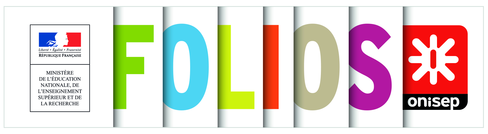
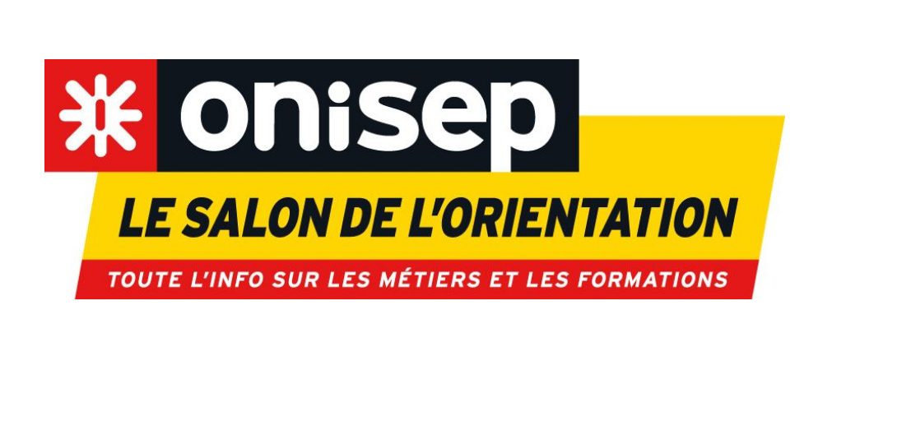
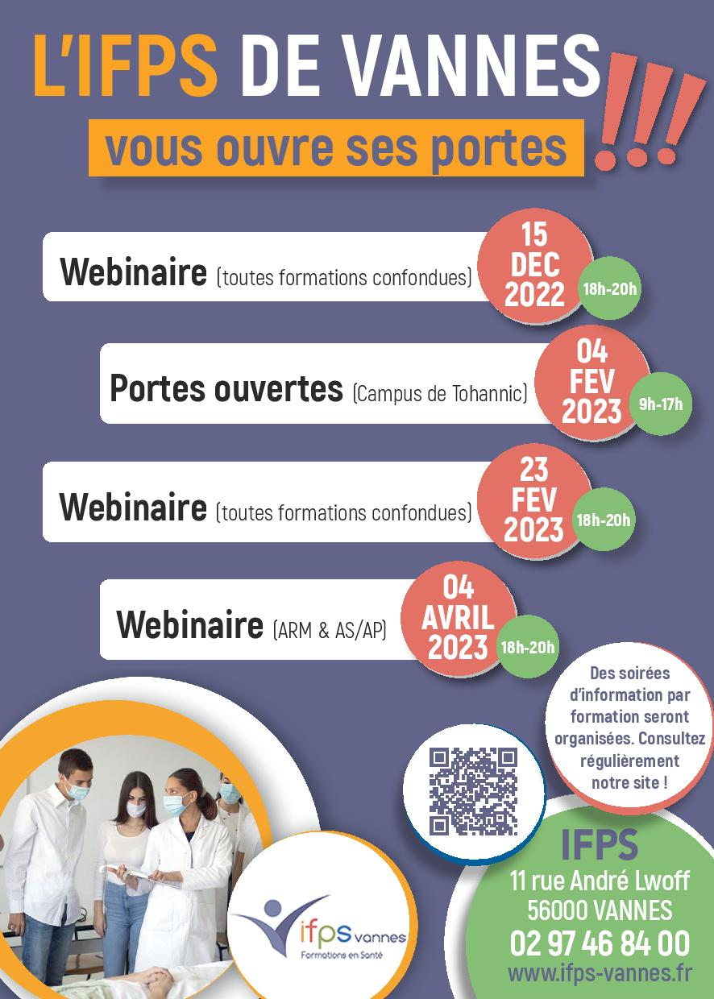
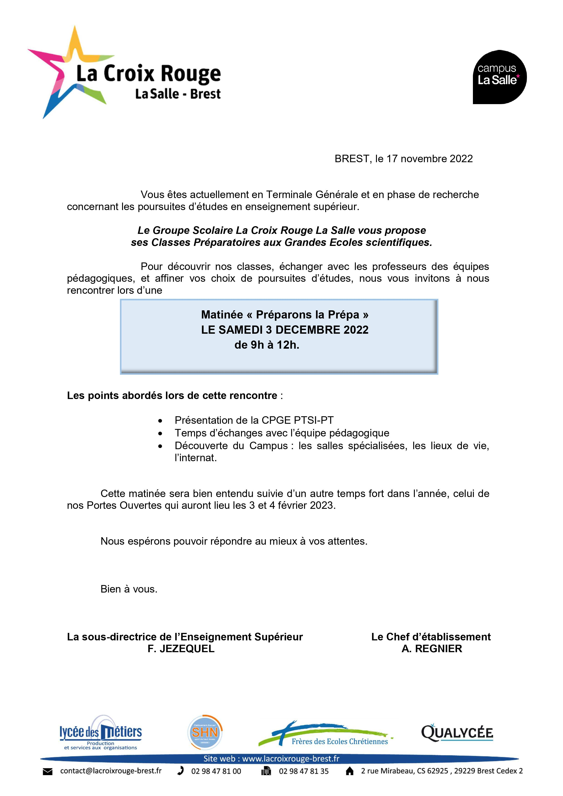
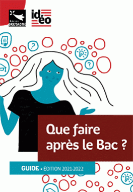
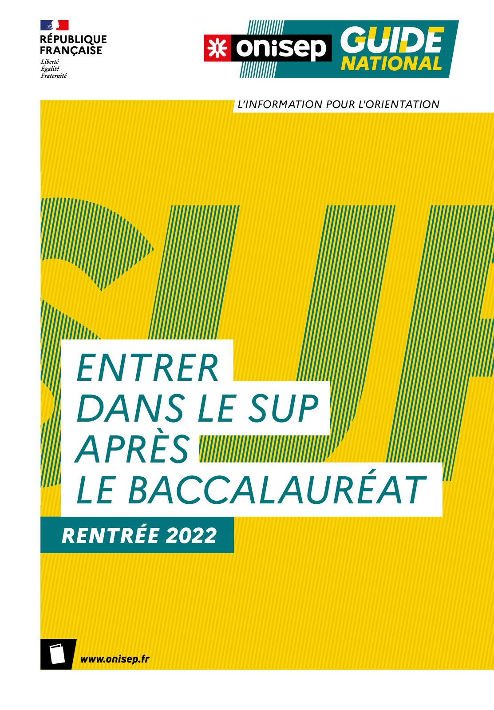

???+ example inline end "Liens utiles :"
    [{width=90%}](https://folios.onisep.fr/){target=_blank}
    [{width=90%}](https://www.onisep.fr/){target=_blank}
    [{width=90%}](https://www.parcoursup.fr/index.php?desc=){target=_blank}
    
    * [**CIO Morlaix**](https://www.ac-rennes.fr/cio-morlaix){target=_blank}
    * [**Villes voisines**](https://demarchesadministratives.fr/cio-information-orientation/morlaix-29600){target=_blank}
    * [**Démarches administratives**](https://demarchesadministratives.fr/demarches/categorie/formation-recherche-demploi/etudier-en-france){target=_blank}
    * [**Vie associative**](https://www.ville.morlaix.fr/VIVRE-A-MORLAIX/Vie-associative){target=_blank}

L'actualité de l'orientation au lycée et dans la région, les ==**sites incontournables**== pour construire son ==**parcours avenir**==, des ==**ressources par niveau**==, les ==**salons et forums**==, la ==**vie étudiante**==...

N'oubliez pas de conserver vos recherches et vos réflexions concernant votre ==**parcours avenir**== et les autres parcours (santé, citoyen, artistique et culturel) dans votre dossier ==**FOLIOS**==.

    

## Actualités
{width=35%}
{width=35%}

??? info "**14/10/2022 : Mail de M. QUINIO (coordinateur pour l'orientation) aux élèves de terminale**"
    Bonjour,

    Voici résumé les informations importantes que j'ai pu compiler en ce mois d'octobre et qui pourront vous aider dans la construction de votre projet d'orientation :

    Rappel : Des ==**immersions à l'UBO et l'UCO**== sont possibles pendant les vacances d'automne (voir sur cette page dans les ressources (==**onglet PO-IMMERSIONS**==).

    ==**InstaFac**== - A partir du mois de novembre, l'UBO propose chaque mercredi entre 14h et 16h une présentation de formations du supérieur par des enseignants et des étudiants. Vous pouvez dès à présent vous inscrire à certaines présentations sur le site de l'[==**UBO**==](https://www.univ-brest.fr/cap-avenir/menu/Bloc-Lyceen/Insta_-Fac){target=_blank}
    Ces présentations vous demanderont de vous déplacer sur Brest. Une justification d'inscription vous sera demandée à la vie scolaire pour excuser votre absence en cours.

    La fondation ==**CGénial**== propose un parcours de plusieurs visioconférences présentant des métiers dans le domaine des sciences et techniques. Les visios seront l'occasion d'avoir des témoignages de professionnels. La première d'entre elle a lieu le 19/10 et s'intitule "Qu'est-ce que le métier d'ingénieur ?" Consultez l'ensemble du parcours [==**ici**==](https://www.cgenial.org/82-nos-actions/225-mercredis-geniaux){target=_blank}.

    Le Forum en ligne se poursuivra après les vacances. Vous trouverez en pièce jointe le programme pour les mois de novembre et décembre.

    ==**Réservez la date !**== Du 08 au 10/12 se tiendra à St Brieuc le salon de l'orientation [==**SupArmor**==](https://www.suparmor.fr/){target=_blank} : équivalent du salon Azimut pour le département 22. C'est l'occasion de rencontrer des étudiants et des enseignants qui représentent des dizaines de formations du supérieur ! 

    Bonne fin de journée,

    F. Quinio
    Coordinateur pour l'orientation

??? info "**23/09/2022 : Mail de M. QUINIO (coordinateur pour l'orientation) aux élèves de terminale**"
    Bonjour à tous,

    En tant que coordinateur pour l'orientation au lycée, je serai amené à vous transmettre quelques informations au cours de l'année scolaire. J'essaierai au maximum de concentrer et trier les informations avant de vous les transmettre. L'objectif étant d'une communication par mois. 

    Pour ce mois de septembre, des informations concernant des possibilités d'==**immersions à l'UBO et l'UCO**== vous ont été envoyées. Vous pouvez les retrouver sur cette page dans les ==**ressources**== (onglet PO-IMMERSIONS).

    A partir du 03 octobre, vous aurez accès au ==**forum en ligne**==. Ce dispositif qui entame sa troisième année vous permettra de découvrir chaque lundi (jusqu'en février) en visio sur ==**TEAMS**== une formation du supérieur présentée par un étudiant ou un enseignant. La visio commence à 18h30 et a une durée d'environ 30 minutes. 
    
    Vos professeurs principaux auront l'occasion de vous présenter les modalités de ce dispositif dans les prochains jours.

    Je vous invite à saisir les opportunités qui vous sont proposées pour construire ou parfaire votre projet dans l'enseignement supérieur.

    Bon week-end,

    F. Quinio
    
    Enseignant de physique-chimie - Coordinateur pour l'orientation

???+ info "**Au fil de la presse...**"
    - [**Le Télégramme - 14/09/2022**](https://www.letelegramme.fr/finistere/morlaix/gwenael-morel-l-atout-drone-des-pompiers-finisteriens-14-09-2022-13178211.php){target=_blank} : Gwenaël Morel, l'atout drone des pompiers finistériens"
    - [**Ouest-france - 24/05/2022**](https://www.ouest-france.fr/bretagne/morlaix-29600/dans-le-pays-de-morlaix-comme-ailleurs-tous-les-metiers-sont-en-tension-6a181b20-db6e-11ec-84fd-0d1f31a3fa84){target=_blank} : Dans le pays de Morlaix comme ailleurs , "tous les métiers sont en tension"...

??? info "**Un espace au service de l'emploi**"
    - [**L'Espace métiers**](https://www.brest.fr/travailler-entreprendre/emploi-insertion/des-evenements-et-un-espace-au-service-de-lemploi-a-brest-1768.html){target=_blank} : un lieu pour s'informer à Brest métropole...
    
## Ressources  

### Pour tous
???+ "Pour tous"
    === "INCONTOURNABLES"
        - [**Réussir au lycée et APRES...**](https://www.education.gouv.fr/reussir-au-lycee/2021-2022-bien-preparer-son-bac-et-son-entree-dans-le-superieur-326326){target=_blank}
        - [**ONISEP**](https://www.onisep.fr/){target=_blank} : Éditeur public, l'Onisep produit et diffuse toute l'information sur les formations et les métiers.
        - [**Orientation pour tous**](https://www.orientation-pour-tous.fr/){target=_blank} : pour ne rien manquer de l'actualité de l'orientation, découvrir des informations sur les métiers, les études par région...
        - [**1001 orientation**](https://1001orientations.fr/){target=_blank} : 1001 conseils, 1001 parcours pour choisir sa voie...
        - [**L'Etudiant**](https://www.letudiant.fr/orientation.html) : les outils pour réussir son orientation, des tests en ligne pour affiner sa réflexion sur l'orientation, le service de coaching du site de l'Etudiant...
        - [**Quelles spécialités pour quelles études ?**](https://www.letudiant.fr/lycee/specialites-bac-general/article/reforme-lycee-quelles-specialites-pour-quelles-etudes.html){target=_blank} : les spécialités recommandées par type de formation ou par domaine d'études...
        - [**Témoignages**](https://www.onisep.fr/Choisir-mes-etudes/ma-premiere-annee-en){target=_blank} : ma première année en... CAP, BAC PRO, BAC TECHNO, diplôme du sport, du paramédical, DUT/BUT, classe préparatoire, DN MADE, licence...
        - [**THOTIS - Le média étudiant**](https://thotismedia.com/){target=_blank} : découvrir les formations et trouver ta voie - Affiner son projet en contactant des étudiants - Se renseigner sur Parcoursup. 
        - [**MOOC**](https://www.mooc-orientation.fr/){target=_blank} : suivre les **MOOC** de l'orientation pour choisir son avenir...
        - [**SNU**](https://www.education.gouv.fr/le-service-national-universel-snu-jeunesse-engagee-5381){target=_blank} : présentation du **Service National Universel** et accès au [**portail**](https://www.snu.gouv.fr/){target=_blank} pour s'inscrire.
    === "GUIDES"
        Tous les [**guides IDEO**](https://ideo.bretagne.bzh/publications){target=_blank} pour l'aide à l'orientation.
    
        -[{width=20%}](./pdf/IDEO_Guide_BAC_2021-2022.pdf){target=_blank}
        -[{width=20%}](./pdf/GUIDE_ENTRER_DANS_LE_SUP_2022.pdf){target=_blank}
    === "ALTERNANCE"
        - [**Portail de l'Alternance**](https://www.alternance.emploi.gouv.fr/decouvrir-lalternance){target=_blank}
        - [**Pôle emploi**](https://www.pole-emploi.fr/accueil/){target=_blank}
        - [**L'Etudiant**](https://www.letudiant.fr/etudes/alternance.html){target=_blank} : dossier sur l'alternance (Ecoles, formations, entreprises, offres...)
        - [**AREP29**](https://www.arep29.fr/){target=_blank} : CFA et centre de formation continue à Brest (CAP, BTS et Bac+3 en alternance, formation continue des salariés d'établissements...)
        - [**ISFFEL**](https://www.isffel.fr/){target=_blank} : chercher sa formation en alternance sur le site de l'Institut Supérieur de Formation. 
    === "VIE ETUDIANTE"
        - [**Vie étudiante : Infos, services, FAQ**](https://www.etudiant.gouv.fr/fr){target=_blank}
        - [**FAQ vie étudiante**](https://www.etudiant.gouv.fr/fr/faq){target=_blank}
        - [**Jeunes.gouv.fr**](https://jeunes.gouv.fr/){target=_blank}
        - [**CROUS**](https://trouverunlogement.lescrous.fr/){target=_blank} et [**CROUS Bretagne**](https://www.crous-rennes.fr/){target=_blank}
        - [**Mes services étudiants**](https://www.messervices.etudiant.gouv.fr/envole/){target=_blank}
        - [**Dossier "vie étudiante"**](https://www.onisep.fr/Choisir-mes-etudes/Apres-le-bac/La-vie-etudiante){target=_blank} du site de l'ONISEP.
        - [**Etudes, vie étudiante et handicap**](https://www.univ-brest.fr/deve/menu/vie_etudiante/Handiversit%C3%A9/HANDIVERSITE){target=_blank}: **Handiversité** dispositif d’accompagnement spécifique de l'UBO.
    === "MOBILITE"
        - [**ERASMUS+**](https://info.erasmusplus.fr){target_blank}
        - [**Etudions à l'étranger**](https://www.etudionsaletranger.fr/){target=_blank}
        - [**Easylangues**](https://www.centre-easylangues.com/){target=_blank} : trouver un job ou un stage à l'étranger...

### Niveau 2nde
??? "SECONDE"
    - [**Guide d'accompagnement à l'orientation 2de**](./pdf/Guide_accompagnement_orientation_2nde_GT_20220316.pdf){target=_blank}
    - [**Vers le PADLET seconde**](https://padlet.com/cdinddmporsmeur/orientation_seconde_2020){target=_blank}
    - [**Secondes/Premières 2022-2023**](https://www.secondes-premieres2022-2023.fr/){target=_blank} 
    - [**Quelles spécialités choisir pour le BAC?**](https://www.letudiant.fr/lycee/simulateur-de-specialites.html){target=_blank}

### Niveau 1re
??? "PREMIERE"
    - [**Vers le PADLET première**](https://padlet.com/cdinddmporsmeur/orientation_premiere_2020){target=_blank}
    - [**Secondes/Premières 2022-2023**](https://www.secondes-premieres2022-2023.fr/){target=_blank} 

### Niveau Tle
??? "TERMINALE"
    === "RESSOURCES"
        - [**PADLET terminale**](https://padlet.com/cdinddmporsmeur/orientation_terminale_2020){target=_blank}
        - [**Terminales 2022-2023**](https://www.terminales2022-2023.fr/){target=_blank}
        - [**Quelle école après le BAC ?**](https://www.ipesup.fr/){target=_blank} : IPESUP, préparations aux examens et concours de l’enseignement supérieur.
        - [**Ensemble des ressources de la DGESIP**](https://services.dgesip.fr/T454/S743/ressources){target=_blank} : Direction Générale de l'Enseignement Supérieur et de l'Insertion 
    === "FORUM EN LIGNE"
        - [**FORUM EN LIGNE**](https://padlet.com/cdinddmporsmeur/forum_en_ligne_2022){target=_blank} 
        
            Prochain rendez-vous ==**lundi 28/11 (18h30-19h)**== : présentation de la ==**licence Eco-Gestion**==. 
        
            [**Inscription à la visio**](https://docs.google.com/forms/d/e/1FAIpQLSfVKyDIJaA2I0R05okvmnbV5vELdgsNEc-JQODJle34cUL0tg/viewform){target=_blank} ==**avant dimanche - 17h**==
    === "PARCOURSUP"
        [{width=20%}](https://www.parcoursup.fr/index.php?desc=){target=_blank}
        
        - [**Vidéo PARCOURSUP - Comment choisir une formation ?**](https://youtu.be/WJzf3wRqcWo){target=_blank}
    === "PO - IMMERSIONS"
        - ==**UBO**== : toutes les informations pour vous inscrire aux [**immersions**](https://www.univ-brest.fr/cap-avenir/menu/Bloc-Lyceen/Inscriptions-individuelles-Continuum){target=_blank} de la Toussaint et conférences [**Insta'fac**](https://www.univ-brest.fr/cap-avenir/menu/Bloc-Lyceen/Insta_-Fac){target=_blank}.
        - ==**UCO Guingamp**== : pour tester l'université, découvrez le [**programme**](https://guingamp.uco.fr/fr/event/testez-l-universite-grace-aux-journees-decouvertes-d-octobre){target=_blank} des journées d'==octobre==.
        - ==**IUT Brest-Morlaix**== : demi-journées d'immersion pour les lycéens de terminale en Génie Biologique (GB), Génie Mécanique et Productique (GMP) et Gestion Administrative et Commerciale (GACO). [**Inscription obligatoire sur weezent**](https://www.iut-brest.fr/evenements/journees-dimmersion-des-lyceens-a-liut/){target=_blank}. 
        - ==**Matinales de l'orientation**== : à l'IUT de Saint-Nazaire ==mercredi 30 novembre==. [**Formulaire d'inscription**](https://questionnaires.univ-nantes.fr/index.php/573826?newtest=Y&lang=fr){target=_blank}.  
        - [**Portes ouvertes du supérieur**](https://padlet-uploads.storage.googleapis.com/119789356/ad6591b8995ae4ba9caad9481091f5fa/JPO_superieur_2022_2e_Edition_Ac_Rennes_Onisep_Bretagne_24_01_2022.pdf){target=_blank} dans l'académie de RENNES.
        - [**Printemps de l'orientation**](https://www.education.gouv.fr/reussir-au-lycee/le-printemps-de-l-orientation-327179){target=_blank} : ==20, 21 et 22 mars 2023==
        - [**ITES**](./pdf/Affiche_Portes-Ouvertes-ITES-18-19-nov-2022.pdf){target=_blank} : [**calendrier**](./pdf/JPO-ITES-Programme_2022-2023.pdf){target=_blank} des portes ouvertes de l'[**Institut de formation au travail Educatif et Social**](https://www.ites-formation.com/){target=_blank}.
        - [**CPGE PTSI-PT**](./pdf/Campus_LaSalle_CPGES_2022.pdf){target=_blank} : ==samedi 3 décembre 2022 - 9h-12h==. [**La Croix Rouge/La Salle - Brest**](https://www.lacroixrouge-brest.fr/ecoles-formations/enseignement-superieur/prepas-scientifiques-aux-grandes-ecoles-ptsi-pt/){target=_blank} 
        - [**BTS - Lycée Chaptal - Quimper**](https://www.lycee-chaptal.fr/actualite/les-podcasts-des-bts-sp3s-1-ere-annee/){target=_blank} : ==04 février 2023 - 9h30-16h30==. 
            [**7 BTS à découvrir**](./pdf/Lycee_Chaptal_PO_post-bac.pdf){target=_blank} : [**Bioqualité**](https://www.lycee-chaptal.fr/bts-bioqualite/){target=_blank} - 
            [**Diététique**](https://www.lycee-chaptal.fr/nos-formations/enseignement-superieur/bts-dietetique/){target=_blank}  - [**ESF**](https://www.lycee-chaptal.fr/nos-formations/enseignement-superieur/bts-esf/){target=_blank} - [**Collaborateur juriste notarial**](https://www.lycee-chaptal.fr/nos-formations/enseignement-superieur/bts-notariat/){target=_blank} - [**SAM (Support à l'action managériale)**](https://www.lycee-chaptal.fr/nos-formations/enseignement-superieur/bts-sam/){target=_blank} - [**SIO (Services informatiques aux organisations)**](https://www.lycee-chaptal.fr/nos-formations/enseignement-superieur/bts-sio/){target=_blank} - [**SP3S (Services et Prestations des Secteurs Sanitaire et Social)**](https://www.lycee-chaptal.fr/nos-formations/enseignement-superieur/bts-sp3s/){target=_blank}
    === "SALONS-FORUMS"
        - [**Salons - Forums de l'orientation**](https://www.onisep.fr/recherche?text=SALONS%20FORUMS){target=_blank} : comment préparer sa visite à un salon ?
        - [**Azimut**](https://www.salon-azimut.com/){target=_blank} : site officiel du salon les ==**19-21 janvier 2023**==
        - [**Flyers soirées Azimut**](./pdf/Flyer_soirees_Azimut.pdf){target=_blank} : ==**novembre 2022**==.
        - [**Sup'Armor**](https://www.suparmor.fr/){target=_blank} : l'équivalent d'Azimut dans le 22 du ==**08 au 10 décembre 2022**==.
        - [**Studyrama**](https://www.studyrama.com/){target=_blank} : dates des prochains salons étudiants...
    === "CONCOURS"
        - [**EMSLB**](https://service-sante-des-armees.uniformesdefrance.com/secours-militaire-ssa-dates-concours-emsbl-esa-eppa-medecin-infirmier.php){target=_blank} : dates des concours pour l'entrée en Ecoles Militaires de Santé de Lyon-Bron. [**Voir fiche**](./pdf/Fiche_conditions_acce%CC%80s_concours_ESA_2023.pdf) conditions d'accès au concours de médecin ou pharmacien militaire. 
        - [**EMSLB - infirmier**](https://www.emslb.defense.gouv.fr/nous-rejoindre-concours/concours-eppa){target=_blank} : devenir infirmier militaire  en intégrant les écoles militaires de santé Lyon-Bron. [**Voir la plaquette**](./pdf/EMSLB_Plaquette_infirmier_militaire.pdf){target=_blank}
    === "STMG"  
        - [**Que faire après un BAC STMG ?**](https://www.onisep.fr/Choisir-mes-etudes/Apres-le-bac/Que-faire-apres-le-bac/Apres-un-bac-techno/Que-faire-apres-le-bac-STMG){target=_blank}

### Voie professionnelle
??? "VOIE PRO"
    === "RESSOURCES"
        - [**Vers le PADLET voie pro**](https://padlet.com/cdinddmporsmeur/LP_2020){target=_blank}
        - [**Recherche de stage, mode d'emploi**](./pdf/IDEO_Recherche_de_stage_mode_d_emploi.pdf){target=_blank}
    === "PARCOURSUP"    
        - [**PARCOURSUP - Site officiel**](https://www.parcoursup.fr/index.php?desc=){target=_blank}
        - [**Vidéo PARCOURSUP - Comment choisir une formation ?**](https://youtu.be/WJzf3wRqcWo){target=_blank}
    === "PO - IMMERSIONS"
        - [**ITES**](./pdf/Affiche_Portes-Ouvertes-ITES-18-19-nov-2022.pdf){target=_blank} : [**calendrier**](./pdf/JPO-ITES-Programme_2022-2023.pdf){target=_blank} des portes ouvertes de l'[**Institut de formation au travail Educatif et Social**](https://www.ites-formation.com/){target=_blank}.

## Domaines
:warning: ==**Attention cette rubrique est en construction. Certains onglets peuvent être vides.**== :construction: 

### Agriculture - Bois
??? "Liens utiles"
    === "AGRICULTURE"
        - [**APETICA**](https://www.apecita.com/){target=_blank} : spécialiste de l'emploi en agriculture, agroalimentaire et environnement.
        - [**Métiers et formations dans l'agriculture**](https://www.onisep.fr/decouvrir-les-metiers/des-metiers-par-secteur/agriculture){target=_blank} (*Sources : Onisep*)

### Architecture - Construction - Travaux publics
??? "Liens utiles"
    === "ARCHITECTURE"
        - [**ENSAB**](https://www.rennes.archi.fr/){target=_blank} : Ecole Nationale Supérieure d'Architecture de Bretagne.

### Armée - Sécurité
??? "Liens utiles"
    === "ARMEE"
        - [**Armée de l'air**](https://devenir-aviateur.fr/){target=_blank} : devenir aviateur.
        - [**Forum des métiers de l'aéronautique**](https://www.eventbrite.fr/e/billets-forum-des-metiers-de-laeronautique-navale-179481121867){target=_blank} : le **31 mars 2023** à la base aéronavale de Landivisiau.
        - [**Armée de terre**](https://www.sengager.fr/){target=_blank} : **117 spécialités** dans **16 domaines d'activité**.
        - [**CIRFA**](https://www.sengager.fr/ou-nous-rencontrer?xtor=SEC-229-GOO-[24018634367]-[353506367]-g-[cirfa]&ds_rl=1210417&gclid=EAIaIQobChMI6PzavM2g7QIV_P3VCh1GLQ1eEAAYASAAEgK7z_D_BwE){target=_blank} : L'armée de terre recrute et forme **16000 postes**. Vous trouverez ici les centres de recrutement.
        - [**Marine Nationale**](https://www.lamarinerecrute.fr/){target=_blank} : En 2022, la marine recrute **4000 jeunes femmes et hommes**, rejoignez l’équipage...
    === "SECURITE"
        - [**Devenir gendarme**](https://www.devenir-gendarme.fr/){target=_blank}
        - [**Devenir policier**](https://www.devenirpolicier.fr/){target=_blank}

### Arts - Artisanat - Culture
??? "Liens utiles"
    === "ARTS"
        - [**CREAPOLE**](https://www.creapole.fr/){target=_blank} eécole de désign (*Paris*).
    === "THEATRE"
        - [**Option études théâtrales**](https://lycee-de-cornouaille-quimper.ac-rennes.fr/spip.php?article1306){target=_blank} au Lycée de Cornouailles à Quimper.

### Audiovisuel - Information - Communication
??? "Liens utiles"
    === "CINEMA"
        - [**Métiers de l'audiovisuel**](https://esra.edu/){target=_blank} le groupe ESRA forme aux métiers du cinéma, de l’audiovisuel, du son et du film d’animation.

### Informatique - Internet
??? "Liens utiles"
    === "INFORMATIQUE & RESEAUX"
        - [**Métiers et emploi dans le secteur**](https://www.onisep.fr/decouvrir-les-metiers/des-metiers-par-secteur/informatique-et-reseaux){target=_blank} (*Sources : Onisep*)
        - [**EPITECH**](https://www.epitech.eu/fr/){target=_blank} : école référence de l'expertise informatique.
    === "JEUX VIDEOS"
        - [**Métiers et emploi dans le jeu vidéo**](https://www.onisep.fr/decouvrir-les-metiers/des-metiers-par-secteur/jeu-video){target=_blank} (*Sources : Onisep*)
        - [**CREAPOLE**](https://www.creapole.fr/cinema-danimation-et-jeu-video/){target=_blank} : formation pour devenir Game designer ou réalisateur de films d'animation.
    

### Santé - Social - Sport
??? "Liens utiles"
    === "Santé"
        - [**Les études de santé**](https://www.onisep.fr/Choisir-mes-etudes/apres-le-bac/principaux-domaines-d-etudes/les-etudes-de-sante){target=_blank} : Maïeutique, médecine, odontologie, pharmacie (*Sources : Onisep*)
        - [**ICO**](https://ico.asso.fr/){target=_blank} : Institut et Campus d'Optique.
        - [**IFEC**](https://www.ifec.net/){target=_blank} : Institut Franco-Européen de Chiropraxie.
        - [**ISO**](https://www.iso.fr/){target=_blank} : Institut Supérieur d'Optique.
        - [**Etiopathie**](https://www.etiopathie.com/){target=_blank} : Institut Français d'Ethiopathie.
        - [**PASS ou L.AS**](https://pass-sante.com/){target=_blank} : que maîtriser pour réussir sa rentrée en [**PASS**](https://www.letudiant.fr/etudes/medecine-sante/ce-qu-il-faut-maitriser-pour-reussir-sa-rentree-en-pass-1.html){target=_blank}.
    === "Social"
        - [**ITES**](https://www.ites-formation.com/){target=_blank} : Institut de Formation  au Travail Educatif et Social.
    === "Sport"
        - [**Travailler dans le sport**](https://sport.onisep.fr/){target=_blank} : je construis mon projet dans le sport sur le site de l'**ONISEP**.
        - [**Fiches métiers**](https://www.letudiant.fr/metiers/secteur/sport.html){target=_blank} : site de **L'Etudiant**.
        - [**Fiches métiers**](https://www.studyrama.com/formations/fiches-metiers/sport){target=_blank} : site **Studyrama**.

## Formations
??? "Liens utiles"

### BTS
??? "Liens utiles"

### Ecoles de commerce
??? "Liens utiles"

### Ecoles d'ingénieurs
??? "Liens utiles"
    === "ECOLES"
        - [**CPE Lyon**](https://www.cpe.fr/){target=_blank} : Ecole d'Ingénieurs en Chimie et Sciences du Numérique (*Lyon - 69*).
        - [**ENSC Rennes**](https://www.ensc-rennes.fr/){target=_blank} : Ecole Nationale Supérieure de Chimie (*Rennes - 35*).
        - [**ESGT**](https://www.esgt.cnam.fr/presentation/){target=_blank} : École Supérieure d'Ingénieurs Géomètres et Topographes (*Le Man - 72*).
        - [**ESIGELEC**](https://www.esigelec.fr/fr){target=_blank} : Ecole d'Ingénieurs généralistes (*Saint-Étienne-du-Rouvray - 76*).
        - [**ESEO**](https://eseo.fr/){target=_blank} : Ecole d'Ingénieurs généralistes des technologies de la transformation numérique et électronique (*Angers - 49 ; Paris-Vélizy - 78 ; Dijon - 21*).
        - [**ESTACA**](https://www.estaca.fr/){target=_blank} : Ecole d'Ingénieurs dans le domaine des transports (aéronautique - automobile - ferroviaire - spatial - naval) (*Talence - 33 ; Laval - 53 ; Saint-Quentin-en-Yvelines - 78*).
        - [**ICAM**](https://www.icam.fr/){target=_blank} : Ecoles d'Ingénieurs généralistes.
        - [**INSA**](https://www.insa-rennes.fr/){target=_blank} : Institut National des Sciences Appliquées (*Rennes - 35*).
        - [**ISAE-SUPAERO**](https://www.isae-supaero.fr/fr/){target=_blank} : Leader mondial de l’enseignement supérieur dans le domaine de l’ingénierie aérospatiale  (*Toulouse - 31*)
        - [**ISEN**](https://www.isen.fr/){target=_blank} : Formations d'ingénieurs dans le numérique.
        
    === "CONCOURS"
        - [**AVENIR**](https://www.concoursavenir.fr/){target=_blank} : 1 concours, 7 Grandes Ecoles d'Ingénieurs, 18 Campus.
        - [**GEIPI POLYTECH**](https://www.geipi-polytech.org/){target=_blank} : concours d'entrée commun à 35 écoles d'ingénieurs publiques. 
        - [**IPESUP**](https://www.ipesup.fr/){target=_blank} : prépa concours AVENIR - PUISSANCE ALPHA - GEPI POLYTECH.
        - [**Puissance ALPHA**](https://www.puissance-alpha.fr/){target=_blank} : les 18 grandes écoles d'ingénieurs du groupe, modalités d'admission.
    
### Ecoles spécialisées
??? "Liens utiles"

### IUT
??? "Liens utiles"

### PREPAS
??? "Liens utiles"

### Universités
??? "Liens utiles"
    === "CAMPUS"
        - [**ICR**](https://www.icrennes.org/){target=_blank} : Institut Catholique de Rennes.
        - [**RENNES 1**](https://www.univ-rennes1.fr/){target=_blank} : Université de Rennes1.
        - [**UBO**](https://nouveau.univ-brest.fr/fr){target=_blank} : Université de Bretagne Occidentale.
        - [**UCO**](https://www.uco.fr/fr){target=_blank} : Université Catholique de l'Ouest.
        - [**UTBM**](https://www.utbm.fr/){target=_blank} : Université de Technologie de Belfort-Montbéliard.
        - [**UTC**](https://www.utc.fr/){target=_blank} : Université de Technologie de Compiègne.

{width=90%}  
  

    
	
	

