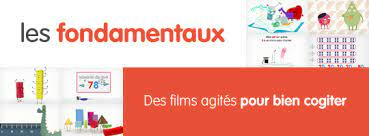
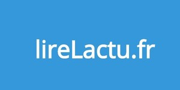
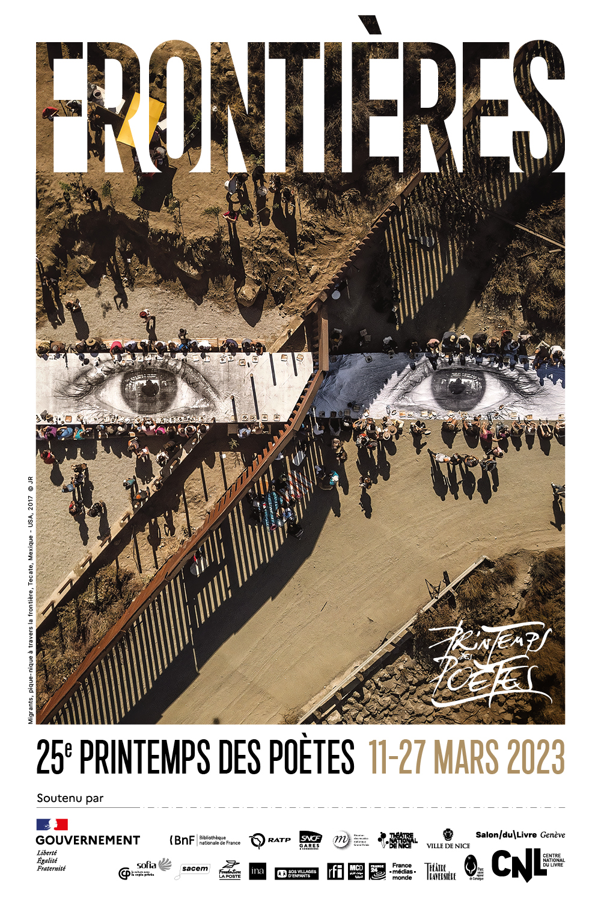
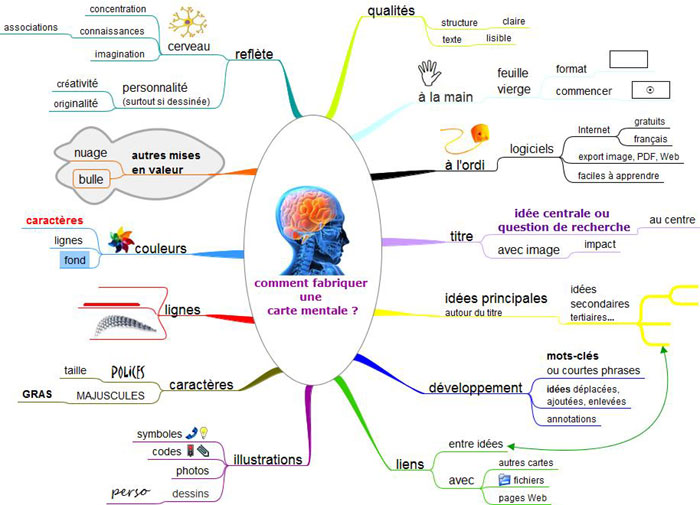
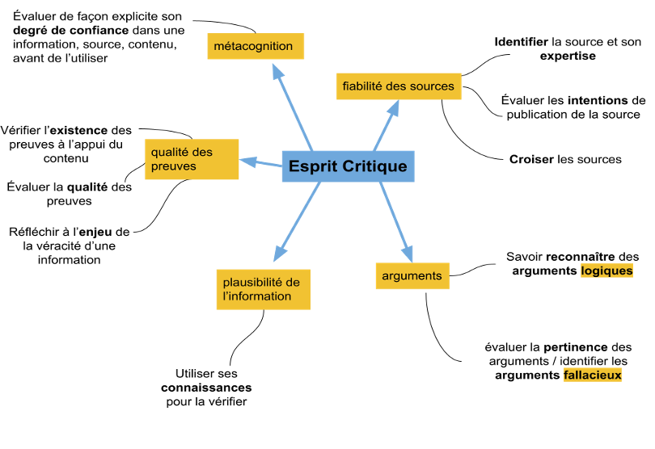
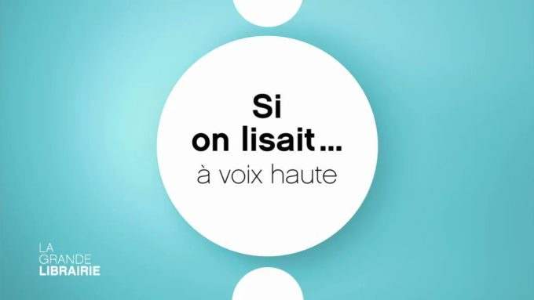
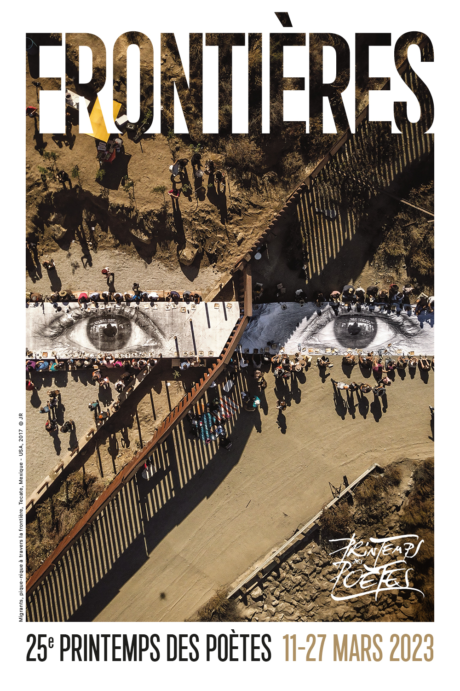

Pour vous aider et vous accompagner dans vos apprentissages :

???+ example inline end "Liens utiles :"
    [{width=60%}](https://www.lumni.fr/){target=_blank}

    [{width=85%}](https://pix.fr/){target=_blank}

    [{width=85%}](https://lesfondamentaux.reseau-canope.fr/){target=_blank}

    [{width=80%}](http://lirelactu.fr/){target=_blank} 
    

- ==**Conseils et tutoriels**== : pour s'organiser dans son travail, améliorer sa rédaction, chercher des informations et présenter le résultat de ses recherches...
- ==**Programmes officiels et ressources utiles**== : pour les disciplines d'enseignement général, les enseignements de spécialités (LGT) ou matières professionnelles (LP).
- ==**Projets pédagogiques**== : concours scolaires, projets d'AP, éducation aux médias et à l'information...

___

## Actualité des disciplines
[{width=40%}](https://www.printempsdespoetes.com/Edition2023){target=_blank}

## Méthodologie pour tous

???+ question "S'organiser"
    - [**Apprendre à travailler**](./pdf/Méthodologie_Apprendre_a_travailler.pdf){target=_blank}
    - [**Apprendre efficacement**](https://apprendre-reviser-memoriser.fr/category/revisions-bac-brevet-examens-concours/){target=_blank}
    - **D'autres exemples de cartes mentales** [**ici**](https://www.ebsi.umontreal.ca/jetrouve/projet/cartes_m/galerie.htm){target=_blank}
    
    {center=80%}
        
??? question "Améliorer sa rédaction"   
    - [**La langue française - Le Robert**](https://www.lalanguefrancaise.com/){target=_blank} : dictionnaire, conjugaison, orthographe, expressions...
    - [**Question d'orthographe**](https://www.projet-voltaire.fr/regles-orthographe/){target=_blank} : consultez le site du projet Voltaire.
    - [**Question de conjugaison**](https://www.toutelaconjugaison.com/){target=_blank}
    - [**Argumenter**](https://www.assistancescolaire.com/eleve/2nde/francais/reviser-le-cours/2_f401){target=_blank} : explications, conseils, et méthode...
    
    Les **manuels scolaires** fourmillent de ==**conseils**== et ==**fiches méthodes**== pour améliorer sa rédaction et répondre aux exigences des différents exercices du baccalauréat ( commentaires, dissertations...) dans les différentes disciplines.
        
??? question "Chercher des informations"
    - [**Base documentaire PMB du lycée**](https://ecmorlaix.basecdi.fr/pmb/opac_css/index.php){target=_blank}
    - [**Les types de documents**](http://www1.univ-ag.fr/buag/cours/LS1-web/co/ls1_2_1.html){target=_blank}
    - [**Se repérer dans le classement**](http://www1.univ-ag.fr/buag/cours/LS1-web/co/ls1_2_2.html){target=_blank}
    - [**Chercher pour trouver**](https://www.ebsi.umontreal.ca/jetrouve/biblio/index.htm){target=_blank}
    - [**Vérifier une information sur Internet**](https://fr.wikihow.com/v%C3%A9rifier-l%E2%80%99information-sur-internet){target=_blank}
    - [**Prendre des notes**](./pdf/Méthodologie_Prendre des notes.pdf){target=_blank}
    - [**Elaborer une problématique**](./pdf/Fiche_intercdi_problematique.pdf){target=_blank}
    

??? question "Présenter le résultat de ses recherches, fiches outils et conseils..."
    - [**Faire un exposé**](./pdf/Méthodologie_Faire un exposé.pdf){target=_blank}
    - [**Faire une revue de presse**](./pdf/Méthodologie_Faire une revue de presse.pdf){target=_blank}
    - [**Réaliser une affiche**](./pdf/Méthodologie_Réaliser une affiche.pdf){target=_blank} 
    - [**Réaliser un panneau**](./pdf/Méthodologie_Réaliser un panneau.pdf){target=_blank}
    - [**Réaliser un diaporama**](./pdf/Méthodologie_Réaliser un diaporama.pdf){target=_blank}
    - [**PREZI - tutoriel**](https://prezi.com/r9ju2zs5ki65/guide-prezi-en-francais/){target=_blank}
    - [**Citer ses sources**](http://www1.univ-ag.fr/buag/cours/LS1-web/co/Module_LICENCE1_6.html){target=_blank} : fiche synthèse [**ici**](./pdf/Méthodologie_Citer ses sources bibliographiques.pdf){target=_blank}
  

??? info "Ressources"
    - [**France Culture Education**](https://www.radiofrance.fr/sujets/france-culture-education-des-podcasts-pour-apprendre-et-reviser){target=_blank} : des podcasts pour apprendre et réviser.
    - [**Nouveaux cours**](https://www.fun-mooc.fr/fr/cours/?limit=21&new=new&offset=0){target=_blank} : en ligne sur FunMOOC pour découvrir, apprendre, progresser... dans les différentes disciplines.
    - [**DYS**](https://www.ffdys.com/troubles-dys){target=_blank} : comprendre les troubles cognitifs spécifiques.
    - [**Documents libres de droits**](https://www.reformedulycee.fr/2019/11/documents-libres-de-droits-nos-sites-preferes/){target=_blank} : liste non exhaustive de sites proposant des images, vidéos et musiques libres de droits. (*Lelivrescolaire.fr*)
    - [**Musiques libres de droits**](https://www.auboutdufil.com/){target=_blank} à télécharger.

??? info "Logiciels and Co"
    - [**EXCEL**](https://www.excel-pratique.com/){target=_blank} : cours en ligne.

___
## EMI Médias et Information
??? question "**Pourquoi et comment s'informer** ?" 
    
    * S'informer pour comprendre le monde
    
    * Connaître et croiser les sources d'informations
    
    * Développer son esprit critique.
    
    * Lutter contre la désinformation.
    
    * Gérer ses données personnelles.
    
    * Maîtriser son temps d'écrans.
    
    ???+ attention "Comment développer son esprit critique ?"
        {width=70% align=left}
        
??? "**Sites pour s'informer**"
    ???+ "**Des Journaux**"
        * [**Le Monde**](https://www.lemonde.fr/){target=_blank}
        * [**Le Figaro**](https://www.lefigaro.fr/){target=_blank}
        * [**Ouest-France**](https://www.ouest-france.fr/){target=_blank}
        
    ???+ "**Autres sites**"
        [{width=20%}](http://lirelactu.fr/){target=_blank}

        * [**AFP**](https://www.afp.com/fr){target=_blank}
        * [**France24**](https://www.france24.com/fr/){target=_blank}
        * [**FranceInfo**](https://mobile.francetvinfo.fr/){target=_blank}
        * [**Reporters sans frontières**](https://rsf.org/fr){target=_blank}
        * [**Vie publique**](https://www.vie-publique.fr/){target=_blank} au coeur des débats pour comprendre les sujets de l'actualité.
     
        

??? question "**Enquêtes sur les médias**"
    - [**Comment les français s'informent-ils sur Internet ?**](https://www.fondationdescartes.org/wp-content/uploads/2021/03/Etude_Information_Internet_FondationDescartes_2021.pdf){target=_blank}

??? question "**Désintox : vrai ou fake ?**"
    En ces périodes troublées, il est plus que jamais ==**nécessaire et important**== de lutter contre la désinformation. 
    
    - [**Quelles solutions pour lutter contre la désinformation**](https://www.europe1.fr/medias-tele/quelles-solutions-pour-lutter-contre-la-desinformation-4042553){target=_blank} : Fabrice Fries, président de l'AFP et auteur de "L'Emprise du faux" répond sur Europe1.
    - [**FranceInfo**](https://www.francetvinfo.fr/vrai-ou-fake/){target=_blank}
    - [**Poutine à la "Une" du Times**](https://www.francetvinfo.fr/monde/europe/manifestations-en-ukraine/vrai-ou-fake-guerre-en-ukraine-non-cette-couverture-du-magazine-time-associant-poutine-et-hitler-n-est-pas-authentique_4987458.html){Target=_blank} : un exemple de fake.

??? "**Ressources pour l'EMI**"
    [**Padlet de ressources**](https://padlet.com/cdinddmporsmeur/emi){target=_blank}

??? "**Données personnelles**"
    - [**Cybermalveillance**](https://www.cybermalveillance.gouv.fr/){target=_blank} : site officiel pour assister les particuliers, les entreprises, les associations, les collectivités et les administrations victimes de cybermalveillance, les informer sur les menaces numériques et les moyens de s'en protéger.
    - [**10 conseils pour assurer votre cybersécurité**](https://www.cybermalveillance.gouv.fr/tous-nos-contenus/bonnes-pratiques/10-mesures-essentielles-assurer-securite-numerique){target=_blank}
    - [**Conseils pour la gestion des "Mots de passe"**](https://www.cybermalveillance.gouv.fr/tous-nos-contenus/bonnes-pratiques/mots-de-passe){target=_blank}
    
    
___
## Concours scolaires

??? info "**Concours de la résistance**"
    La classe de TG2 participent au [**Concours National de la Résistance et de la Déportation**](https://www.reseau-canope.fr/
    cnrd/){target=_blank}. Les objectifs et les modalités du concours sur le site officiel.

___

??? info "**Concours de critique**"
    En octobre et novembre, les élèves de 1G3 et 1G4, participent au [**concours de critique littéraire**](https://www.bruitdelire.org/concours-de-critique-litteraire/){target=_blank} organisé par la Région Bretagne en partenariat avec le Rectorat de Rennes et l’association ==**"Bruit de lire"**==. L’objectif pour les élèves est de rédiger une critique sur l’un des romans de la sélection en lice pour le ==**Prix Goncourt des Lycéens**==.
    
    En apprenant à exprimer leur pensée et à argumenter, les lycéens avancent vers l'autonomie. Au-delà du « j’aime » / « je n’aime pas », ils apprennent à formuler une appréciation personnelle sur l’œuvre choisie et à justifier leur avis. En s’exerçant à ce genre particulier, les élèves développent de véritables compétences d’argumentation.
    
    ???+ "**Autres ressources**"
        * [**L'Académie Goncourt**](https://www.academiegoncourt.com/home){target=_blank}
        * [**PADLET du CONCOURS**](https://padlet.com/cdinddmporsmeur/concours2021){target=_blank}

        
___

??? info "**Si on lisait à voix haute**"
    Dans le cadre de l'AP, 19 élèves de seconde générale participent cette année au concours [**"Si on lisait à voix haute"**](https://www.lumni.fr/dossier/la-grande-librairie-concours-de-lecture-a-voix-haute){target=_blank} organisé par François Busnel et la Grande Librairie.

    Leurs motivations et leurs attentes au moment de choisir cet atelier étaient diverses : pour certains la **curiosité**, pour d’autres, l’**envie de travailler l’oral** et de **gagner en aisance**, pour d’autres encore, aimant déjà lire à voix haute, le **désir de participer à un concours national**, quelques-uns, aussi, sans motivation particulière, parce que s’étant inscrits dans cet atelier un peu par défaut.
    
    Ensembles, ils ont choisi de relever le défi proposé par le concours et se sont engagés à travailler pour progresser dans cet exercice de lecture à voix haute, à s'entraider pour exceller et donner le meilleur d'eux-mêmes.

    Découvrez cet atelier pédagogique sur le [**Padlet du groupe d'AP**](https://padlet.com/cdinddmporsmeur/concours_lagrandelibrairie){target=_blank}.
    {width=35% align=right}
    <figure>
    <iframe title="Vidéo_Nolan_Stewart_Finaliste_2022_02" src="https://tube-numerique-educatif.apps.education.fr/videos/embed/0a21165a-d5a7-4c0c-a450-20a3e4c45a23" allowfullscreen="" sandbox="allow-same-origin allow-scripts allow-popups" width="560" height="315" frameborder="0"></iframe>
    <figcaption>Vidéo du représentant du groupe</figcaption>
    </figure>
___

??? info "**Prix folio des lycéens**"
    Petit parcours vers la **littérature contemporaine** : à travers des activités variées, découvrir 6 titres récents aux thèmes diversifiés ; partager ses impressions de lecture par oral et par écrit ; affiner ses goûts, développer son esprit critique en attribuant « coups de cœur » et « coups de griffe » et en votant pour son roman préféré.
    
    Une manière décontractée de se préparer aux épreuves anticipées de Français (écrites et orales) et au Grand Oral du bac !
    
    Informations et actualités du [**Prix folio**](https://www.prixdeslyceensfolio.fr/){target=_blank} sur le site.
    
___
## Seconde générale

??? info "AP 2nde générale"
    Dans le cadre de l'**accompagnement personnalisé** de la classe de seconde, les élèves participent à un **projet long** et trois **projets courts**.
    
    L’objectif est de les guider dans leurs choix d'orientation, en leur proposant soit des modules de découverte variés où ils pourront exprimer leurs talents, soit des activités liées à une discipline spécifique, ou encore des outils pour les aider à surmonter des difficultés identifiées.
     
    ==**PROJETS LONGS**== (*27 semaines*)
    
    * Sciences et laboratoire : Faire des sciences dans le cadre d’une enquête policière
    
    * Journal du lycée : Ecrire à la façon d’un journaliste
    
    * Projet Symbiose : Science-Fiction, Fantasy, Fantastique, si j’écrivais des nouvelles de SFFF
    
    * Maths expertes : Les maths, j’adore, je veux devenir un expert
    
    * Création et innovation technologique : des idées plein la tête pour des projets concrets
    
    * Lecture à voix haute 
    
    * Atelier d'écriture : pour les écrivains en herbes
    
    * Management et Gestion : Créer ma propre entreprise
    
    * Histoire : Savoir-être et savoir-vivre à la Renaissance

    ==**PROJETS COURTS**== (*9 semaines*)
    
    * Soutien mathématiques : pour reprendre les bases en début d'année
    
    * Soutien français : pour reprendre les bases en début d'année
    
    * Initiation aux sciences de l'ingénieur
    
    * Initiation au management et à la gestion
    
    * Prix des lycéens Folios : être jury dans un concours littéraire

    * Etre à l'aise à l'oral
    
    * Sciences et laboratoire : répondre à des questions scientifiques par l'expérience
    
    * Les Imaginaires du futur : créer une exposition interactive

    * Prononciation anglaise : doubler des séries en anglais
   
___
## Disciplines et Spécialités

???+ attention "Avertissement"
    Ci-dessous les ==**programmes scolaires**== et des ==**ressources**== pour les enseignements du lycée général et technologique.

    Par souci de clarté sont regroupés sous la même rubrique les ==**disciplines du tronc commun**== et les ==**enseignements de spécialité**== proposés au lycée.

???+ info "Choix des spécialités"
    Pour le bac général et technologique, pendant l’année de 2de, les élèves choisissent 3 spécialités qu'ils étudieront pendant la classe de 1re, en fonction de leurs goûts et de leurs motivations. Pour la terminale ils choisiront de conserver 2 des spécialités étudiées en 1re.
    
    Pour bien choisir vos spécialités, découvrir les attendus et les programmes de première et de terminale, pour chacune d'entre elles, rendez-vous sur le site du [**Ministère de l'Education Nationale**](https://www.education.gouv.fr/reussir-au-lycee/choisir-ses-specialites-au-lycee-pour-preparer-ses-etudes-superieures-325475){target=_blank} ou sur le site de [**l'Etudiant**](https://www.studyrama.com/formations/diplomes/bac/les-programmes-et-attendus-des-12-specialites/){target=_blank}.
    
    D'autres sites d'informations sur les spécialités sont à découvrir sous l'onglet [**parcours avenir**](https://cdi-lycee.ecmorlaix.fr/orientation/){target=_blank} du présent site, vers le padlet SECONDE.
  

___   
### Arts plastiques

??? "Programmes"
    Sur le site [**Eduscol**](https://eduscol.education.fr/1713/programmes-et-ressources-en-arts-plastiques-voie-gt){target=_blank}.

??? "Ressources" 
    - [**Arts plastiques - Ministère de la culture**](https://www.culture.gouv.fr/Thematiques/Arts-plastiques){target=_blank}
    - [**Histoire des arts**](https://histoiredesarts.culture.gouv.fr/){target=_blank}
___ 
### EPS
    
??? "Programmes"
    Sur le site [**Eduscol**](https://eduscol.education.fr/1748/programmes-et-ressources-en-eps-voie-gt){target=_blank}
    
??? "Ressources"
    - [**Ministère des sports**](https://www.sports.gouv.fr/){target=_blank}
    - [**Portail des associations sportives par région**](https://portail.sportsregions.fr/){target=_blank}
    
  
___ 
### Français / EAF
??? "Programmes"
    Sur le site [**Eduscol**](https://eduscol.education.fr/1712/programmes-et-ressources-en-francais-voie-gt){target=_blank}.

??? "Ressources" 
    - [**Grammaire du Français**](https://cache.media.eduscol.education.fr/file/Programmes/52/6/Livre_Terminologie_grammaticale_web_1308526.pdf){target=_blank}
    - [**En Français dans le texte**](https://www.franceculture.fr/emissions/ecoutez-revisez){target=_blank} : Emission de France Culture proposant la lecture, par une comédienne ou un comédien, d'un texte (de littérature française le plus souvent, d'histoire ou de philosophie) au programme des classes de première ou de terminale. Chaque lecture est suivie d'une analyse par des professeurs et d'une dictée proposée à l'antenne et sur les réseaux sociaux.
    - [**Etudes littéraires**](https://www.etudes-litteraires.com/){target=_blank} : littérature, fiches méthodes, BAC français, langue française.
    - [**Travaux dirigés de français**](https://www.site-magister.com/){target=_blank} : notions, textes, conseils méthodologiques, ressources pour l'EAF.
    - [**Méthodologie pour réviser le BAC Français**](https://www.lumni.fr/dossier/revisions-bac-methodologie){target=_blank} : sur LUMNI.
    - [**S'entraîner pour l'oral**](https://wordwall.net/fr/resource/2213377/eaf-oral-2-partie){target=_blank}
    - [**Outils numériques pour les lettres et LCA**](http://www.pearltrees.com/t/lettres-lca-academie-de-rennes/numeriques-lettres-academie/id30360664){target=_blank}

    [{width=40%}](https://www.printempsdespoetes.com/Le-Printemps-des-Poetes){target=_blank}

 
 

___       
### HGGSP / Histoire-géographie EMC

??? "Programmes"
    Sur le site [**Eduscol**](https://eduscol.education.fr/1676/programmes-et-ressources-en-histoire-geographie-geopolitique-et-sciences-politiques-voie-g){target=_blank} : programmes d´histoire, géographie, géopolitique et sciences politique...
    [**Programme d´EMC**](https://eduscol.education.fr/1681/programmes-et-ressources-en-enseignement-moral-et-civique-voie-gt){target=_blank}
    
??? "Ressources" 
    === "SITES INSTITUTIONNELS"
        - [**Service public**](https://www.vie-publique.fr/fiches){target=_blank} : fiches thématiques pour comprendre le fonctionnement des principales institutions.
        - [**Site du gouvernement**](https://www.gouvernement.fr){target=_blank} : composition, actualité du gouvernement français.
    === "CARTES"
        - [**Le dessous des cartes**](https://www.arte.tv/fr/videos/RC-014036/le-dessous-des-cartes/){target=_blank} : le magazine géopolitique d'Arte, créé par Jean-Christophe Victor et présenté par Émilie Aubry pour comprendre les enjeux de notre monde contemporain au moyen de cartes géographiques. Diffusée à l'antenne tous les samedis à 19h30, l'émission est disponible en replay et en VOD et DVD.
    === "GEOPOLITIQUE"
        - [**Lumni**](https://www.lumni.fr/recherche?query=G%C3%A9opolitique&establishment=lycee&schoolLevel=seconde){target=_blank} : Série "Géopoliticus" pour décrypter la géopolitique à l’aide d’infographies animées et comprendre le monde et les grands enjeux politiques de notre temps.
        - [**Revue Conflits**](https://www.revueconflits.com/){target=_blank} : Revue de géopolitique.
    === "RELATIONS INTERNATIONALES"
        - [**France Culture**](https://www.franceculture.fr/geopolitique){target=_blank} : Analyses et décryptages : comprendre les relations internationales et la géopolitique du monde actuel grâce aux émissions et podcasts de France Culture.
        - [**EURONEWS**](https://fr.euronews.com/tag/relations-internationales){target=_blank} : actualités des relations internationales.
        - [**IRIS - Institut de Relations Internationales et Stratégiques**](https://www.iris-france.org/){target=_blank}
        
    
??? "Concours"
    - [**Concours national de la résistance**](https://www.reseau-canope.fr/cnrd/){target=_blank} : ressources pour participer.
     
??? "Séances pédagogiques"   
    - [**Faire une revue de presse thématique**](./pdf/HGGSP_1re_revue de presse thématique.pdf){target=_blank}
    
??? "Etudes et géopolitique"
    Si la géopolitique vous intéresse, pourquoi ne pas continuer vos études dans cette voix à l'[**Institut Français de géopolitique**](https://www.geopolitique.net/fr/){target=_blank}
       

___
### HLP / Philosophie

??? "Programmes"
    Sur le site [**Eduscol**](https://eduscol.education.fr/1711/programmes-et-ressources-en-humanites-litterature-et-philosophie-voie-g){target=_blank}
    
??? "Ressources" 
    - [**Encyclopédie philosophie**](https://encyclo-philo.fr/){target=_blank}
    - [**La philosophie**](https://la-philosophie.com/){target=_blank} : Les grands philosophes, les courants... préparation du BAC PHILO (Conseils méthodologiques - Résumés - Citations...)
    - [**Histoire de la philosophie**](http://www.histophilo.com/index.php){target=_blank}
    - [**Les philosophes dans le métro**](https://lesphilosophesdanslemetro.com/plan/){target=_blank}
    - [**Le pouvoir de la parole**](https://www.franceculture.fr/emissions/les-chemins-de-la-philosophie/le-pouvoir-de-la-parole-14-parler-est-ce-agir){target=_blank} : Série de quatre émissions sur le pouvoir de la parole, diffusées sur France Culture en novembre 2019. (^^Episode 1^^ : Parler est-ce agir ? - ^^Épisode 2^^ : Quand la parole ne suffit pas : les stoïciens au secours de l’écologie - ^^Épisode 3^^ : Quand dire, c’est guérir - ^^Épisode 4^^ : Devient-on quelqu’un d’autre quand on ment ?).
   
___  
### LLCE / Langues vivantes

??? "Programmes"
    Sur le site [**Eduscol**](https://eduscol.education.fr/1684/programmes-et-ressources-en-langues-litteratures-et-cultures-etrangeres-et-regionales-voie-g){target=_blank}

??? "Ressources communes" 
    - [**Lingolia**](https://www.lingolia.com/fr/){target=_blank}
    - [**Fiches de vocabulaire**](https://fichesvocabulaire.com/){target=_blank}
    - [**Question de conjugaison**](https://la-conjugaison.nouvelobs.com/){target=_blank} : Français, Anglais, Espagnol, Allemand, Italien...
    - [**Verbes irréguliers anglais**](https://verbesirreguliersanglais.com/){target=_blank}
    - [**Duolingo**](https://fr.duolingo.com/){target=_blank}
    - [**Memrise**](https://app.memrise.com/bienvenue#1){target=_blank}
    - [**British Council**](http://learnenglishteens.britishcouncil.org/){target=_blank}
    - [**BBC**](https://www.bbc.com/news/uk){target=_blank}
    - [**Le Monde - version anglaise**](https://www.lemonde.fr/en/?M_BT=43662779019995){target=blank}
 
??? "Allemand"
    - [**L'Allemand un plus**](https://www.goethe.de/resources/files/pdf216/unplus_broschuere_2022_web.pdf){target=_blank} : Pourquoi choisir l'Allemand ? Brochure éditée par le Goethe Institut, le ministère de l'Education de la jeunesse et des sports et L'Institut Français.
    - [**Genially du cours d'Allemand**](https://view.genial.ly/631c848b649e570019de15e9){target=_blank} de Madame Michel.
    
___    
### Mathématiques / SNT

??? "Programmes"
    Sur le site [**Eduscol**](https://eduscol.education.fr/1723/programmes-et-ressources-en-mathematiques-voie-gt){target=_blank}

??? "Ressources" 
    - [**Spécialité Maths**](http://specialite-maths.fr/){target=_blank}
    - [**M@th_et_tiques**](https://www.maths-et-tiques.fr/index.php/cours-maths){target=_blank}
    - [**Méthode Math**](https://www.methodemaths.fr/){target=_blank}
    - [**Kahn Academy**](https://fr.khanacademy.org/){target=_blank} : Cours en mathématiques...
    - [**Ma@ths en-vie**](https://www.mathsenvie.fr/?p=10530){target=_blank} : Une façon originale d’aborder les mathématiques : motivante, concrète et en lien avec le quotidien des élèves. Activités de la maternelle au lycée...
    - [**Podcast - France Culture**](https://www.franceculture.fr/theme/mathematiques){target=_blank}
    - [**Annales**](https://www.annales2maths.com/){target=_blank}

        ??? "Sites de vos enseignants"
            - [**Mme NUNEZ**](https://dnunez-gua.github.io/Maths_Terminales/){target=_blank} : Spécialité Mathématiques (Terminale) -  Option Maths expertes.
            - [**M. MADEC**](https://ericecmorlaix.github.io/SNT-2GT4_2022-2023/){target=_blank} : SNT seconde générale

        ??? tip "Ressources proposées pour la "Semaine des mathématiques"
            ==**Du 7 au 14 mars 2022, s'est déroulé la semaine des mathématiques**== : l'occasion de renforcer l'attractivité des mathématiques.
    
            - [**Guide officiel**](https://eduscol.education.fr/document/38933/download?attachment){target=_blank} de l´édition 2022 sur le thème ==**"Les Maths en forme(s)"**==.
            - [**Les défis possibles**](https://www.mathsenvie.fr/?p=10530){target=_blank} par niveau, les modalités du concours...
            - [**Ressources**](https://maths.discip.ac-caen.fr/spip.php?article554){target=_blank}

___
### NSI

??? "Programmes"
    Sur le site [**Eduscol**](https://eduscol.education.fr/2068/programmes-et-ressources-en-numerique-et-sciences-informatiques-voie-g){target=_blank}

??? "Ressources" 
    - [**Histoire de l'informatique, d'Internet et du Web**](https://delmas-rigoutsos.nom.fr/documents/YDelmas-histoire_informatique/index.html){target=_blank}
    - [**Cours sur Python**](https://courspython.com/){target=_blank}
    - [**Cours de sciences numériques et informatiques**](https://www.numerique-sciences-informatiques.fr/){target=_blank} : python, mini-projets, HTML et CSS, PHP, robots, objects orientés, android, sujets bacs. Les métiers du numérique.
    - [**Kahn Academy**](https://fr.khanacademy.org/){target=_blank} : Cours en mathématiques, sciences, informatique, économie et finance, arts.
    - [**PIXEES**](https://pixees.fr/){target=_blank} : ressources pour les sciences du numérique.
    - [**Banque de sujets des épreuves pratiques**](https://eduscol.education.fr/2661/banque-des-epreuves-pratiques-de-specialite-nsi){target=_blank}.

___
### Physique Chimie

??? "Programmes"
    Sur le site [**Eduscol**](https://eduscol.education.fr/1648/programmes-et-ressources-en-physique-chimie-voie-gt){target=_blank}

??? "Ressources"
    - [**Méthode physique**](https://www.methodephysique.fr/){target=_blank} : cours, exercices, viédos, conseils méthodologiques.
    - [**CultureSciences - Chimie**](https://culturesciences.chimie.ens.fr/){target=_blank}
    - [**Chimie générale**](https://fr.khanacademy.org/science/chemistry){target=_blank} : sur le site Kahn Academy.
    - [**WebPhysique**](https://webphysique.fr/){target=_blank} : Cours, exercices pour apprendre et découvrir les sciences physiques au lycée.
       

___
### SES

??? "Programmes"
    Sur le site [**Eduscol**](https://eduscol.education.fr/1658/programmes-et-ressources-en-sciences-economiques-et-sociales-voie-gt){target=_blank}

??? "Ressources" 
    === "SITES INSTITUTIONNELS"
        - [**Cité de l'économie**](https://www.citeco.fr/){target=_blank} : Leçons d'économie : vidéos de 2mn pour faire le tour des questions essentielles de la discipline  (marchés, échanges, régulation, TVA, CAC 40...) - Histoire de la pensée économique (fresque) - Les clés de l'éco : explication des Mécanismes économiques, monétaires, financiers - WEBséries : vidéos et quiz.
        - [**CCI Bretagne**](https://www.bretagne.cci.fr/){target=_blank} : Le site de la **Chambre de Commerce et d'Industrie** de Bretagne.
        - [**DGCCRF**](https://www.economie.gouv.fr/dgccrf){target=_blank} : Direction générale de la concurrence, de la consommation et de la répression des fraudes, du site du Ministère de l'économie, des finances et de la relance.
        - [**Autorité de la concurrence**]([https://www.economie.gouv.fr/dgccrf](https://www.autoritedelaconcurrence.fr/fr)){target=_blank} : pour signaler une pratique anticoncurrentielle. 
        - [**INSEE**](https://www.insee.fr/fr/accueil){target=_blank} :  Institut national de la statistique et des études économiques.
        - [**INC**](https://www.inc-conso.fr/){target=_blank} :  Institut national de la consommation.
        - [**60 millions de consommateurs**](https://www.60millions-mag.com/){target=_blank}
        - [**Service public**](https://www.service-public.fr/){target=_blank} : site officiel de l'administration française.
        - [**Banque de France**](https://www.banque-france.fr/){target=_blank} : site officiel de la banque de France. 
    === "SITES PEDAGOGIQUES"
        - [**Econofides**](https://econofides.ac-versailles.fr/){target=_blank} : l'économie pour le lycée, ressources pour la spécialité SES, et la 1ère STMG.
        - [**Melchior**](https://www.melchior.fr/){target=_blank} : site de ressources en SES proposées par des enseignants de SES en partenariat avec l'éducation nationale.
        - [**Pour les SES**](http://www.ses.ac-versailles.fr/){target=_blank} : site de l'académie de Versailles.
        - [**Sujets de BAC**](http://www.ses.ac-versailles.fr/prgs_2019/bac/sujets_term/sujets_term.html){target=_blank} : sujets du BAC de la spécialité SES.
        - [**Autres ressources**](http://ses.ens-lyon.fr/){target=_blank} en Sciences Economiques et Sociales.
        - [**Pour l'Eco**](https://www.pourleco.com/){target=_blank} : le site de la revue.

___
### SI

??? "Programmes"
    Sur le site [**Eduscol**](https://eduscol.education.fr/1646/programmes-et-ressources-en-sciences-de-l-ingenieur-voie-gt){target=_blank}

??? "Ressources" 
    - [**Techniques de l'ingénieur**](https://www.techniques-ingenieur.fr/){target=_blank}

___
### SVT

??? "Programmes"
    Sur le site [**Eduscol**](https://eduscol.education.fr/1664/programmes-et-ressources-en-sciences-de-la-vie-et-de-la-terre-voie-gt){target=_blank}

??? "Ressources" 
    - [**Vive les SVT**](https://www.vivelessvt.com/){target=_blank}
    - [**Planète énergie**](https://www.planete-energies.com/fr){target=_blank}
    - [**A la découverte du corps humain**](https://www.reseau-canope.fr/corpus/#){target=_blank}

___
### Série STMG  
??? "Programmes"
    Sur le site [**Eduscol**](https://eduscol.education.fr/1742/programmes-et-ressources-en-serie-stmg){target=_blank}

??? "Ressources" 
    - [**L'économie en 1ère STMG**](https://econofides.ac-versailles.fr/premiere-stmg/text/0-3-contents.html){target=_blank}
    - [**Vidéos LUMNI**](https://www.lumni.fr/lycee/premiere/voie-technologique/stmg-sciences-et-technologies-du-management-et-de-la-gestion-1){target=_blank} : en lien avec les programmes de droit et d'économie

___
## BAC PRO
Présentation du baccalauréat professionnel sur le site [**Eduscol**](https://eduscol.education.fr/1916/le-baccalaureat-professionnel){target=_blank} (Dernière mise à jour février 2022) : voies de formation, contenu de la formation, conditions d'obtention du diplôme...

- Programmes des [**enseignements généraux**](https://eduscol.education.fr/94/j-enseigne-au-lycee-professionnel){target=_blank}

- [**Métiers de la santé et du social**](https://www.education.gouv.fr/metiers-de-la-sante-et-du-social-99941){target=_blank}

- [**Métiers de la relation client**](https://eduscol.education.fr/document/1902/download){target=_blank}

- [**Le chef d'oeuvre**](https://eduscol.education.fr/3001/la-realisation-du-chef-d-oeuvre){target=_blank} - [**Vademecum**](https://eduscol.education.fr/document/1916/download?attachment){target=_blank} : définition, modalités, collaboration entre disciplines, enjeux et mise en oeuvre.

___
### ASSP
??? "Programmes et référentiel"
    Sur le site [**Eduscol**](https://eduscol.education.fr/referentiels-professionnels/a127/a127c.pdf){target=_blank}
    
___
### AEPA
??? "Programmes et référentiel"
    Sur le Site [**Eduscol**](https://eduscol.education.fr/referentiels-professionnels/Bac_Pro_Animation/Annexes_Bac%20Pro%20Animation190722.pdf){target=_blank}

___
### MCV
??? "Programmes et référentiel"
    Sur le site [**Eduscol**](https://eduscol.education.fr/referentiels-professionnels/BacPro_MetCoVe/Annexes_BacPro_MetCoVe.pdf){target=_blank}

___
## CAP
??? "Programmes et référentiel"
    Sur le Site [**Eduscol**](https://eduscol.education.fr/1923/le-certificat-d-aptitude-professionnelle-cap){target=_blank}

___
### AEPE
??? "Programmes et référentiel"
    Sur le Site [**Eduscol**](https://eduscol.education.fr/referentiels-professionnels/CAP_AEPE.html){target=_blank}

___
### EPC
??? "Programmes et référentiel"
    Sur le Site [**Eduscol**](https://eduscol.education.fr/referentiels-professionnels/cap_EPC.html){target=_blank}

___
## Réviser pour le BAC

??? "S'organiser, planifier son travail"
    - [**Un peu de méthode**](https://www.lumni.fr/dossier/revisions-bac-methodologie){target=_blank} : vidéos "**lumni**" pour réviser...
   
            
??? "Des sites pour réviser et s'entraîner"
    - [**Tout pour le BAC**](https://www.phosphore.com/tout-pour-le-bac/){target=_blank} : Le site Phosphore propose des outils réviser le BAC 2022.
    - [**Banque de sujets**](https://www.sujetdebac.fr//){target=_blank} : banque de données des sujets d'examens du baccalauréat général, technologique et professionnel.
    - [**Studyrama**](https://www.studyrama.com/revision-examen/bac){target=_blank}
    
    
___ 
## Grand Oral

[**Padlet de ressources pour le GO**](https://padlet.com/cdinddmporsmeur/grandoral2021){target=_blank}

??? "**Présentation**" 
    
    Pour ne pas stresser, ce [**test**](https://learningapps.org/display?v=pf4o5pjnk21){target=_blank} récapitule ce qu'il est conseillé de faire ou au contraire préférable d'éviter.
        
    === "**REFERENTIEL**"
        - [**Comment se passe le grand oral ?**](https://www.education.gouv.fr/reussir-au-lycee/baccalaureat-comment-se-passe-le-grand-oral-100028){target=_blank} : objectifs et modalités.
    
??? "**Méthodologie**" 
   
    === "**TUTORIELS**"
        - [**Petits tutos Lumni**](https://www.lumni.fr/dossier/preparer-son-oral#3){target=_blank} : se préparer - se présenter - s'engager - maîtriser les codes de la communication orale. (*Lumni*)
        - [**La minute du coach ?**](https://www.editions-hatier.fr/grand-oral){target=_blank} : conseils et ressources pour préparer l'épreuve. (*Editions Hatier*)
        - [**Exercices**](https://www.super-bac.com/articles/bac/exercices-grand-oral-maniere-parler/){target=_blank} pour améliorer sa manière de parler.
    === "**S'ORGANISER**"

??? "**Ressources par disciplines**"

    === "**HGGSP**"
    === "**HLP**"
    === "**LLCER**"
    === "**MATH**"
    === "**NSI**"
    === "**PHYSIQUE-CHIMIE**"
    === "**SES**"
    === "**SI**"
    === "**SVT**"
    === "**STMG**"
        - [**Quelles questions pour le grand oral ?**](https://grand-oral-enseignants.lerobert.com/9782321015383/assets/les-ressources-numeriques-pour-les-stmg-1/preview){target=_blank} : liste des thèmes du porgramme et exemples de questions par spécialité. 
    

   