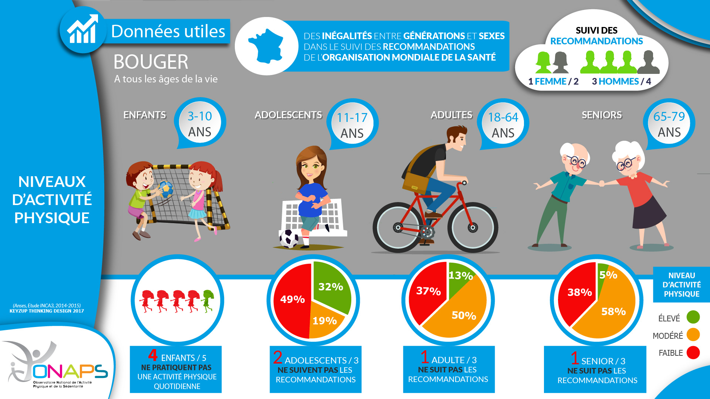

Pour vous aider et vous accompagner dans le domaine de la santé. 
???+ example inline end "Liens utiles"
    - [**Ministère de la santé**](https://solidarites-sante.gouv.fr/){target=_blank}
    

## Actualités
[**"Journée santé"**](https://www.ouest-france.fr/bretagne/morlaix-29600/morlaix-pour-lutter-contre-la-sedentarite-ils-vont-faire-bouger-300-jeunes-6d718506-aa02-11ec-8f08-42ee829ff732){target=_blank} au lycée 

## Alimentation

## Addictions
??? question "Définition des addictions" 

## Sédentarité
??? question "Qu'est-ce que la sédentarité ?" 
    
    
    ???+ attention "Comment développer son esprit critique ?"
        {width=70% align=left} Source : [**Bretagne - Sport santé**](https://bretagne-sport-sante.fr/){target=_blank}
        

## Vie affective et sexuelle

??? "**Des sites pour s'informer**"
    [**CIDFF**](https://finistere.cidff.info/){target=_blank} : Centre d'information sur les droits des femmes et des familles.

    [**CLER**](https://www.cler.net/Education-affective-et-sexuelle){target=_blank} : Education affective  et sexuelle.

