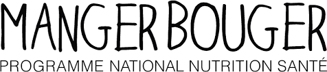

???+ example inline end "Liens utiles"
    [{width=90%}](https://solidarites-sante.gouv.fr/){target=_blank}
     
    [{width=90%}](https://www.santepubliquefrance.fr/){target=_blank}

    [{width=90%}](https://www.mangerbouger.fr/){target=_blank}

    [{width=90%}](https://www.georisques.gouv.fr/){target=_blank}
  

==**Des ressources pour vous informer et vous accompagner dans le domaine de la santé.**==

    

## Actualités
{width=25% align=right}
    

???+ info "**Bougeons ensemble - Edition 2024**"
    ==**Mardi 28 mai**==, 3ème édition de la journée ==**Bougeons ensemble**== pour sensibiliser les élèves de seconde aux bienfaits de l'exercice physique, d'une alimentation équilibrée pour lutter contre la sédentarité. 
    
    <u>Au programme :</u>

    ==**Ateliers sportifs**, **rencontres et échanges avec des professionnels**== (kinésithérapeuthe, sophrologue, diététicien) , exposition sur le thème "sport et science" : ==***Pourquoi est-on penché dans les virages ?***==

    
    ??? "**Photos souvenirs**"

        {width=65% align=left}
        {width=70% align=left}
        {width=70% align=left}
        {width=70% align=left}
        

        

## Alimentation
??? info "Equilibre alimentaire"

    **Manger équilibré, ça veut dire quoi ?** : réponses sur le site [**Mangerbouger.fr**](https://www.mangerbouger.fr/manger-mieux/se-faire-plaisir-en-mangeant-equilibre/manger-equilibre-ca-veut-dire-quoi-et-comment-y-arriver){target=_blank}
    ou le site de la [**Fédération française de cardiologie**](https://www.fedecardio.org/je-m-informe/qu-est-ce-qu-une-alimentation-equilibree/){target=_blank}

    ??? "Guides et astuces"

        50 petites astuces pour manger mieux et bouger plus [**ICI**](https://www.mangerbouger.fr/l-essentiel/guides-et-documents){target=_blank}

    

## Addictions
??? attention "Information" 
    Voir le site [**AMELI**](https://www.ameli.fr/finistere/assure/sante/themes/addictions){target=_blank} de l'assurance maladie.
    === "TABAGISME"
        ==***Même si vous fumez depuis plusieurs années, il n’est jamais trop tard pour arrêter.***==

        * [**TABADO**](https://tabado.fr/){target=_blank} : ensemble, sans tabac. 
        * [**Tabac info service**](https://www.tabac-info-service.fr/){target=_blank} : trouver la motivation pour arrêter de fumer, se faire accompagner...

## Don d'organes

??? info "S'informer"
    * [**Site officiel**](https://www.dondorganes.fr/){target=_blank} : questions-réponses sur le don d'organes. Que dit la loi ?
    * [**FranceAdot**](https://www.france-adot.org/tout-savoir-sur-le-don/don-organe/){target=_blank} : Fédération des Associations pour le Don d'Organes et de Tissus humains.

## Sédentarité
??? attention "Une priorité de santé publique" 
    Voir le site de l'[**ANSES**](https://www.anses.fr/fr/content/manque-d%E2%80%99activit%C3%A9-physique-et-exc%C3%A8s-de-s%C3%A9dentarit%C3%A9-une-priorit%C3%A9-de-sant%C3%A9-publique){target=_blank}
    
    ???+ info "Niveaux d'activité physique par âge"
        {width=70% align=left} Source : [**Bretagne - Sport santé**](https://bretagne-sport-sante.fr/){target=_blank}
        
    ???+ question "La sédentarité et moi !"
        Pour connaître ton niveau d'activité physique et de sédentarité, réalise ce [**test **](https://www.mangerbouger.fr/bouger-plus/test-de-niveau-d-activite-physique-et-de-sedentarite){target=_blank} en ligne et découvre [**pour quel sport tu es fait.**](https://www.phosphore.com/entre-nous/tests-perso/pour-quel-sport-es-tu-faite/){target=_blank}

        D'autres jeux et quizz sur l'[**ONAPS**](https://onaps.fr/jeux-et-quizz/){target=_blank} : Observatoire National de l'Activité Physique et de la Sédentarité.

## Sommeil
??? attention "Le sommeil, un allier santé"
    Une bonne hygiène du sommeil est indispensable et contribue à préserver la santé.
    Le sommeil possède plusieurs fonctions particulières, indissociables de l'état de veille et mettant en jeu de nombreux mécanismes physiologiques : sécrétions hormonales, régénération cellulaire (peau, muscle…), mémorisation etc. Dormir permet ainsi une récupération physique, psychologique et intellectuelle…

    * [**INSV**](https://institut-sommeil-vigilance.org/){target=_blank} : Institut National du Sommeil et de la Vigilance.
    
    * [**INSERM**](https://www.inserm.fr/dossier/sommeil/){target=_blank} : toute la lumière sur notre activité nocturne.
    
    * [**Observatoire de la Santé**](https://www.observatoire-sante.fr/categorie/bien-etre/sommeil/){target=_blank} : les dossiers consacrés au sommeil.

    * [**Réseau Morphée**](https://sommeilenfant.reseau-morphee.fr/en-savoir-plus/les-bienfaits-du-sommeil/){target=_blank} : les bienfaits du sommeil.

    ???+ question "**Testez son sommeil**"

        [**Questionnaire**](https://sommeilenfant.reseau-morphee.fr/){target=_blank} totalement gratuit et anonyme proposé par le [**réseau Morphée**](https://sommeilenfant.reseau-morphee.fr/ado/sommeil-de-ladolescent/){target=_blank} pour réaliser un bilan complet de ton sommeil.

    ???+ question "**Sommeil et écrans**"
        Votre sommeil est-il en danger ? [**Faites le test**](https://institut-sommeil-vigilance.org/sommeil-et-nouvelles-technologies/){target=_blank} et découvrez l'importance du couvre-feu digital. 
    

 

## Vie affective et sexuelle

??? info "Des sites pour s'informer"
    * [**CIDFF**](https://finistere.cidff.info/){target=_blank} : Centre d'information sur les droits des femmes et des familles.
    * [**CLER**](https://www.cler.net/Education-affective-et-sexuelle){target=_blank} : Education affective et sexuelle.

